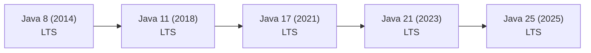

Java reinvented its release model in 2018. Knowing the milestone features — and which versions are **Long-Term Support (LTS)** — is essential both for interviews and for deciding what to run in production.

## The release cadence

Until Java 9, releases were big, multi-year events. Since **2018**, the JDK ships a **feature release every six months** — every **March** and **September** — on a fixed schedule whether or not a marquee feature is ready.

A subset of releases is designated **LTS**. The gap was three years (11 → 17) and Oracle has since shortened it to **two years** (17 → 21 → 25). A non-LTS release gets updates only until the next one lands (~6 months); an **LTS** release gets **several years** of security and bug-fix support from Oracle and other vendors (Eclipse Temurin, Amazon Corretto, Azul, Red Hat).

## Milestone features

| Version | Year | LTS | Headline additions |
|---------|------|-----|--------------------|
| **8** | 2014 | Yes | Lambdas, **Stream API**, `Optional`, default methods, `java.time` |
| **9** | 2017 | | **Module system (JPMS)**, **JShell** REPL, `List.of`/`Map.of` factories |
| **10** | 2018 | | `var` — local-variable type inference |
| **11** | 2018 | Yes | New `java.net.http.HttpClient`, single-file source launch (`java App.java`), `String.strip`/`lines`/`repeat` |
| **14–16** | 2020–21 | | Switch expressions (14), **text blocks** (15), **records** (16), **helpful NullPointerExceptions**, `instanceof` patterns |
| **17** | 2021 | Yes | **Sealed classes**, pattern matching for `switch` (preview), new pseudo-random generators |
| **21** | 2023 | Yes | **Virtual threads**, **pattern matching for switch** + record patterns, **sequenced collections** |
| **25** | 2025 | Yes | Simplified instance `main` + lightweight `IO` console, module import declarations, ongoing performance work |

### The Java 8 inflection point

Java 8 was the biggest leap in the language's history: **lambdas** and the **Stream API** brought functional-style data processing, `Optional` tamed nulls, and `java.time` replaced the broken `Date`/`Calendar` API. An enormous amount of production code still targets it.

### The modern era: 17 and 21

**Java 17** consolidated years of incubating work and made **sealed classes** final. **Java 21** is today's workhorse: **virtual threads** make blocking I/O cheap at massive scale, **pattern matching for switch** and **record patterns** modernize control flow, and **sequenced collections** add a shared interface for ordered collections with first/last access.

### The latest LTS: Java 25

**Java 25** (September 2025) continues the polish. It finalizes the **simplified `main`** — you can write `void main()` with no class wrapper and print through a lightweight `IO` class — lowering the barrier for beginners and scripts, alongside further JVM and performance improvements.

:::note
Treat fast-moving, very recent APIs as still settling. The release *themes* above are accurate, but always confirm exact method signatures and `JEP` details against the official documentation for the version you target.
:::

:::senior
The hardest part of upgrading is rarely new syntax — it's **strong encapsulation**. From Java 16/17 the JDK locks down its internal `sun.*` and `jdk.internal.*` packages, and Java 11 **removed** the bundled Java EE and CORBA modules (JAXB, JAX-WS). Code that reached into internals or relied on those modules breaks. This is why many teams leapfrog straight from 8 to 17 or 21 rather than hopping one release at a time.
:::

## How companies choose a version

- **Standardize on LTS.** Almost nobody runs non-LTS releases in production — six months of support is too short. The realistic options are 8, 11, 17, and 21.
- **Track, don't chase.** Teams pilot a new LTS (run tests, verify libraries and build tools) and migrate when the ecosystem catches up, often 6–18 months after release.
- **Mind the toolchain.** Build tools, frameworks (such as Spring), and bytecode agents must support the target JDK first.

:::gotcha
A *feature* (non-LTS) release such as Java 19 or 23 stops receiving updates the moment the next version ships. Use those locally to try out **preview features** — never as the basis of a production deployment.
:::

:::tip
Language features are tied to the compiler, not just the libraries: records need 16+, sealed types 17+, pattern matching for switch 21+. Pass `--release N` to `javac` so it enforces exactly the language and API level you intend to ship.
:::

:::key
- Since 2018 Java ships **every six months**; **LTS** lands every 2–3 years (8, 11, 17, 21, 25) and is what runs in production.
- Era cheat-sheet: **8** = lambdas/streams, **11** = HttpClient + single-file run, **16** = records, **17** = sealed classes, **21** = virtual threads + pattern matching, **25** = simplified `main`.
- Upgrades stall on **strong encapsulation** and **removed modules**, not on syntax — hence the common 8 → 17/21 leap.
- Run only LTS in production; use non-LTS releases to experiment with preview features.
:::
