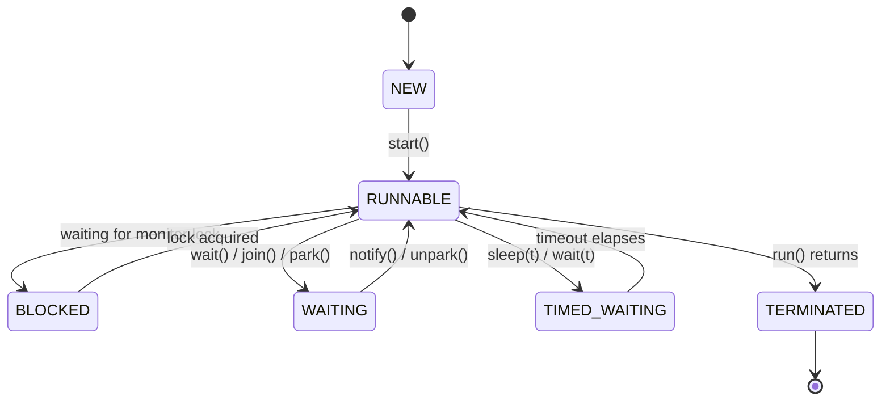

A **thread** is an independent path of execution within a process. Every JVM starts with one thread (`main`); creating more lets work proceed concurrently. A classic *platform* thread maps 1:1 to an OS thread, so it is a relatively heavy resource (roughly a megabyte of stack).

## Thread vs Runnable

`Runnable` is the **task** (*what* to do); `Thread` is the **worker** (*who* runs it). You can supply the task two ways:

```java
// 1. Implement Runnable (preferred) — task is separate from the worker
Runnable task = () -> System.out.println("Hello from " + Thread.currentThread());
Thread t1 = new Thread(task);
t1.start();

// 2. Subclass Thread (rarely a good idea) — couples task to Thread
class Printer extends Thread {
    public void run() { System.out.println("Hi"); }
}
new Printer().start();
```

Prefer `Runnable` (or `Callable`, or an `ExecutorService`). It keeps your task free of `Thread`'s API, lets you reuse it across pools, and leaves your single inheritance slot open.

## `start()` vs `run()`

This is the canonical trap. `start()` asks the JVM to create a **new** call stack and schedule it; the JVM then invokes `run()` on that new thread. Calling `run()` yourself just executes the method **on the current thread** — no concurrency happens at all.

```java
t1.start();   // runs concurrently on a new thread
t1.run();     // runs synchronously on the CALLING thread — a plain method call
```

:::gotcha
Calling `start()` a second time throws `IllegalThreadStateException`. A `Thread` object is single-use; once it terminates it cannot be restarted. Create a new one (or, better, use a pool).
:::

## The thread lifecycle

`Thread.getState()` returns one of six values from the `Thread.State` enum. Note there is **no separate "running" state** — `RUNNABLE` covers both "ready to run" and "currently on a CPU", because the JVM does not distinguish them.



| State | Meaning |
|-------|---------|
| `NEW` | Created but `start()` not yet called |
| `RUNNABLE` | Eligible to run (running or waiting for a CPU) |
| `BLOCKED` | Waiting to acquire an intrinsic (monitor) lock |
| `WAITING` | Parked indefinitely via `wait()`, `join()`, `LockSupport.park()` |
| `TIMED_WAITING` | Same, but with a timeout (`sleep`, timed `wait`/`join`) |
| `TERMINATED` | `run()` has completed (normally or via exception) |

## sleep, join, and daemon threads

- **`Thread.sleep(ms)`** — a *static* method that pauses the **current** thread for a duration. It does **not** release any locks it holds.
- **`t.join()`** — blocks the caller until thread `t` finishes; the tool for "wait for this work to complete".
- **Daemon threads** — background threads (e.g. GC). The JVM exits when only daemon threads remain, abandoning them. Set the flag **before** `start()`.

```java
Thread worker = new Thread(this::poll);
worker.setDaemon(true);   // JVM won't wait for it on shutdown
worker.start();
worker.join(2000);        // wait up to 2s for it to finish
```

:::gotcha
A daemon thread can be killed mid-operation on JVM shutdown — its `finally` blocks may never run. Never use daemon threads for work that must complete or flush (writing files, releasing external resources).
:::

## Interruption — cooperative cancellation

Java has no safe way to forcibly kill a thread (`Thread.stop()` is deprecated and dangerous). Instead, cancellation is **cooperative**: `t.interrupt()` sets a flag. Blocking calls like `sleep`, `wait`, and `join` detect it, throw `InterruptedException`, **and clear the flag**. Long-running loops must poll `Thread.currentThread().isInterrupted()` and stop themselves.

```java
public void run() {
    while (!Thread.currentThread().isInterrupted()) {
        try {
            doChunkOfWork();
            Thread.sleep(100);
        } catch (InterruptedException e) {
            Thread.currentThread().interrupt(); // RESTORE the flag, then exit
            return;
        }
    }
}
```

:::senior
Never swallow `InterruptedException` with an empty `catch`. Either propagate it or restore the flag via `Thread.currentThread().interrupt()` so higher layers can react. Silently dropping it breaks cancellation, shutdown, and thread-pool reuse — a frequent cause of hangs that won't die on `Ctrl-C`.
:::

## Check yourself

```quiz
title: 'Threads — start vs run, daemons'
questions:
  - q: 'What does calling `t.run()` directly (instead of `t.start()`) do?'
    options:
      - text: 'Runs the body synchronously on the *calling* thread — no new thread is created.'
        correct: true
      - 'Creates a new thread and runs the body on it.'
      - 'Throws `IllegalThreadStateException`.'
      - 'Nothing — `run()` cannot be invoked directly.'
    explain: '`start()` asks the JVM to create a new call stack and then invokes `run()` on it. Calling `run()` yourself is an ordinary method call on the current thread, so no concurrency happens.'
  - q: 'What does calling `start()` a second time on the same `Thread` object do?'
    options:
      - 'Restarts the thread from the beginning.'
      - text: 'Throws `IllegalThreadStateException` — a `Thread` is single-use.'
        correct: true
      - 'Silently does nothing.'
      - 'Runs `run()` again on the same OS thread.'
    explain: 'A terminated `Thread` cannot be restarted. Create a new thread (or, better, use a pool).'
  - q: 'Only daemon threads are still running. What does the JVM do?'
    options:
      - 'Waits for them all to finish, then exits.'
      - text: 'Exits immediately and abandons them — their `finally` blocks may never run.'
        correct: true
      - 'Promotes one daemon to a non-daemon thread.'
      - 'Throws an exception.'
    explain: 'Daemon threads do not keep the JVM alive; when only daemons remain it shuts down. Never use a daemon for work that must complete or flush, and set the flag *before* `start()`.'
```

```flashcards
title: 'Thread.State lifecycle'
cards:
  - front: '`NEW`'
    back: 'Created, but `start()` has **not** been called yet.'
  - front: '`RUNNABLE`'
    back: 'Eligible to run — executing on a CPU *or* waiting for one. There is **no** separate "running" state.'
  - front: '`BLOCKED`'
    back: 'Waiting to acquire an intrinsic **monitor lock** (e.g. to enter a `synchronized` block).'
  - front: '`WAITING`'
    back: 'Parked **indefinitely** via `wait()`, `join()`, or `LockSupport.park()` until another thread signals it.'
  - front: '`TIMED_WAITING`'
    back: 'Like `WAITING`, but with a deadline: `sleep(t)`, timed `wait(t)`, or `join(t)`.'
  - front: '`TERMINATED`'
    back: '`run()` has finished — normally or via an exception. The thread cannot be restarted.'
```

:::key
A `Runnable` is the task; a `Thread` runs it. `start()` spawns a new thread and calls `run()` for you — calling `run()` directly is just a synchronous method call. Threads move through six `Thread.State` values (no distinct "running" state). Daemon threads don't keep the JVM alive; `join` waits for completion; cancellation is **cooperative** via interruption, so always restore or propagate `InterruptedException`.
:::
