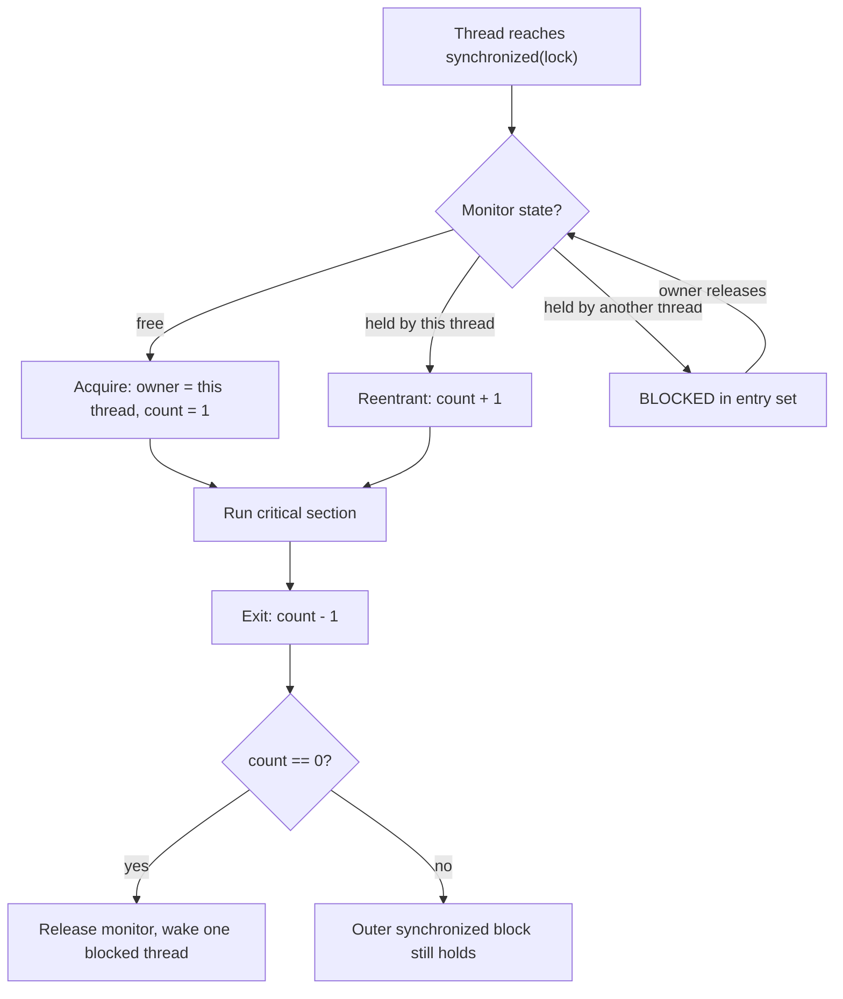

When multiple threads read and write the **same mutable state** without coordination, you get a **race condition**: the result depends on the unpredictable interleaving of operations.

## The race condition

`count++` looks atomic but is three steps — **read**, increment, **write**. Two threads can read the same value, both increment, and both write back, losing an update.

```java
class Counter {
    private int count = 0;
    void increment() { count++; }   // read-modify-write — NOT atomic
    int get() { return count; }
}
// Two threads each calling increment() 1_000_000 times
// rarely yields 2_000_000 — updates are lost.
```

## `synchronized` — mutual exclusion + visibility

Every Java object has an **intrinsic lock** (a *monitor*). The `synchronized` keyword acquires it on entry and releases it on exit, guaranteeing that only one thread holds it at a time. It provides **two** things: mutual exclusion *and* memory **visibility** (a happens-before edge — what one thread did before releasing is visible to the next thread that acquires).

```java
synchronized void increment() { count++; }   // locks 'this'
static synchronized void s() { }              // locks Counter.class

void block() {
    synchronized (lock) {   // lock on a SPECIFIC object — finer-grained
        count++;
    }
}
```

- A `synchronized` **method** locks `this` (instance) or the `Class` object (static).
- A `synchronized` **block** locks any object you name — prefer a `private final Object lock = new Object();` so callers can't grab your lock.

Intrinsic locks are **reentrant**: a thread already holding a lock can re-acquire it (e.g. one `synchronized` method calling another on the same object) without deadlocking itself. The monitor keeps an **owner** and an **entry count** — each re-entry increments it, each exit decrements it, and the lock is released only when the count reaches zero.



:::note
Uncontended `synchronized` is cheap — the JVM uses a lightweight *thin lock* (a CAS on the object header) and only **inflates** to a full OS-backed monitor when threads actually contend. So "synchronized is slow" is folklore; *contention* is slow. (Biased locking, an older optimisation for single-threaded reacquisition, was deprecated and disabled by default in JDK 15.)
:::

:::gotcha
The lock is on the **object**, not the code. Synchronizing on different instances (or on a `new Integer`/boxed value) provides no protection. Conversely, synchronizing on a shared mutable field whose reference can change is a bug — always lock on a `private final` field.
:::

## `wait` / `notify` — the monitor's wait set

Each monitor also carries a **wait set**. Calling `lock.wait()` atomically *releases* the lock and parks the thread until another thread calls `lock.notify()` (wakes one) or `notifyAll()` (wakes all); the woken thread must **re-acquire the lock** before returning from `wait()`.

```java
synchronized (queue) {
    while (queue.isEmpty()) {   // ALWAYS a while, never an if
        queue.wait();           // releases the lock while parked
    }
    return queue.remove();      // condition re-checked, lock held
}
// Producer: synchronized (queue) { queue.add(item); queue.notifyAll(); }
```

Three rules interviewers listen for: you must **hold the monitor** when calling `wait`/`notify` (else `IllegalMonitorStateException`); you guard with a **`while` loop**, because *spurious wakeups* are permitted and the condition may be re-falsified between wake-up and lock re-acquisition; and you prefer **`notifyAll`** unless every waiter is interchangeable — `notify` wakes an arbitrary thread, which can strand the one that actually needed the signal. In new code, prefer a `BlockingQueue` or `Condition` over hand-rolled `wait`/`notify`.

## `ReentrantLock` — the explicit alternative

`java.util.concurrent.locks.ReentrantLock` offers the same semantics with more control. The price: you must `unlock()` yourself, always in a `finally`.

```java
private final ReentrantLock lock = new ReentrantLock();

void update() {
    lock.lock();
    try {
        // critical section
    } finally {
        lock.unlock();   // MUST be in finally, or a thrown exception leaks the lock
    }
}
```

| Feature | `synchronized` | `ReentrantLock` |
|---------|----------------|-----------------|
| Acquire/release | implicit (block scope) | manual (`lock`/`unlock`) |
| Timed / give-up | no | `tryLock(timeout)` |
| Interruptible wait | no | `lockInterruptibly()` |
| Fairness option | no | yes (`new ReentrantLock(true)`) |
| Multiple conditions | one wait-set | many via `newCondition()` |
| Risk | can't leak | leaks if you forget `finally` |

`tryLock` is the key extra power — it lets a thread *back off* instead of blocking forever, which is a primary defence against deadlock.

## `ReadWriteLock` — many readers OR one writer

When data is read far more often than written, a single mutex needlessly serialises readers. `ReentrantReadWriteLock` allows **any number of concurrent readers** *or* **one exclusive writer**.

```java
private final ReadWriteLock rw = new ReentrantReadWriteLock();

V read(K key) {
    rw.readLock().lock();
    try { return map.get(key); }
    finally { rw.readLock().unlock(); }
}
void write(K key, V val) {
    rw.writeLock().lock();
    try { map.put(key, val); }
    finally { rw.writeLock().unlock(); }
}
```

:::senior
For read-heavy workloads, `StampedLock` (Java 8) often beats `ReadWriteLock` thanks to an **optimistic read** mode (`tryOptimisticRead`) that takes no lock at all and validates afterward. Caveats: `StampedLock` is **not reentrant** and supports no `Condition`. For most code, a `ConcurrentHashMap` or an immutable snapshot beats hand-rolled read/write locking entirely — reach for explicit locks only when you genuinely need them.
:::

## The seed of deadlock

The moment you hold more than one lock, ordering matters. Two threads that grab locks `A` and `B` in **opposite** order can each hold one and wait forever for the other.

```java
// Thread 1: synchronized(A){ synchronized(B){...} }
// Thread 2: synchronized(B){ synchronized(A){...} }  // ← reversed: deadlock risk
```

The fix is a **global lock-ordering** rule: always acquire locks in the same, consistent order everywhere. (Deadlock and its four necessary conditions are covered in depth in *Concurrency Pitfalls*.)

## Check yourself

```quiz
title: 'Locks & monitors'
questions:
  - q: 'Which guarantees does `synchronized` give you?'
    options:
      - 'Mutual exclusion only — visibility needs `volatile` on every field.'
      - text: '**Mutual exclusion** and **visibility**: writes made before releasing the monitor are visible to the next thread that acquires it.'
        correct: true
      - 'Visibility only — two threads can still be inside the block at once.'
      - 'Atomicity for all fields of the object, even outside the block.'
    explain: 'Monitor release/acquire is a happens-before edge, so `synchronized` covers both exclusion *and* visibility for the guarded state. Fields accessed outside any lock get neither.'
  - q: 'Thread 1 runs a `synchronized` instance method; thread 2 simultaneously runs a `static synchronized` method of the same class. What happens?'
    options:
      - 'Thread 2 blocks until thread 1 exits — same class, same lock.'
      - text: 'Both run concurrently — the instance method locks `this`, the static method locks the `Class` object. Different locks.'
        correct: true
      - 'It throws `IllegalMonitorStateException`.'
      - 'They deadlock.'
    explain: 'A `synchronized` instance method locks the instance; a `static synchronized` method locks `ClassName.class`. Two different monitors never exclude each other — a classic source of accidental races.'
  - q: 'Why must `wait()` be called inside a `while (!condition)` loop instead of an `if`?'
    options:
      - 'Because `wait()` can only be compiled inside a loop.'
      - text: 'Spurious wakeups are permitted, and the condition can be re-falsified by another thread between `notify` and re-acquiring the lock — so it must be re-checked.'
        correct: true
      - 'To make the code run faster by polling.'
      - 'Only `notifyAll()` requires a loop; `notify()` works with `if`.'
    explain: 'A woken thread re-competes for the monitor; by the time it re-enters, another thread may have consumed the condition. The JVM is also allowed to wake threads spuriously. Re-checking in a loop is mandatory for correctness in both cases.'
  - q: 'What does `synchronized (new Object()) { count++; }` protect?'
    options:
      - text: 'Nothing — every thread locks a *different* brand-new object, so no exclusion ever happens.'
        correct: true
      - 'It protects `count`, since any monitor works.'
      - 'It protects `count`, but only on a single-core machine.'
      - 'It throws at runtime because the object escapes.'
    explain: 'Mutual exclusion requires all threads to contend on the **same** monitor. Locking a fresh local object (or a boxed value that may be freshly autoboxed) excludes nobody — always lock a shared `private final` field.'
```

:::key
Unsynchronized access to shared mutable state is a **race condition**. `synchronized` uses an object's intrinsic, reentrant **monitor** to give both mutual exclusion *and* visibility. `ReentrantLock` adds `tryLock`, interruptible and fair acquisition, and multiple conditions — but you must `unlock()` in a `finally`. `ReadWriteLock` scales read-heavy access. Always lock on a `private final` object, and acquire multiple locks in a consistent global order to avoid deadlock.
:::
