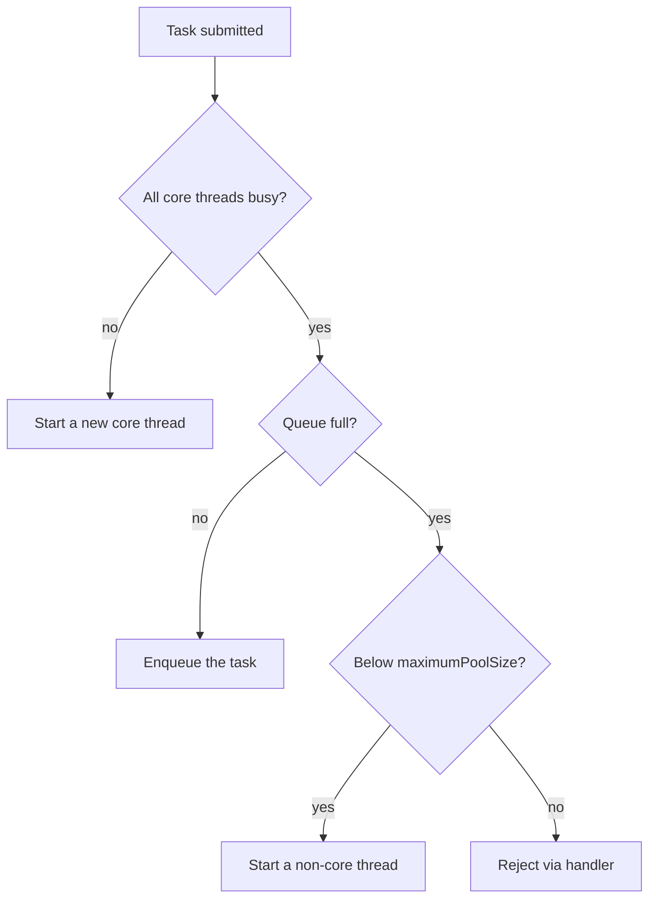

Creating a `new Thread()` per task is wasteful (thread creation is expensive) and unbounded (a flood of tasks spawns a flood of threads). The **Executor framework** (Java 5) decouples *task submission* from *thread management*: you submit tasks; a reusable **pool** of worker threads runs them.

## ExecutorService and the factory

`ExecutorService` is the main interface; the `Executors` factory produces ready-made pools.

```java
ExecutorService pool = Executors.newFixedThreadPool(4);
pool.execute(() -> log.info("fire and forget"));   // Runnable
Future<Integer> f = pool.submit(() -> compute());  // Callable<Integer>
int result = f.get();                              // blocks until done
```

| Factory method | Behaviour | Use when |
|----------------|-----------|----------|
| `newFixedThreadPool(n)` | exactly `n` threads, unbounded queue | steady, CPU-bound load |
| `newCachedThreadPool()` | grows unboundedly, idle threads reaped after 60s | many short, bursty tasks |
| `newSingleThreadExecutor()` | one thread, tasks run in order | sequential task pipeline |
| `newScheduledThreadPool(n)` | delayed / periodic execution | timers, polling |
| `newVirtualThreadPerTaskExecutor()` | a fresh virtual thread per task (Java 21) | high-concurrency blocking I/O |

## Callable and Future

`Runnable` returns nothing and can't throw checked exceptions. `Callable<V>` returns a value and may throw. `submit` hands back a `Future<V>` — a handle to a result that may not exist yet.

```java
Callable<String> task = () -> fetch(url);
Future<String> future = pool.submit(task);
// ... do other work ...
String body = future.get(2, TimeUnit.SECONDS);  // waits, with timeout
boolean done = future.isDone();
future.cancel(true);                             // interrupt if running
```

`invokeAll` runs a batch and returns when all complete; `invokeAny` returns the first success.

:::gotcha
`submit` **swallows exceptions**: a task that throws does not print a stack trace — the exception is stored and re-thrown (wrapped in `ExecutionException`) only when you call `future.get()`. If you never call `get()`, the failure vanishes silently. Use `execute` for fire-and-forget work so uncaught exceptions reach the thread's `UncaughtExceptionHandler`.
:::

## Shutdown: graceful vs forceful

A pool's non-daemon threads keep the JVM alive, so you **must** shut it down.

```java
pool.shutdown();                       // stop accepting; finish queued tasks
if (!pool.awaitTermination(30, TimeUnit.SECONDS)) {
    pool.shutdownNow();                // interrupt running, drop the queue
}
```

- **`shutdown()`** — orderly: rejects new tasks, lets submitted ones finish.
- **`shutdownNow()`** — best-effort stop: interrupts active threads and returns the list of never-started tasks. (It only *interrupts* — tasks that ignore interruption keep running.)

## ThreadPoolExecutor — what the factories hide

Every pool above is a `ThreadPoolExecutor`. Understanding its parameters lets you build the right pool instead of accepting a factory's defaults.

```java
new ThreadPoolExecutor(
    4,                          // corePoolSize  — threads kept alive
    16,                         // maximumPoolSize — hard ceiling
    60, TimeUnit.SECONDS,       // keepAliveTime  — idle reap for non-core
    new ArrayBlockingQueue<>(100),         // bounded work queue
    new ThreadFactoryBuilder().build(),    // names threads for debugging
    new ThreadPoolExecutor.CallerRunsPolicy()); // rejection handler
```

The growth algorithm is the part interviewers probe:



The order surprises people: the pool prefers **queueing over growing** — extra threads beyond core start only once the queue is *full*. So with an **unbounded** queue (what `newFixedThreadPool` uses), step D is never "full", `maximumPoolSize` is meaningless, and a backlog grows without limit until you run out of memory.

When the pool does reject, the **rejection handler** decides what happens:

| Policy | Behaviour | Consequence |
|--------|-----------|-------------|
| `AbortPolicy` (default) | throws `RejectedExecutionException` | caller must handle the failure |
| `CallerRunsPolicy` | the *submitting* thread runs the task itself | natural back-pressure — the producer slows down |
| `DiscardPolicy` | drops the task silently | data loss with no signal — rarely acceptable |
| `DiscardOldestPolicy` | evicts the oldest queued task, retries | sacrifices the longest-waiting work |

## Scheduled execution

`ScheduledExecutorService` runs tasks after a delay or periodically — the modern replacement for `Timer` (which used a single thread and died permanently if a task threw).

```java
ScheduledExecutorService ses = Executors.newScheduledThreadPool(2);
ses.scheduleAtFixedRate(this::poll, 0, 10, TimeUnit.SECONDS);   // every 10s by the clock
ses.scheduleWithFixedDelay(this::sync, 0, 10, TimeUnit.SECONDS); // 10s AFTER each finish
```

- **`scheduleAtFixedRate`** targets a constant *rate*; if a run overruns its period, subsequent runs start late and then run back-to-back (they never execute concurrently).
- **`scheduleWithFixedDelay`** waits a fixed gap *after* each completion — use it when runs must not bunch up.

:::gotcha
If a periodic task **throws**, the exception is silently captured and **all future runs are cancelled** — the schedule just stops, with no log line. Wrap the body in a `try/catch (Throwable)` that logs, or your "every 10 seconds" job dies quietly the first time it hiccups.
:::

## Sizing a pool

- **CPU-bound** work: `threads ≈ cores + 1` (`Runtime.getRuntime().availableProcessors()`). More threads just thrash on context switches.
- **I/O-bound** work: threads spend most time waiting, so you need more. A rule of thumb: `cores * (1 + waitTime / computeTime)`.

:::senior
In production, avoid the `Executors` factories — they hide an **unbounded queue** (fixed/single) or **unbounded thread count** (cached), both of which fail catastrophically under load. Construct a `ThreadPoolExecutor` with a **bounded queue**, a **named thread factory** (so thread dumps are readable), and an explicit **rejection policy** (`CallerRunsPolicy` provides natural back-pressure). For blocking I/O on Java 21, prefer `newVirtualThreadPerTaskExecutor()` over a large fixed pool.
:::

## Check yourself

```quiz
title: 'Thread pools'
questions:
  - q: 'A `ThreadPoolExecutor` has core=4, max=16, queue capacity=100. Four tasks are running and a fifth arrives. What happens?'
    options:
      - 'A fifth thread starts immediately — the pool grows toward max.'
      - text: 'The task is **queued** — non-core threads start only when the queue is full.'
        correct: true
      - 'The task is rejected because all core threads are busy.'
      - 'The submitting thread runs it (caller-runs).'
    explain: 'Growth order is: fill core threads → fill the queue → only then add threads up to max → then reject. Most people guess the pool grows before queueing — it does not.'
  - q: 'Why does `Executors.newFixedThreadPool(4)` never create more than 4 threads even under a huge backlog?'
    options:
      - text: 'Its queue is **unbounded**, so the "queue full" branch that would add threads never triggers.'
        correct: true
      - 'Because `maximumPoolSize` is 4 more than core size.'
      - 'The JVM caps pools at the CPU count.'
      - 'It does grow, but only after 60 seconds of saturation.'
    explain: 'Fixed pools use an unbounded `LinkedBlockingQueue`, so tasks queue forever instead of triggering growth — the real production risk is unbounded memory, not thread count.'
  - q: 'A task submitted with `pool.submit(...)` throws a `RuntimeException`. Where does it surface?'
    options:
      - 'It is printed by the default `UncaughtExceptionHandler` immediately.'
      - text: 'Nowhere — it is stored in the `Future` and re-thrown (wrapped in `ExecutionException`) only when someone calls `get()`.'
        correct: true
      - 'It kills the worker thread and shrinks the pool.'
      - 'It propagates to the thread that called `submit`.'
    explain: '`submit` captures any thrown exception inside the returned `Future`. If nobody calls `get()`, the failure is silent. Use `execute` for fire-and-forget so exceptions reach the uncaught-exception handler.'
  - q: 'A task scheduled with `scheduleAtFixedRate` throws on its third run. What happens to the schedule?'
    options:
      - 'The exception is logged and the schedule continues.'
      - text: 'All subsequent runs are silently cancelled — the periodic task never fires again.'
        correct: true
      - 'The executor shuts down.'
      - 'The run is retried once, then skipped.'
    explain: 'An uncaught throwable from a periodic task cancels the schedule with no log output. Always wrap periodic task bodies in a catch-all that logs.'
```

:::key
Executors reuse a pool of threads so you don't manage threads by hand. `submit` returns a `Future` (and silently captures exceptions until `get()`); `execute` is fire-and-forget. Always `shutdown()` (graceful) then `shutdownNow()` (forceful) the pool. Under the hood every pool is a `ThreadPoolExecutor` defined by *core size, max size, keep-alive, queue, factory, and rejection handler* — prefer building one with a **bounded queue** over the `Executors` factory shortcuts.
:::
