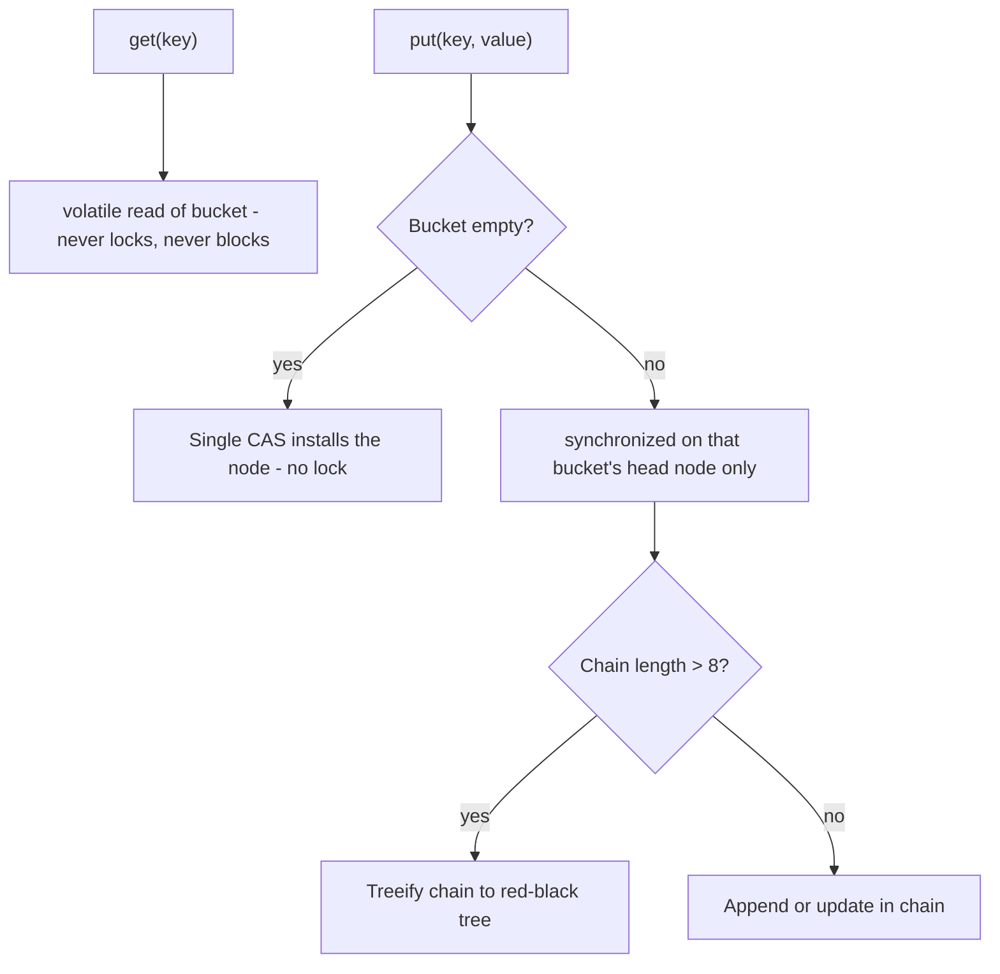

The `java.util.concurrent` collections are engineered for **scalable** concurrent access. They beat the legacy `Collections.synchronizedX` wrappers, which simply guard every method with one lock.

## Why not just `Collections.synchronizedMap`?

`Collections.synchronizedMap(map)` wraps each method in `synchronized`. That gives a single, coarse-grained lock — every operation contends on it, so throughput collapses under load. Worse, **compound actions and iteration are still not safe**: you must lock manually, or risk `ConcurrentModificationException`.

```java
Map<String,Integer> m = Collections.synchronizedMap(new HashMap<>());
// Iteration needs EXTERNAL synchronization or it can throw CME:
synchronized (m) {
    for (var e : m.entrySet()) { /* ... */ }
}
// Check-then-act is still a race even though each call is atomic:
if (!m.containsKey(k)) m.put(k, v);   // two threads can both pass the check
```

## ConcurrentHashMap (Java 8+ design)

`ConcurrentHashMap` is the workhorse. The key thing to know is that the **Java 8 redesign dropped the old segment locks** (the `Segment` array of Java 7). It now uses the same bucket array as `HashMap`, with **fine-grained synchronization per bucket**:

- **Reads are lock-free.** Buckets and values are `volatile`, so `get` never blocks.
- **Inserting into an empty bucket** uses a single **CAS** (compare-and-swap) — no lock at all.
- **Inserting into a non-empty bucket** synchronizes only on **that bucket's head node**, so unrelated buckets proceed in parallel. Concurrency now scales with the number of buckets, not a fixed segment count.
- Long collision chains **treeify** into red-black trees, just like `HashMap`.



```java
ConcurrentHashMap<String,Integer> counts = new ConcurrentHashMap<>();
counts.merge(word, 1, Integer::sum);            // atomic increment
counts.computeIfAbsent(key, k -> loadExpensive(k)); // atomic, runs lambda once
counts.putIfAbsent("x", 0);
Set<String> seen = ConcurrentHashMap.newKeySet();   // the "ConcurrentHashSet"
```

There is no `ConcurrentHashSet` class — the idiomatic concurrent set is `ConcurrentHashMap.newKeySet()` (or `Collections.newSetFromMap(new ConcurrentHashMap<>())` pre-Java 8).

:::gotcha
`ConcurrentHashMap` permits **no null keys or values** (unlike `HashMap`), so `map.get(k) == null` unambiguously means "absent". Its iterators are **weakly consistent** — they never throw `ConcurrentModificationException` but may or may not reflect concurrent updates, and `size()` is an **estimate**, valid only as a snapshot. Don't build logic on an exact live `size()`.
:::

## CopyOnWriteArrayList

Every mutation copies the **entire** backing array; readers operate on an immutable snapshot with **no locking**.

```java
List<Listener> listeners = new CopyOnWriteArrayList<>();
listeners.add(l);                 // copies the whole array
for (Listener l : listeners) { }  // iterates a stable snapshot — never throws CME
```

Use it only for **read-mostly, small** collections (classically, event-listener lists). Writes are O(n) and allocate, so it is a terrible choice for write-heavy or large data.

## BlockingQueue — the producer/consumer backbone

A `BlockingQueue` blocks producers when full and consumers when empty — the foundation of work-handoff and thread pools.

```java
BlockingQueue<Task> queue = new ArrayBlockingQueue<>(1000);
queue.put(task);          // blocks if full   (producer)
Task t = queue.take();    // blocks if empty  (consumer)
queue.offer(task, 1, TimeUnit.SECONDS);  // timed variant
```

| Implementation | Capacity | Notes |
|----------------|----------|-------|
| `ArrayBlockingQueue` | bounded (fixed) | array-backed; natural back-pressure |
| `LinkedBlockingQueue` | optionally bounded | higher throughput; unbounded by default |
| `SynchronousQueue` | **zero** | direct hand-off; used by cached pools |
| `PriorityBlockingQueue` | unbounded | ordered by comparator; not FIFO |
| `DelayQueue` | unbounded | elements emerge only after a delay |
| `LinkedTransferQueue` | unbounded | `transfer()` waits for a consumer |

## Choosing a collection

| Need | Use |
|------|-----|
| Concurrent map | `ConcurrentHashMap` |
| Sorted concurrent map | `ConcurrentSkipListMap` |
| Read-mostly list / listeners | `CopyOnWriteArrayList` |
| Producer/consumer hand-off | a `BlockingQueue` |
| Non-blocking FIFO queue | `ConcurrentLinkedQueue` |
| Legacy code, low contention | `Collections.synchronizedX` |

:::senior
Reach for a dedicated concurrent collection over `synchronized` wrappers — but remember the atomicity boundary is a **single method call**. `if (!map.containsKey(k)) map.put(k,v)` is still a race even on a `ConcurrentHashMap`; use the **atomic combinators** (`putIfAbsent`, `compute`, `merge`, `computeIfAbsent`) instead. And keep the `computeIfAbsent` mapping function short and side-effect-free — it runs while holding the bin lock, so blocking inside it stalls other writers to that bucket. A mapping function that touches the **same map again** (a recursive `computeIfAbsent`) is outright forbidden: it can throw `IllegalStateException: Recursive update` or deadlock on the bin lock.
:::

## Check yourself

```quiz
title: 'Concurrent collections'
questions:
  - q: 'Why does `ConcurrentHashMap` forbid `null` keys and values when `HashMap` allows them?'
    options:
      - 'Nulls would break the CAS instruction.'
      - text: 'In a concurrent map, `get(k) == null` must unambiguously mean "absent" — with nulls allowed you could not tell "mapped to null" from "not present" without a racy two-call check.'
        correct: true
      - 'It is a legacy restriction inherited from `Hashtable` that could be lifted.'
      - 'Null keys cannot be hashed.'
    explain: 'In `HashMap` you can disambiguate with `containsKey`, but in a concurrent map a `containsKey` + `get` pair is a race — the map can change between the calls. Banning nulls makes the single atomic `get` self-sufficient.'
  - q: 'Is `if (!chm.containsKey(k)) chm.put(k, v);` thread-safe on a `ConcurrentHashMap`?'
    options:
      - 'Yes — every method of `ConcurrentHashMap` is thread-safe.'
      - text: 'No — each call is atomic, but the check-then-act **sequence** is not. Use `putIfAbsent`/`computeIfAbsent`.'
        correct: true
      - 'Yes, as long as the map was sized correctly at construction.'
      - 'No, because `containsKey` locks the whole table.'
    explain: 'Thread safety of individual methods never composes into atomicity of a sequence. Two threads can both pass the `containsKey` check and both `put`. The atomic combinators exist precisely for this.'
  - q: 'A `CopyOnWriteArrayList` holds 100,000 elements and receives frequent writes. What is the problem?'
    options:
      - 'Readers block while a write is in progress.'
      - text: 'Every single mutation copies the entire 100k-element array — O(n) time and allocation per write, hammering the GC.'
        correct: true
      - 'Iterators throw `ConcurrentModificationException` under load.'
      - 'It silently drops concurrent writes.'
    explain: 'Copy-on-write is for **small, read-mostly** data (listener lists). Readers never block and iterate a stable snapshot — but each write clones the whole array, so large or write-heavy usage collapses.'
  - q: 'Which queue does a *cached* thread pool use internally, and why?'
    options:
      - 'An unbounded `LinkedBlockingQueue`, to buffer bursts.'
      - text: 'A `SynchronousQueue` — zero capacity, so every hand-off either goes straight to a free thread or spawns a new one.'
        correct: true
      - 'An `ArrayBlockingQueue` of size 1000.'
      - 'A `PriorityBlockingQueue` ordered by submission time.'
    explain: 'A `SynchronousQueue` has no storage: `offer` succeeds only if a consumer is already waiting. That is exactly the cached pool''s contract — never queue, always run immediately, growing the pool if needed.'
```

:::key
`Collections.synchronizedX` uses one coarse lock and still needs manual locking for iteration and check-then-act. `ConcurrentHashMap` (Java 8+) uses **lock-free reads, CAS on empty buckets, and per-bucket-head synchronization** — not segment locks — and forbids nulls; use its atomic `compute`/`merge`/`putIfAbsent` for compound updates. `CopyOnWriteArrayList` suits read-mostly lists; the `BlockingQueue` family powers producer/consumer pipelines.
:::
