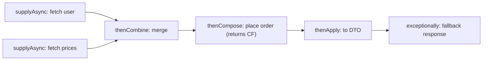

A plain `Future` can only be polled or blocked on with `get()` — you cannot say "when this finishes, do that". `CompletableFuture` (Java 8) fixes this: it implements `Future` **and** `CompletionStage`, letting you build non-blocking pipelines of dependent steps.

## Starting an async computation

```java
CompletableFuture<String> cf = CompletableFuture.supplyAsync(() -> fetch(url));
CompletableFuture<Void>   r  = CompletableFuture.runAsync(() -> log());   // no result
CompletableFuture<Integer> done = CompletableFuture.completedFuture(42);  // already done
```

- `supplyAsync(Supplier)` — runs work that **returns** a value.
- `runAsync(Runnable)` — runs work that returns nothing.
- Without an explicit executor, both run on the shared **`ForkJoinPool.commonPool()`**.

## Transforming results

Each step returns a new stage, so they **chain**. The `*Async` suffix moves the continuation onto a pool instead of the completing thread.

```java
CompletableFuture.supplyAsync(() -> loadUser(id))   // CF<User>
    .thenApply(User::email)        // transform value:        User  -> String
    .thenAccept(System.out::println) // consume value:        String -> void
    .thenRun(() -> log("done"));     // run after, ignore value
```

| Method | Input | Output | Purpose |
|--------|-------|--------|---------|
| `thenApply` | `T` | `U` | map the value |
| `thenAccept` | `T` | `void` | consume the value |
| `thenRun` | — | `void` | run an action, ignore value |
| `thenCompose` | `T` | `CF<U>` | **flat-map**: chain a dependent future |
| `thenCombine` | two `CF` | `U` | combine two **independent** futures |

## compose vs combine

Use **`thenCompose`** when the next step itself returns a `CompletableFuture` and **depends on** the previous result — it flattens `CF<CF<U>>` into `CF<U>` (the monadic flat-map):

```java
CompletableFuture<Order> order = getUser(id)        // CF<User>
    .thenCompose(user -> getLatestOrder(user));     // CF<Order>, not CF<CF<Order>>
```

Use **`thenCombine`** to join two futures that run **in parallel** and merge their results:

```java
CompletableFuture<Price> total = priceFut.thenCombine(taxFut,
    (price, tax) -> price.add(tax));   // both run concurrently, then merge
```

A realistic pipeline mixes both shapes — independent fetches combined, then a dependent call, with recovery at the end:



An exception thrown at *any* stage skips every normal stage downstream and jumps to the first `exceptionally`/`handle` — the async analogue of `throw` unwinding to the nearest `catch`.

## Timeouts and cancellation

Java 9 added timeouts you attach directly to the pipeline instead of blocking in `get(timeout)`:

```java
cf.orTimeout(2, TimeUnit.SECONDS)                    // fail with TimeoutException
cf.completeOnTimeout(DEFAULT_VALUE, 2, TimeUnit.SECONDS) // or degrade to a fallback
```

:::gotcha
`CompletableFuture.cancel(true)` does **not** interrupt the thread running the task — unlike `FutureTask`, it ignores the `mayInterruptIfRunning` flag entirely. It merely completes the future with a `CancellationException`; the underlying computation keeps running to completion, invisibly. If you need real interruption, submit to an `ExecutorService` and cancel the `Future` it returns, or check a flag inside the task.
:::

## Handling failure

Exceptions propagate down the chain (wrapped in `CompletionException`). Recover with:

```java
CompletableFuture.supplyAsync(() -> risky())
    .exceptionally(ex -> "fallback")          // recover: only runs on failure
    .handle((value, ex) ->                    // sees BOTH outcomes
        ex != null ? "error" : value)
    .whenComplete((value, ex) -> log(value, ex)); // side-effect, passes result through
```

- `exceptionally` — supplies a fallback **only** on error.
- `handle` — receives `(result, throwable)`; transforms either outcome.
- `whenComplete` — observes the outcome without altering it (the result/exception flows through).

## Fan-out: allOf / anyOf

```java
CompletableFuture<Void> all = CompletableFuture.allOf(a, b, c); // completes when ALL do
all.join();
List<String> results = Stream.of(a, b, c).map(CompletableFuture::join).toList();

CompletableFuture<Object> first = CompletableFuture.anyOf(a, b, c); // first to finish
```

`allOf` returns `CompletableFuture<Void>` — it signals completion but carries no values, so you re-read each future (now non-blocking) to collect results.

:::gotcha
`get()` throws **checked** `ExecutionException` (wrapping the real cause), while `join()` throws **unchecked** `CompletionException` — handy inside lambdas and streams. Either way the cause is wrapped one level deep, so unwrap with `ex.getCause()`. And never call a blocking `get()`/`join()` *inside* a stage running on the common pool — you can starve it.
:::

## Choosing the executor

The default `commonPool()` is sized to **`cores − 1`** and is **shared JVM-wide**. That is fine for short CPU-bound steps but dangerous for **blocking I/O**: a few blocked tasks can starve the whole pool (and everyone else using it). Pass a dedicated executor for blocking work.

```java
ExecutorService io = Executors.newFixedThreadPool(50);     // or a virtual-thread executor
CompletableFuture.supplyAsync(() -> callRemoteService(), io)
                 .thenApplyAsync(this::parse, io);
```

:::senior
Pick the `*Async` overload that takes an `Executor` for any stage that blocks, and isolate unrelated workloads onto **separate, bounded** pools so one slow dependency can't starve another. On Java 21, `Executors.newVirtualThreadPerTaskExecutor()` is an excellent backing executor for I/O-heavy `CompletableFuture` chains — blocking calls cost almost nothing.
:::

## Check yourself

```quiz
title: 'CompletableFuture'
questions:
  - q: 'You have `CF<User>` and a method `CF<Order> latestOrder(User u)`. Which operator chains them without ending up with `CF<CF<Order>>`?'
    options:
      - '`thenApply(this::latestOrder)`'
      - text: '`thenCompose(this::latestOrder)` — it flattens the nested future (flat-map).'
        correct: true
      - '`thenCombine(latestOrder, ...)`'
      - '`thenAccept(this::latestOrder)`'
    explain: '`thenApply` would wrap the returned future, giving `CF<CF<Order>>`. `thenCompose` is the monadic flat-map: the function itself returns a `CompletableFuture`, and compose flattens it. `thenCombine` is for two *independent* futures.'
  - q: 'By default, where does `supplyAsync(() -> blockingHttpCall())` run, and why is that risky?'
    options:
      - 'On a fresh thread per call — risk of thread explosion.'
      - text: 'On the shared `ForkJoinPool.commonPool()` (sized about cores − 1) — a few blocking calls can starve every user of the pool JVM-wide.'
        correct: true
      - 'On the calling thread — it blocks the caller.'
      - 'On a dedicated I/O pool sized 10 × cores.'
    explain: 'The common pool is tiny and shared by parallel streams and every default async stage in the JVM. Blocking its workers stalls unrelated code. Pass an explicit executor (or a virtual-thread executor on Java 21) for blocking work.'
  - q: 'What does `CompletableFuture.allOf(a, b, c)` return?'
    options:
      - 'A `CF<List<Object>>` containing the three results in order.'
      - text: 'A `CF<Void>` that completes when all three do — you re-read each future (e.g. via `join()`) to collect the values.'
        correct: true
      - 'A `CF<Object[]>` of results.'
      - 'The fastest of the three futures.'
    explain: 'The inputs may have heterogeneous types, so `allOf` only signals completion. After it completes, each `join()` returns instantly. (`anyOf` returns `CF<Object>` with the first result.)'
  - q: 'What does `cf.cancel(true)` do to a task already running inside `supplyAsync`?'
    options:
      - 'Interrupts the worker thread, like `FutureTask.cancel(true)`.'
      - text: 'Nothing to the task — it only completes the future with `CancellationException`; the computation keeps running in the background.'
        correct: true
      - 'Kills the worker thread immediately.'
      - 'Blocks until the task notices the flag and stops.'
    explain: '`CompletableFuture` ignores `mayInterruptIfRunning` — it has no reference to the thread running the work. Downstream stages see the cancellation, but the task itself runs to completion unless it checks its own cancellation signal.'
```

:::key
`CompletableFuture` turns futures into composable, non-blocking pipelines. Use `thenApply` to map, `thenCompose` to chain a **dependent** future (flat-map), and `thenCombine` to merge two **independent** ones. Recover with `exceptionally`/`handle`; fan out with `allOf`/`anyOf`. The default `commonPool` suits short CPU work — supply a **dedicated executor** (or a virtual-thread one) for blocking I/O so you don't starve the pool.
:::
