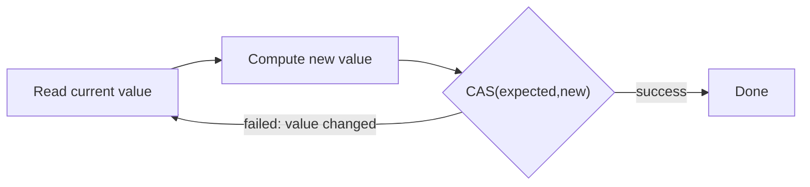

The `java.util.concurrent.atomic` package offers **lock-free**, single-variable thread safety. Instead of blocking with a lock, atomic operations use a hardware instruction to update a value, retrying if another thread got there first.

## The atomic classes

```java
AtomicInteger counter = new AtomicInteger(0);
counter.incrementAndGet();             // atomic ++value, returns new value
counter.getAndAdd(5);                  // atomic, returns old value
counter.compareAndSet(10, 20);         // set to 20 only if currently 10

AtomicReference<Node> head = new AtomicReference<>();
head.updateAndGet(curr -> new Node(curr));   // atomic transform via CAS loop
```

The family includes `AtomicInteger`, `AtomicLong`, `AtomicBoolean`, `AtomicReference<V>`, the array variants (`AtomicIntegerArray`…), and field updaters. All share the same engine: **compare-and-swap**.

## How compare-and-swap (CAS) works

CAS is a single atomic CPU instruction (`CMPXCHG` on x86, exposed via `VarHandle`/`Unsafe`). It takes three arguments — a memory location, an **expected** value, and a **new** value — and atomically: *if the location still holds `expected`, store `new` and report success; otherwise do nothing and report failure.*

```java
// Conceptually how incrementAndGet is built:
int current;
do {
    current = value;                       // optimistic read
} while (!compareAndSet(current, current + 1)); // retry if someone else changed it
```

This is **optimistic**: assume no conflict, attempt the update, and only loop if a competing thread won the race. Under low-to-moderate contention this beats locking — no thread is ever suspended, so there is no context-switch cost and no risk of deadlock.



:::note
Lock-free does not mean wait-free. Under heavy contention, threads can spin through many failed CAS retries, burning CPU. CAS shines when contention is **low to moderate**; for highly contended counters, prefer `LongAdder` (below) or a different design.
:::

## The ABA problem

CAS only checks that the value **equals** the expected one — not that it never changed. If a value goes `A → B → A`, a CAS expecting `A` **succeeds**, oblivious to the intervening change. For an `int` counter that is harmless; for a **reference** (e.g. a lock-free stack reusing nodes), it can corrupt the structure.

The fix is a **version stamp**: pair the value with a counter that increments on every change, so `A`(v1) and `A`(v3) are distinguishable.

```java
AtomicStampedReference<Node> top = new AtomicStampedReference<>(node, 0);
int[] stampHolder = new int[1];
Node curr = top.get(stampHolder);
int stamp = stampHolder[0];
top.compareAndSet(curr, next, stamp, stamp + 1);  // must match value AND stamp
```

(`AtomicMarkableReference` is a one-bit variant for "is this node logically deleted?".)

## LongAdder — scaling hot counters

A single `AtomicLong` becomes a bottleneck under heavy write contention: every thread CASes the **same** memory location, so they all fail and retry against each other (cache-line ping-pong). `LongAdder` (Java 8) spreads writes across **multiple internal cells** — different threads hit different cells, drastically cutting contention. `sum()` adds the cells together.

| | `AtomicLong` | `LongAdder` |
|---|---|---|
| Write contention | high (one hot location) | low (striped cells) |
| Exact value cheaply | yes (`get()`) | no (`sum()` aggregates) |
| Best for | low contention, need value often | hot counters/metrics, read rarely |

```java
LongAdder requests = new LongAdder();
requests.increment();          // contention-friendly
long total = requests.sum();   // aggregate when you actually need it
```

`LongAccumulator` generalises it to any associative function (max, custom merge).

:::senior
Default to high-level tools — `Atomic*` for single shared counters/flags, `LongAdder` for high-throughput metrics, and concurrent collections for everything structural. Hand-rolling lock-free data structures with raw CAS is genuinely hard: you must reason about the ABA problem, memory reclamation, and the JMM simultaneously, and bugs are timing-dependent and nearly impossible to reproduce. Use `VarHandle` (not the internal `sun.misc.Unsafe`) if you truly must.
:::

:::gotcha
`volatile` gives visibility but **not** atomic read-modify-write: `volatile long x; x++;` still loses updates. That's exactly the gap the atomic classes fill — `AtomicLong.incrementAndGet()` is the correct tool.
:::

:::key
Atomic classes provide lock-free updates via **compare-and-swap**: read, compute, swap-if-unchanged, retry on failure — optimistic, deadlock-free, and best under low/moderate contention. CAS can't detect an `A→B→A` change (the **ABA problem**); guard references with `AtomicStampedReference`. For hot counters, `LongAdder` stripes writes across cells and beats `AtomicLong`. And `volatile` alone can't make `x++` atomic — that's what these classes are for.
:::
