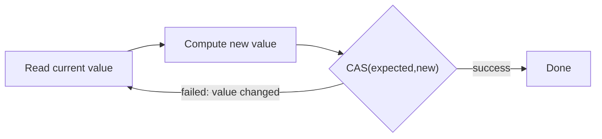

The `java.util.concurrent.atomic` package offers **lock-free**, single-variable thread safety. Instead of blocking with a lock, atomic operations use a hardware instruction to update a value, retrying if another thread got there first.

## The atomic classes

```java
AtomicInteger counter = new AtomicInteger(0);
counter.incrementAndGet();             // atomic ++value, returns new value
counter.getAndAdd(5);                  // atomic, returns old value
counter.compareAndSet(10, 20);         // set to 20 only if currently 10

AtomicReference<Node> head = new AtomicReference<>();
head.updateAndGet(curr -> new Node(curr));   // atomic transform via CAS loop
```

The family includes `AtomicInteger`, `AtomicLong`, `AtomicBoolean`, `AtomicReference<V>`, the array variants (`AtomicIntegerArray`…), and field updaters. All share the same engine: **compare-and-swap**.

Mind the naming convention: `incrementAndGet()` returns the **new** value, `getAndIncrement()` the **old** one — mixing them up is an off-by-one that survives code review. Java 9 added `compareAndExchange`, which returns the *witness value* (what the variable actually held) instead of a boolean, saving a re-read in retry loops.

## How compare-and-swap (CAS) works

CAS is a single atomic CPU instruction (`CMPXCHG` on x86, exposed via `VarHandle`/`Unsafe`). It takes three arguments — a memory location, an **expected** value, and a **new** value — and atomically: *if the location still holds `expected`, store `new` and report success; otherwise do nothing and report failure.*

```java
// Conceptually how incrementAndGet is built:
int current;
do {
    current = value;                       // optimistic read
} while (!compareAndSet(current, current + 1)); // retry if someone else changed it
```

This is **optimistic**: assume no conflict, attempt the update, and only loop if a competing thread won the race. Under low-to-moderate contention this beats locking — no thread is ever suspended, so there is no context-switch cost and no risk of deadlock.



:::note
Lock-free does not mean wait-free. Under heavy contention, threads can spin through many failed CAS retries, burning CPU. CAS shines when contention is **low to moderate**; for highly contended counters, prefer `LongAdder` (below) or a different design.
:::

## The ABA problem

CAS only checks that the value **equals** the expected one — not that it never changed. If a value goes `A → B → A`, a CAS expecting `A` **succeeds**, oblivious to the intervening change. For an `int` counter that is harmless; for a **reference** (e.g. a lock-free stack reusing nodes), it can corrupt the structure.

The fix is a **version stamp**: pair the value with a counter that increments on every change, so `A`(v1) and `A`(v3) are distinguishable.

```java
AtomicStampedReference<Node> top = new AtomicStampedReference<>(node, 0);
int[] stampHolder = new int[1];
Node curr = top.get(stampHolder);
int stamp = stampHolder[0];
top.compareAndSet(curr, next, stamp, stamp + 1);  // must match value AND stamp
```

(`AtomicMarkableReference` is a one-bit variant for "is this node logically deleted?".)

## LongAdder — scaling hot counters

A single `AtomicLong` becomes a bottleneck under heavy write contention: every thread CASes the **same** memory location, so they all fail and retry against each other (cache-line ping-pong). `LongAdder` (Java 8) spreads writes across **multiple internal cells** — different threads hit different cells, drastically cutting contention. `sum()` adds the cells together.

| | `AtomicLong` | `LongAdder` |
|---|---|---|
| Write contention | high (one hot location) | low (striped cells) |
| Exact value cheaply | yes (`get()`) | no (`sum()` aggregates) |
| Best for | low contention, need value often | hot counters/metrics, read rarely |

```java
LongAdder requests = new LongAdder();
requests.increment();          // contention-friendly
long total = requests.sum();   // aggregate when you actually need it
```

`LongAccumulator` generalises it to any associative function (max, custom merge).

:::senior
Default to high-level tools — `Atomic*` for single shared counters/flags, `LongAdder` for high-throughput metrics, and concurrent collections for everything structural. Hand-rolling lock-free data structures with raw CAS is genuinely hard: you must reason about the ABA problem, memory reclamation, and the JMM simultaneously, and bugs are timing-dependent and nearly impossible to reproduce. Use `VarHandle` (not the internal `sun.misc.Unsafe`) if you truly must.
:::

:::gotcha
`volatile` gives visibility but **not** atomic read-modify-write: `volatile long x; x++;` still loses updates. That's exactly the gap the atomic classes fill — `AtomicLong.incrementAndGet()` is the correct tool.
:::

## Check yourself

```quiz
title: 'CAS & atomics'
questions:
  - q: 'What exactly does `compareAndSet(expected, next)` do?'
    options:
      - 'Locks the variable, checks it, writes, and unlocks.'
      - text: 'Atomically writes `next` **only if** the variable still holds `expected`; otherwise it does nothing and reports failure — all in one CPU instruction.'
        correct: true
      - 'Writes `next` and returns the previous value.'
      - 'Spins until the variable equals `expected`, then writes.'
    explain: 'CAS is a single hardware instruction (e.g. `CMPXCHG`): compare-and-conditionally-swap, no lock, no blocking. Callers build retry loops around it — read, compute, CAS, repeat on failure.'
  - q: 'A lock-free stack pops node A, another thread pops A and B and pushes A back, then the first thread''s CAS on the head "A" succeeds. What is this failure called?'
    options:
      - 'A spurious wakeup.'
      - text: 'The **ABA problem** — CAS sees the same value and cannot tell the structure changed underneath; fix with `AtomicStampedReference` version stamps.'
        correct: true
      - 'A lost update.'
      - 'Priority inversion.'
    explain: 'CAS compares only the current value with the expected one. A value that went A→B→A passes the check even though the intervening change may have invalidated what the value points to. A version stamp makes A(v1) ≠ A(v3).'
  - q: '32 threads hammer one shared counter millions of times per second, and you read the total once per minute for metrics. Best tool?'
    options:
      - '`AtomicLong` — it is lock-free, so contention is irrelevant.'
      - text: '`LongAdder` — it stripes writes across internal cells so threads don''t CAS-fight over one cache line; `sum()` aggregates on the rare read.'
        correct: true
      - '`volatile long` with `++`.'
      - '`synchronized` on a `long` field.'
    explain: 'Lock-free is not contention-free: with `AtomicLong`, all 32 threads retry against one memory location (cache-line ping-pong). `LongAdder` trades exact-cheap-reads for near-linear write scaling — ideal for hot counters read rarely. `volatile long x; x++` is simply broken.'
```

:::key
Atomic classes provide lock-free updates via **compare-and-swap**: read, compute, swap-if-unchanged, retry on failure — optimistic, deadlock-free, and best under low/moderate contention. CAS can't detect an `A→B→A` change (the **ABA problem**); guard references with `AtomicStampedReference`. For hot counters, `LongAdder` stripes writes across cells and beats `AtomicLong`. And `volatile` alone can't make `x++` atomic — that's what these classes are for.
:::
