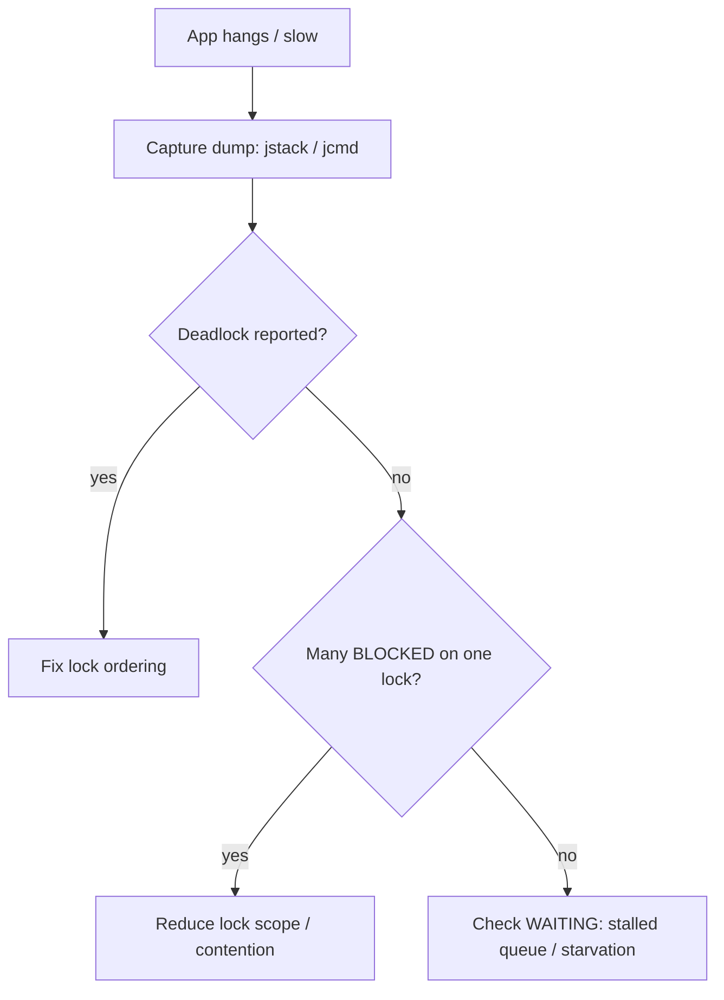

Concurrency bugs are **non-deterministic**: they depend on timing, so they pass tests, survive review, and surface only in production under load. Knowing the named failure modes lets you recognise and prevent them.

## Deadlock and the four Coffman conditions

A **deadlock** is a cycle of threads each waiting for a lock another holds, so none ever proceeds. Deadlock requires **all four** Coffman conditions to hold simultaneously — break **any one** and deadlock becomes impossible:

| Condition | Meaning | How to break it |
|-----------|---------|-----------------|
| **Mutual exclusion** | a resource is held exclusively | use lock-free / immutable structures |
| **Hold and wait** | hold one lock while requesting another | acquire all locks at once, or none |
| **No preemption** | locks can't be forcibly taken | use `tryLock` with a timeout, then back off |
| **Circular wait** | a cycle of "waiting-for" edges | impose a **global lock ordering** |

```java
// Classic circular wait: thread 1 takes A then B; thread 2 takes B then A
void transfer(Account from, Account to, long amt) {
    synchronized (from) {
        synchronized (to) {   // reversed args in another call => cycle => deadlock
            from.debit(amt); to.credit(amt);
        }
    }
}
```

The standard fix is **lock ordering** — always lock the lower-id account first, destroying the *circular wait* condition:

```java
Account first  = from.id() < to.id() ? from : to;
Account second = from.id() < to.id() ? to   : from;
synchronized (first) { synchronized (second) { /* transfer */ } }
```

`tryLock` with a timeout is the alternative, attacking *no preemption*:

```java
if (lockA.tryLock(1, SECONDS)) {
    try {
        if (lockB.tryLock(1, SECONDS)) { try { /* work */ } finally { lockB.unlock(); } }
    } finally { lockA.unlock(); }
}   // on failure, release everything and retry — no permanent block
```

## Livelock and starvation

- **Livelock** — threads are *active* but make no progress because they keep reacting to each other (two people stepping aside in a hallway, forever). Common with naive `tryLock`-and-retry that always retries immediately; add **randomised back-off** to break symmetry.
- **Starvation** — a thread *can* run but never gets the chance: a greedy thread monopolises a lock, low priority loses every scheduling race, or an unfair lock keeps handing off to newcomers. A **fair** lock (`new ReentrantLock(true)`) trades throughput for guaranteed ordering.

## Race conditions and visibility bugs

A **race condition** is unsynchronised access where the outcome depends on interleaving — typically **check-then-act** or **read-modify-write**:

```java
if (!map.containsKey(k)) map.put(k, v);   // two threads both pass the check
balance = balance - amount;               // lost-update race
```

A **visibility bug** is subtler: there is no interleaving problem, but one thread simply never *sees* another's write because no happens-before edge exists (see *The Java Memory Model*).

```java
private boolean stop = false;             // missing 'volatile'
public void run()  { while (!stop) {} }   // may spin forever — never sees the write
public void halt() { stop = true; }
```

:::gotcha
The most dangerous trait of races and visibility bugs is that they are **timing-dependent**. They vanish under a debugger (which serialises threads), pass on a fast dev laptop, and strike only on a many-core production box under load. "Works on my machine" is meaningless for concurrency — reason about correctness, don't rely on testing.
:::

## Diagnosing with thread dumps

When a JVM hangs, capture a **thread dump** — a snapshot of every thread's state and stack. The JVM even detects lock cycles for you.

```bash
jstack <pid>                 # or:  jcmd <pid> Thread.print
# kill -3 <pid> prints a dump to stdout (Unix)
```

What to look for:

- **`Found one Java-level deadlock`** — the JVM names the threads and the locks forming the cycle. Definitive.
- Many threads **`BLOCKED`** on the same monitor → lock contention; the dump shows which thread *owns* it (`- locked <0x...>`).
- Threads stuck in **`WAITING`/`TIMED_WAITING`** on a queue or condition → possible producer/consumer stall or starvation.



:::senior
The cheapest concurrency bug is the one you never create. Favour **immutability** and confinement (no shared mutable state, no bug); prefer **higher-level constructs** (`ExecutorService`, concurrent collections, `CompletableFuture`) over hand-rolled locks; keep critical sections tiny; and acquire multiple locks in a single documented order. For diagnosis beyond thread dumps, **Java Flight Recorder** captures lock contention and thread events with negligible overhead, and tools like async-profiler reveal lock hotspots.
:::

:::key
Deadlock needs all **four Coffman conditions** (mutual exclusion, hold-and-wait, no preemption, circular wait) — break one, usually via **consistent lock ordering** or `tryLock`. **Livelock** = busy but no progress (add back-off); **starvation** = perpetually denied (use fairness). **Races** come from check-then-act/read-modify-write; **visibility bugs** from missing happens-before. Capture a **thread dump** (`jstack`/`jcmd`) to find deadlocks and contention — and prevent bugs up front with immutability and high-level concurrency tools.
:::
