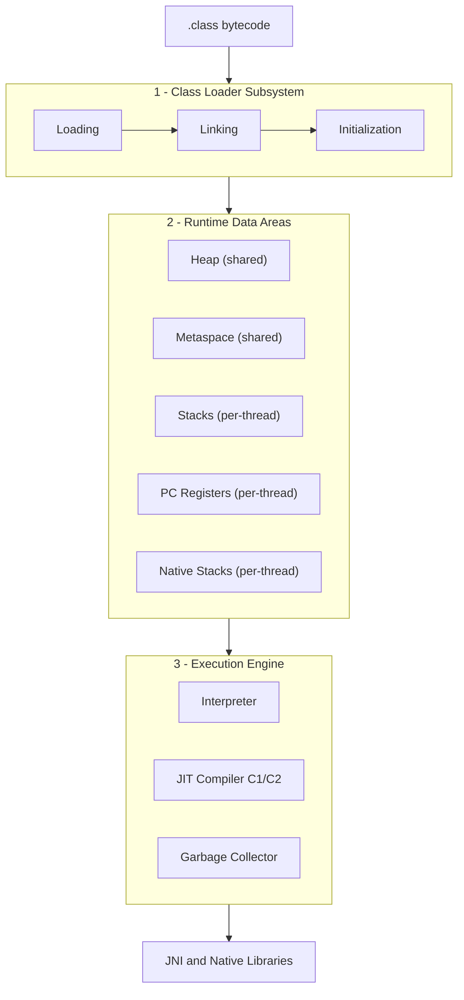

The JVM is the engine that turns portable `.class` bytecode into running native instructions while managing memory and enforcing Java's safety guarantees. Internally it is organised into **three cooperating subsystems**: the **class loader** finds and prepares types, the **runtime data areas** hold all program state, and the **execution engine** actually runs the code. Everything else in this module is a zoom-in on one of these three.

## "The JVM" is a specification, not one program

`The JVM` names a *specification* (the JVM Spec, *JVMS*), not a single binary. Oracle's **HotSpot** is the reference implementation bundled in the OpenJDK, but it isn't the only one:

| Implementation | Notable for |
|---|---|
| **HotSpot** (OpenJDK) | The default; C1/C2 JIT, G1/ZGC collectors |
| **Eclipse OpenJ9** | Smaller footprint, fast startup, shared class cache |
| **GraalVM** | Polyglot, the Graal JIT, and Native Image (AOT) |
| **Azul Zing/Prime** | Pauseless **C4** collector for large low-latency heaps |

All honour the same bytecode contract, so a `.class` file runs identically on each — but their GC algorithms, JIT internals, and tuning flags differ. Everything below describes HotSpot, the JVM you almost certainly run.

## The three subsystems

Bytecode enters at the top and each subsystem hands off to the next.



### 1. Class loader subsystem

Reads `.class` files from the module path, class path, or even the network and runs each type through **loading → linking → initialization**. It enforces the **parent-delegation model** so trusted core classes such as `java.lang.String` can't be shadowed by application code. The next topic dissects this in detail.

### 2. Runtime data areas

The JVM's memory. The **heap** (objects) and **Metaspace** (class metadata) are *shared* by all threads; each thread additionally owns a **stack** (call frames and locals), a **PC register** (the address of the current instruction), and a **native method stack** (for JNI calls). See *Memory Areas* for the full map.

### 3. Execution engine

Where bytecode becomes action. Three moving parts:

- **Interpreter** — executes bytecode one opcode at a time. Fast to start, slower per instruction.
- **JIT compiler** — HotSpot *profiles* running code and compiles hot methods to optimised native code through the tiered **C1** and **C2** compilers.
- **Garbage collector** — reclaims unreachable heap objects automatically, so there is no manual `free`.

A fourth bridge, the **Java Native Interface (JNI)**, lets bytecode call into native libraries written in C/C++ (and vice versa).

:::note
HotSpot runs in **mixed mode**: the interpreter and JIT operate *simultaneously*. A method starts interpreted, gathers profiling data, and is recompiled to native code only once it proves "hot." You can force pure interpretation with `-Xint` or compiled-only with `-Xcomp` — both are diagnostic, not production, settings.
:::

:::gotcha
The runtime data areas are **not** all one pool. **Metaspace, thread stacks, and the JIT code cache live in *native* memory, outside the Java heap.** That is why `-Xmx` does *not* bound them — a classloader leak throws `OutOfMemoryError: Metaspace` no matter how large your heap, and thousands of threads can exhaust native memory while the heap sits half-empty.
:::

:::senior
Treating "the JVM" as a black box hides real engineering levers. The spec deliberately leaves placement undefined — e.g. **escape analysis** can put a short-lived object's fields in registers instead of the heap, and **compressed ordinary object pointers (compressed oops)** shrink references to 32 bits below a ~32 GB heap. Picking an *implementation* (OpenJ9 for fast container startup, GraalVM Native Image for serverless, Zing for pauseless latency) is an architectural decision, not a detail.
:::

## Check yourself

```quiz
title: 'JVM architecture'
questions:
  - q: 'Which memory areas are **shared** across all threads?'
    options:
      - 'Heap, stacks, and PC registers.'
      - text: 'The **heap** and **Metaspace** — stacks, PC registers, and native stacks are per-thread.'
        correct: true
      - 'Only the heap.'
      - 'Everything — the JVM has one flat memory pool.'
    explain: 'Objects (heap) and class metadata (Metaspace) are visible to every thread — which is why they need GC and synchronization. Each thread privately owns its call stack, PC register, and native stack.'
  - q: 'Your service throws `OutOfMemoryError: Metaspace` even though the 8 GB heap is half-empty. Why does raising `-Xmx` not help?'
    options:
      - 'Metaspace is 25% of the heap, so you must raise it more.'
      - text: 'Metaspace lives in **native memory**, outside the Java heap — `-Xmx` does not bound it. The usual culprit is a classloader leak; cap and monitor it with `-XX:MaxMetaspaceSize`.'
        correct: true
      - 'The error is mislabelled heap exhaustion.'
      - 'Metaspace only grows at JVM startup.'
    explain: 'Metaspace, thread stacks, and the JIT code cache are native allocations. A framework that keeps generating classes (proxies, redeploys without discarding old classloaders) exhausts Metaspace regardless of heap headroom.'
  - q: 'What does HotSpot''s "mixed mode" mean?'
    options:
      - 'It mixes Java bytecode with Kotlin bytecode.'
      - text: 'The interpreter and JIT run **simultaneously**: methods start interpreted, get profiled, and only proven-hot methods are compiled to native code.'
        correct: true
      - 'Half the heap is compiled, half interpreted.'
      - 'It alternates between C1 and C2 on every call.'
    explain: 'Interpreting starts instantly; compiling everything up-front would be slow and wasteful since most methods run rarely. Profiling finds the hot 1-5% worth optimising. `-Xint` and `-Xcomp` disable the mix for diagnostics only.'
```

:::key
- The JVM has **three subsystems**: class loader (finds/prepares types), runtime data areas (holds state), execution engine (runs code).
- The execution engine = **interpreter + JIT (C1/C2) + garbage collector**, with **JNI** bridging to native code; HotSpot runs interpreter and JIT together in *mixed mode*.
- "The JVM" is a *spec*; **HotSpot** is one implementation among OpenJ9, GraalVM, and Zing.
- Heap and Metaspace are **shared**; stack, PC register, and native stack are **per-thread** — and several areas live in native memory beyond `-Xmx`.
:::
