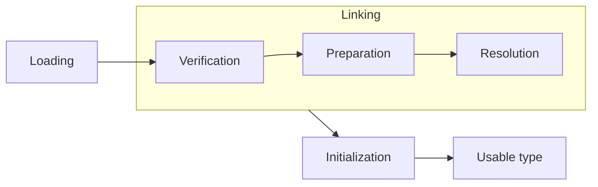
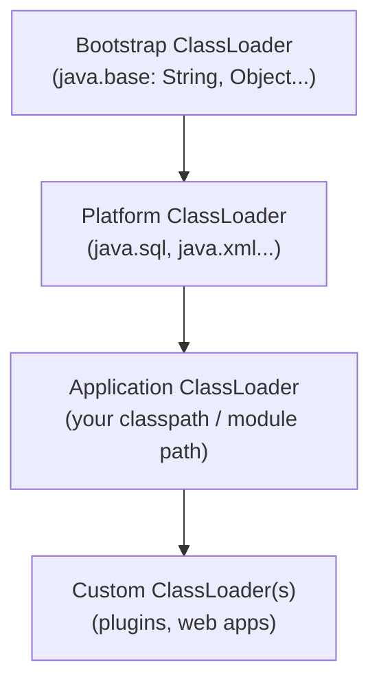

A class doesn't spring into existence when the JVM starts. It is brought in **lazily**, on first active use, by a **class loader** that walks it through a strict lifecycle before any of your code touches it. Mastering this lifecycle explains static-initialization order, `ClassNotFoundException` vs `NoClassDefFoundError`, and the namespace bugs that plague app servers and plugin systems.

## The lifecycle: loading → linking → initialization



**Loading** — a loader locates the binary `.class`, parses it, and creates the class metadata in Metaspace (with a `java.lang.Class` mirror on the heap) representing the type.

**Linking** has three sub-phases:

- **Verification** — the bytecode verifier proves the class is well-formed and type-safe: no operand-stack overflows, no jumps to the middle of an instruction, no `final` violations. This is a cornerstone of the sandbox; malformed bytecode is rejected with a `VerifyError`.
- **Preparation** — memory for `static` fields is allocated and set to **default values** (`0`, `false`, `null`) — *not* their source-code initializers yet.
- **Resolution** — symbolic references in the constant pool (names like `"java/util/List"`) are replaced with direct references. This may be done lazily, on first use of each reference.

**Initialization** — finally the JVM runs the **static initializers and static field assignments**, in textual order. This is the step that assigns `static int X = 5;` and runs `static { ... }` blocks.

```java
class Config {
    static int a = compute();          // runs during INITIALIZATION
    static { System.out.println("init"); }
    static int compute() { return 42; }
}
```

Initialization is triggered only by an **active use**: creating an instance, invoking a static method, reading/writing a non-constant static field, reflection (`Class.forName`), or initializing a subclass. The JVM guarantees initialization happens **exactly once** and is **thread-safe** — it holds a per-class init lock, which is precisely what makes the *initialization-on-demand holder* idiom a correct lazy singleton.

:::gotcha
A `static final` **compile-time constant** (`static final int N = 10;`) is inlined into callers at compile time, so reading it does **not** trigger the owning class's initialization. Also: `Class.forName("X")` initializes `X`, but `loader.loadClass("X")` only loads and links it — a difference that bites JDBC drivers and reflection-heavy frameworks.
:::

## The classloader hierarchy

Loaders form a parent chain (delegation links, *not* subclassing). Since Java 9 the old "extension" loader became the **platform** loader, and the bootstrap loader reads from the module image rather than `rt.jar`.



| Loader | Implemented in | Loads |
|---|---|---|
| **Bootstrap** | Native C++ (shows as `null`) | Core JDK modules (`java.base`) |
| **Platform** | Java | Other standard modules (`java.sql`, etc.) |
| **Application** | Java | Your application's class/module path |

## The parent-delegation model

When asked to load a class, a loader **first delegates to its parent**, only loading the class itself if every ancestor fails. So a request for `java.lang.String` bubbles all the way up to the bootstrap loader.

```text
loadClass(name):
  1. is it already loaded?           -> return it
  2. ask parent.loadClass(name)      -> (recurses to bootstrap)
  3. parent failed? findClass(name)  -> load it myself
```

This guarantees that core types are always loaded by the trusted bootstrap loader and **can't be spoofed** by a rogue `java.lang.String` on the classpath, and that a class is loaded once per loader.

## Custom class loaders

Extend `ClassLoader` and override **`findClass`** (not `loadClass`, so delegation is preserved), then hand raw bytes to `defineClass`:

```java
class ByteClassLoader extends ClassLoader {
    @Override
    protected Class<?> findClass(String name) throws ClassNotFoundException {
        byte[] bytes = loadBytecodeFor(name);   // from disk, network, decryptor...
        return defineClass(name, bytes, 0, bytes.length);
    }
}
```

This powers app servers (isolating each web app), OSGi, hot-reload tooling, and bytecode-instrumentation agents.

:::senior
A class's identity is **(fully-qualified name, defining classloader)** — its *runtime package*. The same `.class` loaded by two different loaders yields **two incompatible types**, producing the infamous `ClassCastException: Foo cannot be cast to Foo`. This is also how a `static` field can appear to "leak": redeploying a web app creates a new loader, and if a thread (or a JDK cache) still references the old loader, the entire old class graph can't be unloaded — a classic **`OutOfMemoryError: Metaspace`** leak.
:::

:::key
- A type goes through **loading → linking (verify, prepare, resolve) → initialization**; static blocks/initializers run in the **initialization** phase, once, thread-safely.
- The hierarchy is **bootstrap → platform → application → custom**; loaders use **parent delegation** (ask the parent first) so core classes can't be spoofed.
- Custom loaders override **`findClass`** and call **`defineClass`** — overriding `loadClass` breaks delegation.
- Class identity = **name + defining loader**; mismatched loaders cause `ClassCastException` and classloader leaks that exhaust **Metaspace**.
:::
