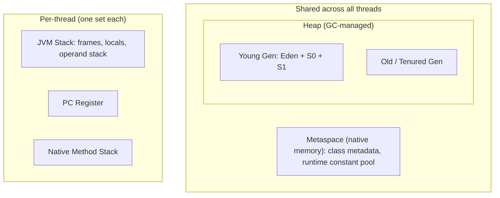

The JVM partitions memory into distinct **runtime data areas**, each with its own lifetime, ownership, and failure mode. Knowing exactly where a piece of data lives — and which area runs out first — is the difference between guessing at an `OutOfMemoryError` and diagnosing it.

## The map



## The heap — shared, GC-managed

The heap holds **every object and array** and is shared by all threads. HotSpot splits it generationally:

- **Young generation** — where new objects are allocated, subdivided into **Eden** plus two **survivor** spaces (S0/S1). Cheap, frequent **minor GCs** clear it.
- **Old (tenured) generation** — objects that survive enough minor GCs are **promoted** here. Collected by slower major/full GCs.

This layout exploits the *generational hypothesis* (most objects die young), covered in *Garbage Collection*. The heap is bounded by `-Xms` (initial) and `-Xmx` (max); exceeding it throws `OutOfMemoryError: Java heap space`.

## Per-thread stacks — frames and locals

Each thread gets its own **JVM stack**. Every method call pushes a **frame** containing:

- the **local variable array** (method parameters and locals — primitives by value, objects by reference),
- the **operand stack** (the work area for bytecode, since the JVM is a stack machine),
- a reference to the runtime constant pool.

Frames are popped on `return`, so stack memory is reclaimed automatically — no GC needed. Stack size is set by `-Xss` (often ~512 KB–1 MB).

```java
void f() {
    int x = 5;                  // x (a primitive) lives in the frame on the stack
    Point p = new Point(1, 2);  // reference 'p' on the stack; Point object on the heap
}
```

## Metaspace — class metadata in native memory

Metaspace stores **class metadata**: the structure of loaded classes, method bytecode, field/method descriptors, and the runtime constant pool. Crucially it lives in **native memory**, not the heap, and grows dynamically (cap it with `-XX:MaxMetaspaceSize`).

:::note
**Metaspace replaced PermGen in Java 8.** PermGen was a fixed-size region *inside the heap*, infamous for `OutOfMemoryError: PermGen space` during redeploys. Metaspace's native, auto-growing design largely retired that error. (The **interned String pool** also moved out of PermGen into the heap back in Java 7.)
:::

## PC registers and native method stacks

- **PC register** — per thread, holds the address of the bytecode instruction currently executing (undefined while running a native method).
- **Native method stack** — per thread, the C-style stack used when execution crosses into native code via JNI.

## What lives where

| Data | Area |
|---|---|
| Objects, arrays, instance fields | **Heap** |
| `static` fields' values | **Heap** (the object they point to); the slot is described in class metadata |
| Class metadata, method bytecode, constant pool | **Metaspace** (native) |
| Local primitives, references, return addresses | **Thread stack** frame |
| Current instruction pointer | **PC register** |
| JIT-compiled native code | **Code cache** (native) |

## StackOverflowError vs OutOfMemoryError

Both are subclasses of `Error` (not `Exception`) — you normally let them crash the JVM rather than catch them.

| | `StackOverflowError` | `OutOfMemoryError` |
|---|---|---|
| Area exhausted | A single **thread stack** | **Heap**, **Metaspace**, native memory, or code cache |
| Typical cause | Unbounded/too-deep **recursion** | Leak, undersized heap, too many classes/threads |
| Tuning lever | `-Xss` (stack size) | `-Xmx`, `-XX:MaxMetaspaceSize`, fix the leak |
| Message | (none) | `Java heap space`, `Metaspace`, `unable to create native thread`, ... |

```java
int boom(int n) { return boom(n + 1); }  // no base case -> StackOverflowError
```

:::gotcha
`OutOfMemoryError` is **not always a heap problem**. `OutOfMemoryError: Metaspace` means a classloader leak (often redeploys); `unable to create new native thread` means the OS refused another thread (each one reserves `-Xss` of native memory) — *raising* `-Xmx` makes that worse by leaving less address space for stacks. **Always read the message after the colon** before reaching for `-Xmx`.
:::

:::senior
Object layout is itself a tuning surface. A 64-bit JVM uses **compressed ordinary object pointers (compressed oops)** so references are 32 bits while the heap stays under ~32 GB — sizing a heap *just over* 32 GB can paradoxically hold *fewer* objects because every reference doubles in width. Headers, 8-byte alignment padding, and field ordering all affect footprint; tools like JOL (Java Object Layout) reveal the real per-object cost behind your data structures.
:::

## Check yourself

```quiz
title: 'Where does it live?'
questions:
  - q: 'A method runs `Point p = new Point(1, 2);`. Where do the reference `p` and the `Point` object live?'
    options:
      - text: 'The reference `p` is in the thread stack frame; the `Point` object is on the heap.'
        correct: true
      - 'Both on the heap.'
      - 'Both on the stack.'
      - '`p` on the heap; the `Point` object in Metaspace.'
    explain: 'Local variables — including object references — live in the stack frame; the object they point to is always allocated on the shared heap.'
  - q: 'Since Java 8, where do class metadata, method bytecode, and the runtime constant pool live?'
    options:
      - text: 'Metaspace — native memory, outside the heap.'
        correct: true
      - 'PermGen, inside the heap.'
      - 'The young generation of the heap.'
      - 'The per-thread stack.'
    explain: 'Metaspace replaced PermGen in Java 8 and lives in native memory, growing dynamically (cap it with `-XX:MaxMetaspaceSize`).'
  - q: 'Unbounded recursion with no base case throws which error, and why?'
    options:
      - text: '`StackOverflowError` — too many frames exhaust a single thread stack.'
        correct: true
      - '`OutOfMemoryError: Java heap space` — too many objects.'
      - '`OutOfMemoryError: Metaspace` — too many classes.'
      - 'No error; the JVM optimizes the recursion away.'
    explain: 'Each call pushes a frame; with no base case the thread stack fills up. Tune size with `-Xss`, but the real fix is a base case.'
```

```flashcards
title: 'What data lives in which area'
cards:
  - front: 'Objects, arrays, and instance fields'
    back: '**Heap** — shared by all threads, GC-managed.'
  - front: 'Local primitives, references, and return addresses'
    back: '**Thread stack** frame — one stack per thread; reclaimed on `return`.'
  - front: 'Class metadata, method bytecode, runtime constant pool'
    back: '**Metaspace** — native memory; replaced PermGen in Java 8.'
  - front: 'The value of a `static` field'
    back: 'The **heap** object it refers to; the field *slot* is described in class metadata.'
  - front: 'Address of the currently executing bytecode instruction'
    back: '**PC register** — one per thread.'
  - front: 'JIT-compiled native code'
    back: '**Code cache** — native memory.'
```

:::key
- **Heap** (shared, GC-managed): objects/arrays, split into **young (Eden + survivors)** and **old** generations; bounded by `-Xmx`.
- **Per-thread**: the **stack** (frames, locals, operand stack — auto-reclaimed on return), the **PC register**, and the **native method stack**.
- **Metaspace** (native memory, post-Java-8) holds class metadata and replaced the heap-resident **PermGen**.
- `StackOverflowError` = one thread's stack exhausted (deep recursion, tune `-Xss`); `OutOfMemoryError` = heap/Metaspace/native memory exhausted — **read the message to know which**.
:::
