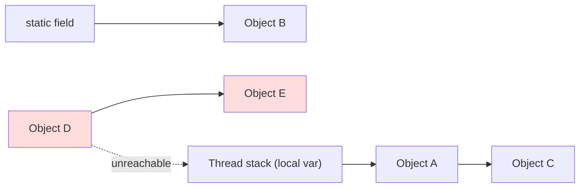

Java has no `free`. The **garbage collector** automatically reclaims objects the program can no longer reach. Understanding *how* it decides what is garbage — and which collector to pick — is the core of JVM performance work.

## GC roots and reachability

An object is **live** if it is reachable by following references from a set of **GC roots**; everything else is garbage. Roots include:

- local variables and operand-stack entries of **live thread stacks**,
- **`static` fields** of loaded classes,
- **JNI** references from native code,
- active **synchronization monitors**.



Reachability is *transitive*: D and E reference each other but neither is reachable from a root, so **both are collected** — which is why Java has no classic reference-counting cycle leak. (`SoftReference`, `WeakReference`, and `PhantomReference` let the GC reclaim more aggressively.)

## The generational hypothesis

Empirically, **most objects die young** and few old objects reference young ones. Collectors exploit this by splitting the heap into a **young** and an **old** generation:

- New objects land in **Eden**. A **minor GC** copies the few survivors into a **survivor** space (then between survivor spaces), aging them.
- Objects that survive enough cycles are **promoted (tenured)** to the old generation, collected far less often.

Because the young gen is small and mostly dead, minor GCs are cheap and frequent — the single biggest reason generational GC is fast. (Cross-generational references are tracked in a *card table* so a minor GC needn't scan the whole old gen.)

## Mark-sweep-compact

The underlying algorithm has up to three steps:

1. **Mark** — trace from roots, flag every reachable object.
2. **Sweep** — reclaim the space of unmarked objects.
3. **Compact** — slide survivors together to remove fragmentation, keeping allocation a fast pointer bump.

Young-gen collectors instead **copy** the few survivors out and declare Eden entirely free — fast when survivors are rare.

## Minor vs major vs full GC

| Term | Scope | Cost |
|---|---|---|
| **Minor GC** | Young gen only | Cheap, frequent, brief stop-the-world |
| **Major GC** | Old gen | Expensive |
| **Full GC** | Entire heap **+ Metaspace** | Most expensive; long pause — avoid |

A **stop-the-world (STW)** pause freezes all application threads while GC runs; minimising it is the central goal of modern collectors.

## The collectors

- **Serial** (`-XX:+UseSerialGC`) — one thread, full STW. Lowest overhead; great for tiny heaps, single cores, and containers.
- **Parallel** (`-XX:+UseParallelGC`) — multi-threaded STW collector tuned for **maximum throughput** (work per CPU), at the cost of longer pauses. The default through Java 8.
- **G1** (`-XX:+UseG1GC`) — the **default since Java 9**. Divides the heap into ~2048 **regions**, marks concurrently, and compacts *incrementally* to hit a **pause-time target** (`-XX:MaxGCPauseMillis`, default 200 ms). The pragmatic balance.
- **ZGC** (`-XX:+UseZGC`) — concurrent, **sub-millisecond pauses** that stay flat from MB to multi-TB heaps (colored pointers + load barriers). **Generational ZGC** (Java 21+) greatly improves throughput.
- **Shenandoah** (`-XX:+UseShenandoahGC`) — also concurrent and low-pause, compacting concurrently via load-reference barriers; pause times are independent of heap size.

| Collector | Optimises for | Pause | Typical heap | Notes |
|---|---|---|---|---|
| Serial | Footprint | High (STW) | < ~100 MB | Containers, single core |
| Parallel | **Throughput** | High (STW) | Any | Batch jobs, no SLA on pauses |
| G1 | Balance | ~10–200 ms | Medium–large | **Default**; pause-target driven |
| ZGC | **Latency** | < 1 ms | Large–huge (TB) | Concurrent; generational in 21+ |
| Shenandoah | **Latency** | < ~10 ms | Medium–large | Concurrent; pause ≈ const |

## Throughput vs pause time

These pull in opposite directions. A **throughput** collector (Parallel) does the least total GC work but stops the world longer; a **latency** collector (ZGC, Shenandoah) keeps pauses tiny by working concurrently, at the cost of more CPU and memory headroom. There is no universally "best" collector — only the one that matches your SLO.

:::gotcha
Garbage collection does **not** prevent memory leaks. An object that is *reachable but useless* — accumulated in a `static` collection, a never-removed listener, a growing cache, or a `ThreadLocal` on a pooled thread — can never be collected. `System.gc()` only **requests** a collection; it guarantees nothing and can trigger a costly full GC, so avoid it in production.
:::

:::senior
Choose the collector by SLO, not by reputation. For a request-serving service with a p99 latency budget, **ZGC or Shenandoah** keep pauses sub-millisecond regardless of heap size; for a throughput-bound batch pipeline, **Parallel** wins. The dominant input is usually the **allocation rate**, not the live-set size: GC frequency is driven by how fast you fill Eden. Reducing allocation (object reuse, primitives, escape-analysis-friendly code) often beats any flag. Always start from **GC logs**, not intuition.
:::

## Check yourself

```quiz
title: 'Garbage collection'
questions:
  - q: 'An object becomes eligible for collection when it is...'
    options:
      - text: 'Unreachable from every GC root (live thread stacks, `static` fields, JNI refs, monitors).'
        correct: true
      - 'No longer referenced by any *local* variable, even if a `static` field still points to it.'
      - 'Set to `null` at least once.'
      - 'Part of a reference cycle — cycles always leak in Java.'
    explain: 'Liveness is reachability from the GC roots, and it is transitive. Two objects that reference each other but are unreachable from any root are both collected — so cycles do **not** leak.'
  - q: 'What does the *generational hypothesis* claim, and why does it pay off?'
    options:
      - text: 'Most objects die young, so a small young generation can be collected cheaply and often.'
        correct: true
      - 'Old objects are collected more often than young ones.'
      - 'Objects should be allocated directly in the old generation.'
      - 'Every object survives exactly one GC cycle before promotion.'
    explain: 'Because most objects die young, a minor GC only copies the few survivors out of Eden — cheap and frequent. Survivors that age enough are promoted to the old gen and collected rarely.'
  - q: 'A request-serving service has a strict p99 latency budget on a large heap. Which collector fits best?'
    options:
      - text: 'ZGC or Shenandoah — concurrent, sub-millisecond pauses regardless of heap size.'
        correct: true
      - 'Parallel — it maximizes raw throughput.'
      - 'Serial — one thread, lowest overhead.'
      - 'It makes no difference; the collector does not affect pause time.'
    explain: 'Choose by SLO: latency-sensitive services want a low-pause concurrent collector (ZGC/Shenandoah); throughput-bound batch jobs prefer Parallel; G1 is the balanced default.'
```

:::key
- An object is garbage when it's **unreachable from the GC roots** (thread stacks, statics, JNI, monitors); reachability is transitive, so reference cycles are still collected.
- The **generational hypothesis** (most objects die young) makes cheap, frequent **minor GCs** possible; survivors are promoted to the old gen.
- The core algorithm is **mark-sweep-compact**; a **full GC** (whole heap + Metaspace) is the pause to avoid.
- Pick a collector by goal: **Parallel** = throughput, **G1** = balanced default, **ZGC/Shenandoah** = ultra-low pause. **Serial** for tiny/constrained heaps.
:::
