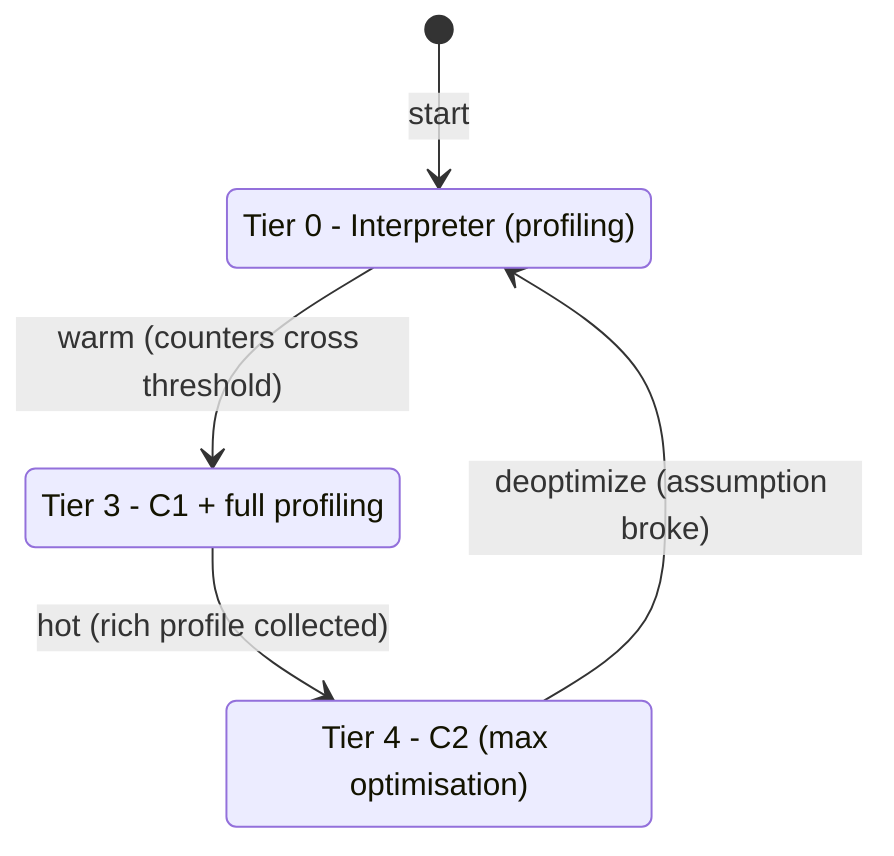
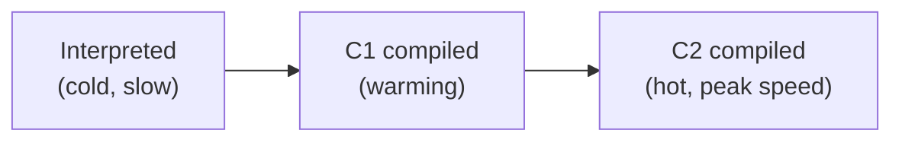

Bytecode starts out *interpreted* — read and executed one opcode at a time. That gives instant startup but is slow. HotSpot's **Just-In-Time (JIT) compiler** closes the gap: it watches your program run, then compiles the hot parts to optimised native code, often matching or beating C. The twist is that it uses *runtime* information a static compiler never has.

## Tiered compilation: interpreter → C1 → C2

HotSpot runs two JIT compilers and the interpreter together. **Tiered compilation** (on by default) moves a method up through five levels as it gets hotter:



- **C1 (client)** — compiles fast, applies cheap optimisations; gets code running natively quickly while a profile is gathered.
- **C2 (server)** — compiles slowly but aggressively, using the profile to produce the fastest code for the hottest methods.

(Levels 1 and 2 are C1 variants with less profiling; level 3 is the fully-profiled C1 step that feeds C2 at level 4.) HotSpot decides what to compile using **invocation counters** and **back-edge counters** (loop iterations) — when they cross a threshold, the method is queued for compilation on a background thread.

## Profile-guided optimisation

Because it compiles *at runtime*, the JIT exploits data a static compiler can't see:

- **Type/receiver profiles** — if a virtual call site only ever sees one concrete type, C2 **devirtualizes** and inlines it (monomorphic dispatch), guarded by a cheap type check.
- **Branch frequencies** — rarely-taken branches are compiled as **uncommon traps** that bail to the interpreter, keeping the hot path tight.
- **Null/range checks** — provably-safe checks are elided.

### Method inlining

The most valuable optimisation: replace a call with the callee's body, eliminating call overhead and — more importantly — **exposing the inlined code to further optimisation** (constant folding, dead-code elimination across the boundary). Tunable via `-XX:MaxInlineSize` and `-XX:FreqInlineSize`. Inlining is why small accessor methods cost effectively nothing once compiled.

### Escape analysis and scalar replacement

C2 proves whether a newly-allocated object **escapes** its creating method/thread. If it doesn't:

- **Scalar replacement** — the object is never allocated on the heap at all; its fields become local values in registers/stack. **Zero allocation, zero GC pressure.**
- **Lock elision** — synchronization on a non-escaping object is removed.
- **Lock elision** — synchronization on a non-escaping object is dropped, since no other thread can contend for it. (HotSpot has no separate *stack-allocation* pass; scalar replacement above is how a non-escaping object avoids the heap.)

```java
// The Point here never escapes distance(); C2 can scalar-replace it,
// so no heap allocation happens despite the `new`.
double distance(int x, int y) {
    Point p = new Point(x, y);
    return Math.sqrt(p.x * p.x + p.y * p.y);
}
```

Escape analysis (`-XX:+DoEscapeAnalysis`, on by default) is why "just allocate a small object" is often free in hot code — but only *after* C2 compiles it.

## Deoptimization

The JIT makes **speculative** bets ("this call site is always a `Dog`"). When a bet is invalidated — a new class is loaded, an uncommon branch is finally taken, a `Dog` subclass appears — HotSpot **deoptimizes**: it discards the compiled code, rebuilds the interpreter frame mid-method (*on-stack replacement* in reverse), and resumes interpreting, later recompiling with the corrected profile. This is what lets the JVM optimise aggressively *and* stay correct in a dynamic, class-loading language.

## JVM warmup

A consequence of all the above: a freshly-started JVM is **slow** until counters trip, profiles fill, and C2 compiles the hot paths to tier 4. This **warmup** period can last seconds to minutes for large services.



:::gotcha
**Naive microbenchmarks lie.** Time a loop "before warmup" and you measure the interpreter; the JIT may also delete your benchmark entirely via **dead-code elimination** if the result is unused, or fold a constant input. Always benchmark with **JMH**, which handles warmup iterations, blackholes results to defeat DCE, and forks fresh JVMs.
:::

:::senior
Warmup is a real cost for **short-lived and serverless** workloads that exit before reaching peak. Mitigations: **Class Data Sharing / AppCDS** to skip class loading, **`-XX:TieredStopAtLevel=1`** (C1-only) for short jobs, **GraalVM Native Image** (AOT, no JIT, millisecond startup at the cost of peak throughput), and **Project Leyden** / cached profiles to persist JIT decisions. Also watch the **code cache** (`-XX:ReservedCodeCacheSize`): if it fills, the JIT *stops compiling* and performance silently degrades — visible as the "CodeCache is full" warning.
:::

:::key
- HotSpot is **mixed-mode**: interpret first, then **tiered C1 → C2** compile hot methods detected via invocation/back-edge counters.
- Runtime **profiling** enables optimisations a static compiler can't do: **inlining**, **devirtualization**, and **escape analysis** (scalar replacement, lock elision).
- **Deoptimization** discards compiled code when a speculative assumption breaks, falling back to the interpreter — correctness in a dynamic language.
- Peak speed requires **warmup**; benchmark with **JMH**, and mitigate cold starts with CDS/AppCDS, AOT, or Native Image.
:::
