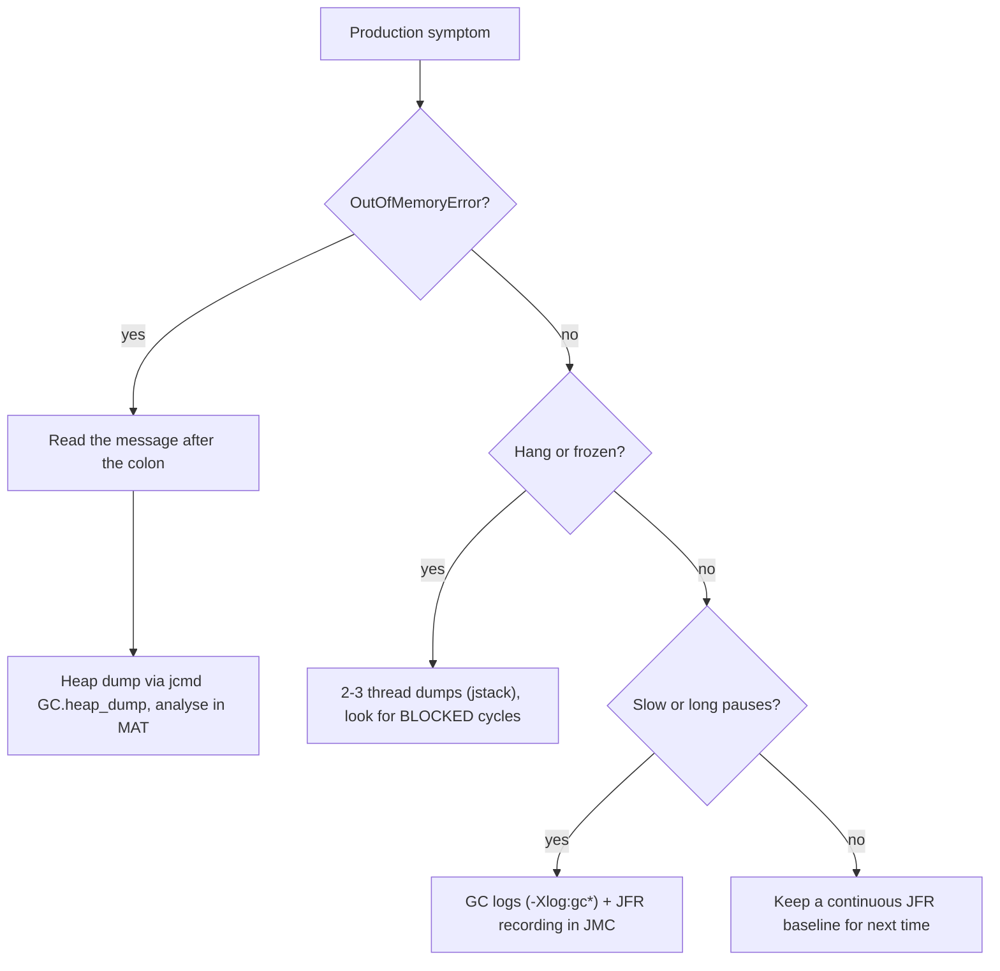

Tuning the JVM is an empirical discipline: **measure, change one thing, measure again.** This topic is the field guide — the flags worth knowing and the tools for diagnosing the failures you'll actually hit in production.

## Key flags

| Flag | Controls |
|---|---|
| `-Xms` / `-Xmx` | Initial / maximum **heap** size |
| `-Xss` | Per-thread **stack** size |
| `-XX:MaxMetaspaceSize` | Cap on class-metadata (native) memory |
| `-XX:+UseG1GC` / `UseZGC` / `UseParallelGC` | Select the **collector** |
| `-XX:MaxGCPauseMillis` | G1 (and Parallel) pause-time target |
| `-XX:MaxRAMPercentage` | Heap as a **% of container memory** |
| `-XX:+HeapDumpOnOutOfMemoryError` | Auto-dump heap on OOM |

A common production practice is **`-Xms` = `-Xmx`**: pre-committing the heap avoids costly resize pauses and surfaces memory limits at startup, not under load.

:::gotcha
In containers before Java 10, `-Xmx`-less JVMs read the **host's** total RAM and got OOM-killed by the cgroup. Modern JDKs are container-aware (`-XX:+UseContainerSupport`, on by default) and respect cgroup limits — but the default heap is only **~25%** of the container's memory. In a 4 GB pod that's a 1 GB heap; set `-XX:MaxRAMPercentage=75` (or an explicit `-Xmx`) deliberately rather than leaving free RAM unused.
:::

## Diagnosing OutOfMemoryError

First **read the message after the colon** (`Java heap space`, `Metaspace`, `unable to create new native thread`, `Direct buffer memory`) — each points at a different area. For a heap leak, capture a **heap dump** and analyse the object graph:

```bash
# Automatically on crash (set this everywhere):
-XX:+HeapDumpOnOutOfMemoryError -XX:HeapDumpPath=/var/log/app/

# On demand from a live process:
jcmd <pid> GC.heap_dump /tmp/heap.hprof      # preferred
jmap -dump:live,format=b,file=/tmp/heap.hprof <pid>
```

Open the `.hprof` in **Eclipse MAT** (Memory Analyzer Tool). Its **Leak Suspects** report and **dominator tree** show which objects retain the most memory and the **GC root path** keeping them alive — the smoking gun for `static` collections, oversized caches, or classloader leaks.

## Thread dumps for deadlocks and hangs

When the app **hangs** or pegs the CPU, capture a **thread dump** — a snapshot of every thread's stack and lock state:

```bash
jstack <pid>            # or: jcmd <pid> Thread.print
```

`jstack` explicitly reports **deadlocks** ("Found one Java-level deadlock") and shows each thread's state. Read it for:

- **`BLOCKED`** threads — waiting on a monitor another thread holds (lock contention).
- Two threads each holding a lock the other wants — the classic deadlock cycle.
- Many threads stuck in the same call (a slow downstream dependency).

Take **two or three dumps a few seconds apart**: threads stuck in the same frame across all of them indicate a real hang, not a transient.

## GC logs — the source of truth for pauses

Never tune GC by feel. Enable **unified logging** (Java 9+) and read what actually happened:

```bash
-Xlog:gc*:file=gc.log:time,uptime,level,tags
```

The log shows pause durations, frequency, promotion rates, and heap occupancy before/after each collection. Frequent **full GCs**, rising post-GC old-gen occupancy (a leak), or pauses exceeding your target are all visible here. Visualise with **GCViewer** or upload to **GCeasy**.

## Java Flight Recorder & JMC

**JFR** is the flagship profiler: an always-on, **near-zero-overhead** (~1%) event recorder built into the JVM. It captures allocations, GC, lock contention, I/O, exceptions, and method-sampling profiles into a `.jfr` file.

```bash
# Start at launch:
-XX:StartFlightRecording=duration=120s,filename=rec.jfr

# Or attach to a running JVM:
jcmd <pid> JFR.start name=diag settings=profile
jcmd <pid> JFR.dump name=diag filename=rec.jfr
jcmd <pid> JFR.stop name=diag
```

Open the recording in **JDK Mission Control (JMC)** to see allocation hot spots, the methods burning CPU, lock contention, and a GC timeline — usually pinpointing the problem without the overhead (or pauses) of older profilers.



:::senior
Build a methodology, not a flag collection. **Reproduce, then measure with JFR before changing anything** — most "GC problems" are really allocation problems fixed in code, not flags. Change **one variable at a time** and compare GC logs. Beware tools with side effects: `jmap -dump` can **pause or even crash** a fragile process, so prefer the safer `jcmd GC.heap_dump` or JFR's continuous `OldObjectSample` for leak hunting on live systems. Cargo-culting a "magic flags" list from the internet is how you make latency *worse*.
:::

:::note
`jcmd` is the modern Swiss-army knife — it subsumes much of `jmap`, `jstack`, and `jstat`. Run `jcmd <pid> help` to list every diagnostic command a JVM exposes (`VM.flags`, `GC.class_histogram`, `Thread.print`, `JFR.*`, and more).
:::

## Check yourself

```quiz
title: 'Tuning & troubleshooting'
questions:
  - q: 'A JVM in a 4 GB container runs with no memory flags at all. Roughly how big is its heap?'
    options:
      - '4 GB — the JVM takes what the container allows.'
      - text: 'About **1 GB** — container-aware JVMs default the max heap to ~25% of the container''s memory.'
        correct: true
      - '512 MB, a hard-coded default.'
      - 'It grows without bound until the cgroup kills it.'
    explain: 'Modern JDKs respect cgroup limits but default `MaxRAMPercentage` to 25 — leaving most of the pod''s RAM unused. Set `-XX:MaxRAMPercentage=75` or an explicit `-Xmx` deliberately.'
  - q: 'Why do experienced engineers often set `-Xms` equal to `-Xmx` in production?'
    options:
      - 'It enables compressed oops.'
      - text: 'Pre-committing the heap avoids runtime resize pauses and surfaces memory-limit problems at startup instead of under load.'
        correct: true
      - 'It halves GC frequency.'
      - 'It is required for G1 to work.'
    explain: 'Growing the heap mid-flight costs pauses at the worst possible time (under load). Equal sizes trade a bit of startup footprint for predictable behaviour.'
  - q: 'The app is hung. You take ONE `jstack` dump and see many threads in the same frame. What should you do before concluding anything?'
    options:
      - 'Restart the app; the evidence is complete.'
      - text: 'Take 2-3 more dumps a few seconds apart — only threads stuck in the **same frame across dumps** indicate a real hang rather than a transient snapshot.'
        correct: true
      - 'Increase `-Xss` and observe.'
      - 'Attach a debugger to each thread.'
    explain: 'A single dump is one instant: a busy-but-healthy pool can look "stuck". Consistency across spaced dumps separates a hang or deadlock from normal work in progress.'
  - q: 'What makes JFR the preferred production profiler?'
    options:
      - 'It pauses the JVM to take exact measurements.'
      - text: 'It is built into the JVM with ~1% overhead and records allocations, locks, GC, and method samples continuously — safe to leave on in production.'
        correct: true
      - 'It rewrites bytecode for maximal detail.'
      - 'It only works in development mode.'
    explain: 'JFR''s events are captured by the JVM itself, so there is no instrumentation distortion and negligible cost. Open recordings in JMC; older `jmap`-style tools can pause or even crash a fragile process.'
```

:::key
- Core flags: **`-Xms`/`-Xmx`** (heap, often set equal), **`-Xss`** (stack), **`-XX:MaxMetaspaceSize`**, and a **`-XX:+Use*GC`** selector; in containers set **`-XX:MaxRAMPercentage`**.
- **OOM** → enable `HeapDumpOnOutOfMemoryError`, capture with `jcmd GC.heap_dump`/`jmap`, analyse in **MAT** (leak suspects, dominator tree). **Read the message** to know which memory area failed.
- **Hang/deadlock** → multiple **`jstack`** thread dumps; look for `BLOCKED` threads and lock cycles.
- **Always-on profiling** → **JFR + JMC** (low overhead); tune GC from **GC logs**, never by guesswork — measure, change one thing, measure again.
:::
