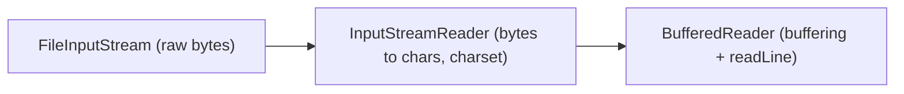

Java models I/O as **streams**: ordered sequences of data you read from a *source* or write to a *destination* — a file, a socket, an in-memory array, `System.out`. The `java.io` package splits this into two parallel hierarchies, one for raw **bytes** and one for **characters**.

## Byte streams vs character streams

| | Byte streams | Character streams |
|---|---|---|
| Root classes | `InputStream` / `OutputStream` | `Reader` / `Writer` |
| Unit | 8-bit `byte` | 16-bit `char` (decoded via a charset) |
| Use for | binary: images, audio, zip, any raw data | text |
| Examples | `FileInputStream`, `BufferedOutputStream` | `FileReader`, `BufferedWriter` |
| Bridge | — | `InputStreamReader` / `OutputStreamWriter` |

`InputStream`/`OutputStream` move 8-bit bytes — `read()` returns an `int` in `0..255`, or `-1` at end of stream. Reach for them for *binary* data: images, PDFs, compressed archives, anything that isn't text.

`Reader`/`Writer` move 16-bit `char`s and apply a **charset** to decode bytes into text (and encode it back). Use them for text so multi-byte encodings like UTF-8 are handled correctly. The bridge between the two worlds is `InputStreamReader` (wraps a byte `InputStream`, decodes with a `Charset`) and `OutputStreamWriter` (the reverse).

```java
try (var reader = new BufferedReader(
        new InputStreamReader(
            new FileInputStream("notes.txt"), StandardCharsets.UTF_8))) {
    String line;
    while ((line = reader.readLine()) != null) {
        System.out.println(line);
    }
}
```

:::note
Legacy `FileReader`/`FileWriter` used the platform **default charset**, producing files that broke on other machines. Since JEP 400 (Java 18) the default is UTF-8, but be explicit anyway — pass `StandardCharsets.UTF_8` or use `Files.newBufferedReader(path)`, which is UTF-8 by default.
:::

## The decorator pattern

`java.io` is the textbook example of the **decorator pattern**: small classes that each *wrap* another stream and add exactly one capability. You compose them from the inside out, and because every wrapper implements the same abstract type it decorates, they nest arbitrarily.



`BufferedReader` neither knows nor cares whether its ultimate source is a file, a socket, or a string — it just decorates a `Reader`. This composition is why `java.io` has so many small classes instead of one giant `File` reader with dozens of flags.

## Buffering

Without a buffer, every `read()`/`write()` may cross into the operating system — one syscall per byte is catastrophically slow. `BufferedInputStream`, `BufferedOutputStream`, `BufferedReader`, and `BufferedWriter` move large chunks into an in-memory array and serve your small calls from it. As a bonus, `BufferedReader` adds `readLine()` and `BufferedWriter` adds `newLine()`.

```java
int b;                                   // MUST be int, not byte
try (var in = new FileInputStream("a.bin")) {
    while ((b = in.read()) != -1) {      // -1 signals end of stream
        process(b);
    }
}
```

:::gotcha
A `byte` ranges `-128..127`, so the valid data byte `0xFF` *equals* `-1` — using a `byte` loop variable would stop early on binary data. `read()` returns an `int` precisely so the `-1` sentinel is unambiguous.
:::

## Always use try-with-resources

Streams hold OS handles; leaking them eventually exhausts the file-descriptor table. Let the compiler close them: any `AutoCloseable` declared in a `try (...)` header is closed automatically, in **reverse** order, even if the body throws or returns.

```java
try (var in  = Files.newInputStream(Path.of("a.bin"));
     var out = Files.newOutputStream(Path.of("b.bin"))) {
    in.transferTo(out);                  // Java 9+: copy all bytes
}                                        // out closed first, then in
```

:::senior
Closing the outermost wrapper closes the whole chain, and closing a buffered output stream **flushes** it first — forgetting to close is the classic cause of "my file is empty." Also: if both the body *and* `close()` throw, the body's exception propagates and the close exception is attached as a **suppressed** exception (`Throwable.getSuppressed()`). The old hand-written `try/finally` pattern silently discarded the original.
:::

:::key
Bytes flow through `InputStream`/`OutputStream`; text flows through `Reader`/`Writer` with an explicit charset, bridged by `InputStreamReader`/`OutputStreamWriter`. Wrap with `Buffered*` for performance — that nesting *is* the decorator pattern. Always manage streams with try-with-resources so they flush and close deterministically.
:::
