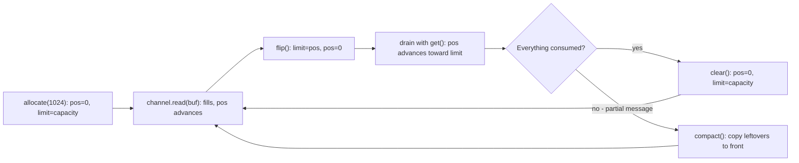

**NIO.2** (`java.nio.file`, added in Java 7) is the modern file API. It centres on two types: `Path`, an abstract handle to a location in a file system, and `Files`, a utility class of static methods that *do* things to paths. Together they replace the clumsy, error-swallowing `java.io.File`.

## Path: naming a location

A `Path` merely *describes* a location — it never touches the disk, and the target need not exist. Build one with the factory `Path.of` (Java 11+; older code uses the equivalent `Paths.get`):

```java
Path config = Path.of("app", "config", "settings.yaml"); // app/config/settings.yaml
Path abs    = config.toAbsolutePath();
Path parent = config.getParent();                         // app/config
Path backup = config.resolveSibling("settings.bak");      // app/config/settings.bak
```

Paths are **immutable** — every "modifier" returns a new `Path` — and they use the platform separator automatically, so the same code works on Windows and Unix.

## Files: the workhorse

`Files` turns common operations into one-liners that throw a **descriptive `IOException`** on failure:

```java
Files.writeString(out, "hello\n");                       // UTF-8; creates or truncates
String text       = Files.readString(out);               // whole file as a String (Java 11+)
List<String> rows = Files.readAllLines(out);
Files.copy(src, dst, StandardCopyOption.REPLACE_EXISTING);
Files.move(tmp, dst, StandardCopyOption.ATOMIC_MOVE);
Files.createDirectories(Path.of("a/b/c"));               // makes the whole chain
boolean present   = Files.exists(out);
```

## Streaming large files

`readString` and `readAllLines` pull the *entire* file into memory. For large inputs, stream lazily: `Files.lines` yields a `Stream<String>` and `Files.walk` a `Stream<Path>` for recursive directory traversal.

```java
try (Stream<String> lines = Files.lines(Path.of("huge.log"))) {
    long errors = lines.filter(l -> l.contains("ERROR")).count();
}

try (Stream<Path> tree = Files.walk(Path.of("src"))) {
    tree.filter(p -> p.toString().endsWith(".java"))
        .forEach(System.out::println);
}
```

:::gotcha
`Files.lines`, `Files.walk`, `Files.list`, and `Files.find` return streams backed by an **open file handle**. Unlike a stream over a `List`, the OS resource is not released until the stream is closed — so you *must* wrap them in try-with-resources. A bare `Files.lines(p).count()` leaks a descriptor on every call.
:::

## Why NIO.2 beats legacy File

| Task | `java.io.File` | NIO.2 |
|---|---|---|
| Build a path | `new File("a/b")` | `Path.of("a", "b")` |
| Read text | hand-rolled streams | `Files.readString(p)` |
| Delete | `file.delete()` returns `boolean` | `Files.delete(p)` throws *why* it failed |
| Copy | manual read/write loop | `Files.copy(src, dst, ...)` |
| Walk a tree | manual recursion | `Files.walk(p)` stream |
| Metadata | a few boolean getters | `BasicFileAttributes`, POSIX perms, symlinks |

The headline difference is error reporting: `File.delete()` and `mkdir()` return `false` on failure and tell you **nothing**, whereas NIO.2 throws an `IOException` that explains what went wrong (no such file, access denied, not a directory). NIO.2 also adds atomic moves, symbolic-link awareness, file-attribute views, and a `WatchService` for change notifications. Bridge to legacy APIs with `file.toPath()` and `path.toFile()`.

:::senior
Prefer `Files.newBufferedReader(path)`/`newBufferedWriter(path)` (UTF-8) over hand-built `InputStreamReader` chains, and favour the lazy `Files.lines` over `readAllLines` for anything that might be large. For publish-style updates, write to a temp file then `Files.move(tmp, target, ATOMIC_MOVE, REPLACE_EXISTING)` so readers never observe a half-written file.
:::

## A note on channels and buffers

The original NIO (Java 1.4, `java.nio`) is a lower-level, **buffer-oriented** layer. A `FileChannel` transfers data through a `ByteBuffer` rather than one byte at a time, supports memory-mapped files (`MappedByteBuffer`), and — with `SocketChannel` plus a `Selector` — enables non-blocking I/O.

```java
try (FileChannel ch = FileChannel.open(Path.of("data.bin"))) {
    ByteBuffer buf = ByteBuffer.allocate(1024);
    ch.read(buf);        // fills the buffer (it is now in "write" state)
    buf.flip();          // flip to read mode before consuming
    while (buf.hasRemaining()) process(buf.get());
}
```

A `ByteBuffer` is a slab of memory governed by three indices — **position** (next slot to read/write), **limit** (first slot you must not touch), and **capacity** (total size). The same buffer alternates between *filling* (channel writes into it) and *draining* (you read out of it), and `flip()` is the pivot between the two modes:



Forgetting `flip()` is *the* classic NIO bug: you drain from the wrong end and read zero bytes (or garbage). `allocateDirect` requests an **off-heap** direct buffer — faster for OS transfers because the kernel can DMA into it without a copy, but slower to allocate and invisible to `-Xmx`, so direct-buffer leaks surface as `OutOfMemoryError: Direct buffer memory`.

For everyday file work reach for `Files`; drop down to channels only when you need memory mapping, scatter/gather transfers, or non-blocking sockets. Memory-mapped files (`MappedByteBuffer`) shine for huge random-access reads — the file becomes pageable virtual memory served by the OS page cache — which is exactly how databases like Kafka and LMDB get their speed.

## Check yourself

```quiz
title: 'NIO.2 & buffers'
questions:
  - q: 'Does `Path.of("/data/report.pdf")` fail if the file does not exist?'
    options:
      - 'Yes — it throws `NoSuchFileException`.'
      - text: 'No — a `Path` is a pure description of a location and never touches the disk; only `Files` operations do.'
        correct: true
      - 'Yes, but only on Windows.'
      - 'It creates an empty file as a side effect.'
    explain: 'The Path/Files split is deliberate: `Path` is immutable naming, `Files` is I/O. `Files.exists(path)` is how you ask the disk.'
  - q: 'What is wrong with `long n = Files.lines(path).count();` as a one-liner?'
    options:
      - 'Nothing — streams are garbage collected.'
      - text: 'It leaks an open **file handle**: streams from `Files.lines`/`walk`/`list` hold an OS resource until closed, so they must be in try-with-resources.'
        correct: true
      - '`count()` cannot be called on a file-backed stream.'
      - 'It loads the whole file into memory.'
    explain: 'Unlike a stream over a collection, these streams wrap a descriptor. Repeated calls without closing exhaust the process''s descriptor table — a production outage that looks like "Too many open files".'
  - q: 'After `channel.read(buf)`, what must you do before consuming the data with `buf.get()`?'
    options:
      - 'Call `buf.rewind()` to reset capacity.'
      - text: 'Call `buf.flip()` — it sets `limit` to the current position and `position` to 0, switching the buffer from filling mode to draining mode.'
        correct: true
      - 'Call `buf.compact()`.'
      - 'Nothing; `get()` starts from index 0 automatically.'
    explain: 'Without `flip()`, `position` still points *after* the last byte written, so you would read the empty region beyond your data. Fill → flip → drain → clear/compact is the canonical cycle.'
  - q: 'Why is `Files.delete(path)` considered better API design than `File.delete()`?'
    options:
      - 'It is faster because it uses a native call.'
      - text: 'It throws a specific `IOException` explaining *why* deletion failed (not found, access denied, directory not empty) instead of returning an uninformative `false`.'
        correct: true
      - 'It recursively deletes directories.'
      - 'It cannot fail.'
    explain: 'Boolean-returning `File` methods silently swallow the reason for failure, making bugs undiagnosable. NIO.2''s exceptions carry the cause — and there is also `deleteIfExists` when absence is not an error.'
```

:::key
`Path.of` names a location; the `Files` utility performs the operation and fails loudly with `IOException`. Use `readString`/`writeString`/`copy`/`move` for simple cases and the lazy, **must-be-closed** `Files.lines`/`Files.walk` streams for large trees. NIO.2 supersedes `java.io.File` everywhere; channels and buffers are the lower-level layer for memory mapping and non-blocking I/O.
:::
