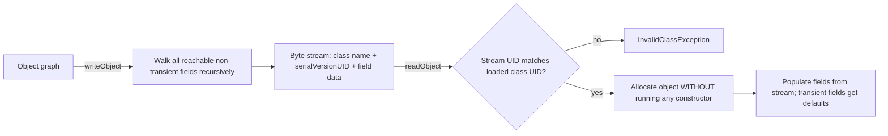

**Serialization** converts an object graph into a byte stream (and back) so it can be persisted or sent over the wire. Java has it built in — implement one marker interface and `ObjectOutputStream` does the rest. That convenience hides some of the sharpest edges in the language.

## The basics: Serializable

A class opts in by implementing `Serializable`, a **marker interface** with no methods. `ObjectOutputStream.writeObject` then walks the object and every reachable field, recursively; `ObjectInputStream.readObject` rebuilds the graph.

```java
public class User implements Serializable {
    @Serial
    private static final long serialVersionUID = 1L;

    private final String name;
    private final int loginCount;
    private transient String sessionToken;   // excluded from the byte stream
    // constructor, getters...
}
```

```java
try (var out = new ObjectOutputStream(Files.newOutputStream(Path.of("user.ser")))) {
    out.writeObject(user);
}
try (var in = new ObjectInputStream(Files.newInputStream(Path.of("user.ser")))) {
    User restored = (User) in.readObject();
}
```

Every field must itself be serializable, or `writeObject` throws `NotSerializableException`. `static` fields belong to the class, not the instance, so they are never written.

The full round-trip, including the two facts interviews probe — the version check and the constructor bypass:



## serialVersionUID and transient

- **`serialVersionUID`** is a version stamp. On read, the JVM compares the stream's UID against the loaded class's UID; a mismatch throws `InvalidClassException`. If you don't declare one, the serialization runtime **computes** it from the class's structure — so adding, removing, or renaming a field (or changing a member signature) can silently change it and reject old data.
- **`transient`** marks a field to *skip*: secrets, caches, derived values, or non-serializable references. On the way back in, transient fields get their defaults (`null`, `0`, `false`).

:::gotcha
Omitting `serialVersionUID` is the classic maintenance trap: serialize today, add a field next sprint, and every previously stored object fails to deserialize with `InvalidClassException`. Always declare it explicitly — the `@Serial` annotation (Java 14+) makes the compiler check the member's signature.
:::

## Customizing with readObject and writeObject

A class can hook the process with two **private** methods the JVM finds reflectively. Call the matching `default*` helper, then add your own logic — and crucially, read custom data back in the **same order** you wrote it:

```java
@Serial
private void writeObject(ObjectOutputStream out) throws IOException {
    out.defaultWriteObject();          // serialize the non-transient fields
    out.writeLong(checksum());         // append a custom integrity value
}

@Serial
private void readObject(ObjectInputStream in)
        throws IOException, ClassNotFoundException {
    in.defaultReadObject();            // restore the non-transient fields
    long expected = in.readLong();     // read custom data in the SAME order
    if (name == null || checksum() != expected)
        throw new InvalidObjectException("corrupt User stream");
}
```

`readObject` is effectively a **hidden constructor** that bypasses your real ones — so any invariant your constructors enforce must be re-checked here, or an attacker can hand-craft a stream that builds an "impossible" object.

## Externalizable

`Externalizable` extends `Serializable` and hands you **full** control via `writeExternal`/`readExternal`. It can be faster and more compact, but it requires a **public no-arg constructor** (the framework calls it, then populates the object) and you must serialize every field by hand — easy to get out of sync.

## The pitfalls — and the modern answer

Java's built-in serialization is widely regarded as a design mistake (Oracle's own architects have said so). Two problems dominate:

1. **Security.** Deserializing untrusted data is a notorious remote-code-execution vector: a crafted stream triggers "gadget chains" during `readObject`, *before* you can validate anything (the Apache Commons Collections CVEs are the famous example). Java 9 added `ObjectInputFilter` (JEP 290) to allowlist classes, but the safest rule is **never deserialize data you don't trust**.
2. **Maintenance.** The serialized form becomes part of your public API. Renaming or removing fields breaks compatibility, the format is opaque binary, and it is Java-only, so schema evolution is painful.

| Approach | Cross-language | Human-readable | Safe by default | Schema evolution |
|---|---|---|---|---|
| `Serializable` | no | no | no (RCE risk) | painful |
| `Externalizable` | no | no | no | manual |
| JSON (Jackson/Gson) | yes | yes | yes | easy |
| Protobuf / Avro | yes | no (binary) | yes | designed-in |

That is why teams reach for **JSON** (readable, ubiquitous, ideal for APIs) or **Protobuf/Avro** (compact, fast, schema-versioned) instead. These formats are language-agnostic, define an explicit contract, and — critically — never execute arbitrary code on read.

:::senior
*Effective Java* (Items 85–90) is blunt: prefer alternatives to Java serialization. If a legacy system forces it, use the **serialization proxy pattern** — a small `private static` nested class holding the logical state, with `writeReplace` returning the proxy and the proxy's `readResolve` rebuilding the object through normal constructors. That restores your invariants and sidesteps most deserialization attacks.
:::

## Check yourself

```quiz
title: 'Serialization traps'
questions:
  - q: 'You serialized objects last release without declaring `serialVersionUID`. This release adds one field. What happens when old data is read?'
    options:
      - 'The new field is silently `null` and everything works.'
      - text: '`InvalidClassException` — the runtime *computed* the UID from the class structure, and the added field changed it, so the stream and class UIDs no longer match.'
        correct: true
      - 'The stream is automatically migrated.'
      - 'A compile-time error next build.'
    explain: 'An auto-computed UID is a hash of the class shape. Declare `private static final long serialVersionUID = 1L;` explicitly so *compatible* evolution (adding fields) keeps working — new fields simply default on old streams.'
  - q: 'A `transient String sessionToken` field is deserialized. What value does it hold?'
    options:
      - 'Its value at serialization time.'
      - text: '`null` — transient fields are skipped on write and restored to their type''s **default value**, not to any field-initializer value.'
        correct: true
      - 'The empty string.'
      - 'Whatever the no-arg constructor assigns.'
    explain: 'Deserialization bypasses constructors *and* field initializers for `Serializable` classes: the object is allocated raw and non-transient fields are filled from the stream. Recompute transient state in `readObject` if you need it.'
  - q: 'Why is deserializing untrusted bytes a remote-code-execution risk?'
    options:
      - 'The bytes can contain x86 machine code.'
      - text: '`readObject` runs during stream decoding — crafted streams chain "gadget" classes on your classpath whose readObject/hashCode side effects execute attacker-controlled logic *before* any validation you wrote.'
        correct: true
      - 'It is not — Java streams are sandboxed.'
      - 'Only `Externalizable` classes are vulnerable.'
    explain: 'The Apache Commons Collections CVEs made this famous: exploitation needs only vulnerable classes on the classpath, not in your code. Mitigate with JEP 290 `ObjectInputFilter` allowlists — or simply never deserialize untrusted data.'
  - q: 'Which fields are **never** written by `ObjectOutputStream`?'
    options:
      - 'Fields of primitive type.'
      - text: '`static` fields (they belong to the class, not the instance) and `transient` fields (explicitly excluded).'
        correct: true
      - 'Fields declared `final`.'
      - 'Inherited fields.'
    explain: 'Serialization captures per-instance state. `final` instance fields ARE serialized (which is why the proxy pattern exists — plain deserialization must write them reflectively); inherited non-transient fields of serializable superclasses are included too.'
```

:::key
`Serializable` is a no-method marker; always declare an explicit `serialVersionUID`, mark secrets and derived fields `transient`, and re-validate invariants in `readObject` because it bypasses your constructors. `Externalizable` trades automation for manual control plus a public no-arg constructor. Built-in serialization is an RCE risk and a maintenance burden — for new systems use JSON or Protobuf, and never deserialize untrusted bytes.
:::
