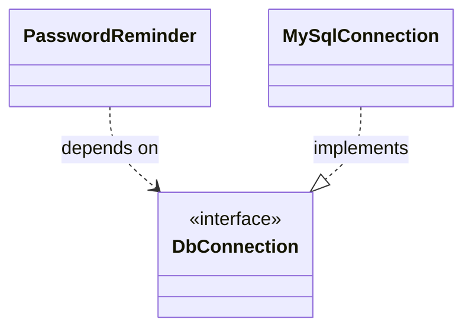

**SOLID** is five design principles (popularised by Robert C. Martin) that keep object-oriented code flexible, testable, and resistant to rot. They are heuristics, not laws — but ignoring them is how a codebase calcifies into a ball of mud. Patterns are the *tactics*; SOLID is the *strategy* behind them.

| Letter | Principle | One-line goal |
|--------|-----------|---------------|
| **S** | Single Responsibility | One reason to change per class |
| **O** | Open/Closed | Extend without editing existing code |
| **L** | Liskov Substitution | Subtypes honour their base type's contract |
| **I** | Interface Segregation | No client forced to depend on unused methods |
| **D** | Dependency Inversion | Depend on abstractions, not concretions |

## S — Single Responsibility

A class should have **one reason to change**. Mixing business rules, presentation, and persistence means a formatting tweak risks breaking tax logic.

```java
// Before: three responsibilities, three reasons to change
class Invoice {
    List<Item> items;
    double total()            { /* tax + discount rules */ }
    void printToConsole()     { /* presentation */ }
    void saveToDatabase()     { /* persistence */ }
}

// After: each concern stands alone
class Invoice            { List<Item> items; double total() { /* rules */ } }
class InvoicePrinter     { void print(Invoice inv) { /* presentation */ } }
class InvoiceRepository  { void save(Invoice inv)  { /* persistence */ } }
```

## O — Open/Closed

Software should be **open for extension, closed for modification**. A `switch` over types means every new case edits old code.

```java
// Before: adding a shape edits this method (and risks regressions)
double area(Object shape) {
    if (shape instanceof Circle c) return Math.PI * c.r() * c.r();
    if (shape instanceof Square s) return s.side() * s.side();
    throw new IllegalArgumentException("unknown shape");
}

// After: each type owns its behaviour; new shapes add code, never change it
sealed interface Shape permits Circle, Square { double area(); }
record Circle(double r)   implements Shape { public double area() { return Math.PI * r * r; } }
record Square(double side) implements Shape { public double area() { return side * side; } }
```

## L — Liskov Substitution

A subtype must be usable **anywhere its supertype is expected** without surprising the caller. The classic violation: `Square extends Rectangle`.

```java
class Rectangle {
    protected int w, h;
    void setWidth(int w)  { this.w = w; }
    void setHeight(int h) { this.h = h; }
    int area()            { return w * h; }
}
class Square extends Rectangle {                 // "a square is-a rectangle"
    @Override void setWidth(int w)  { this.w = this.h = w; }
    @Override void setHeight(int h) { this.w = this.h = h; }
}

// Caller written against Rectangle's contract:
void resize(Rectangle r) {
    r.setWidth(5);
    r.setHeight(4);
    assert r.area() == 20;   // holds for Rectangle, FAILS for Square (gives 16)
}
```

`Square` weakens the postcondition that width and height vary independently, so it is **not substitutable**. The fix is to drop the inheritance and model both as immutable shapes implementing a common interface.

:::gotcha
LSP is about **behavioural contracts**, not whether code compiles. A subtype breaks it by *strengthening a precondition*, *weakening a postcondition*, *throwing a new checked exception*, or returning unexpected values — all of which compile fine but blow up callers.
:::

## I — Interface Segregation

Clients shouldn't be forced to depend on methods they don't use. A fat interface forces empty or throwing implementations.

```java
// Before: a simple printer is forced to implement scan/fax
interface Machine { void print(Doc d); void scan(Doc d); void fax(Doc d); }
class OldPrinter implements Machine {
    public void print(Doc d) { /* ok */ }
    public void scan(Doc d)  { throw new UnsupportedOperationException(); } // smell
    public void fax(Doc d)   { throw new UnsupportedOperationException(); }
}

// After: small role interfaces, composed as needed
interface Printer { void print(Doc d); }
interface Scanner { void scan(Doc d); }
class SimplePrinter implements Printer            { public void print(Doc d) { } }
class AllInOne     implements Printer, Scanner    { public void print(Doc d){} public void scan(Doc d){} }
```

## D — Dependency Inversion

High-level policy should not depend on low-level detail; **both depend on an abstraction**. Inject the dependency instead of `new`-ing a concrete class.

```java
// Before: high-level class nailed to a concrete database
class PasswordReminder {
    private final MySqlConnection db = new MySqlConnection();   // can't test, can't swap
}

// After: depend on an interface, receive it from outside
interface DbConnection { /* ... */ }
class MySqlConnection implements DbConnection { /* ... */ }
class PasswordReminder {
    private final DbConnection db;
    PasswordReminder(DbConnection db) { this.db = db; }         // injected
}
```



The arrow of dependency now points *toward* the abstraction — the high-level module and the low-level module both depend on `DbConnection`, so either can be swapped (e.g. an in-memory fake for tests).

:::senior
The principles pull in tension: SRP and ISP push toward *many small types*, which can over-fragment a design if applied dogmatically. Treat SOLID as forces to balance, not boxes to tick. The biggest practical payoff is DIP — programming to interfaces is what makes unit testing with mocks, and later swapping implementations, painless.
:::

## Check yourself

```quiz
title: 'SOLID'
questions:
  - q: '`Square extends Rectangle` compiles and passes all Rectangle method signatures. Which principle does it still violate, and why?'
    options:
      - 'OCP — squares cannot be extended.'
      - text: 'LSP — it breaks Rectangle''s **behavioural contract**: callers assume width and height vary independently, but Square silently couples them, so `setWidth(5); setHeight(4)` yields area 16, not 20.'
        correct: true
      - 'SRP — a square has two responsibilities.'
      - 'DIP — Square depends on a concrete class.'
    explain: 'LSP is about substitutable *behaviour*, not compilable signatures. A subtype that strengthens preconditions, weakens postconditions, or surprises callers breaks it invisibly at compile time and loudly at runtime.'
  - q: 'An implementation is full of methods that just `throw new UnsupportedOperationException()`. Which principle is being violated?'
    options:
      - 'Open/Closed.'
      - text: 'Interface Segregation — the interface is too fat, forcing clients to depend on (and stub out) operations they cannot support.'
        correct: true
      - 'Single Responsibility.'
      - 'Dependency Inversion.'
    explain: 'Throwing stubs are the canonical ISP smell (and usually an LSP time bomb too, since callers of the interface cannot rely on its contract). Split into small role interfaces that implementations can honour fully.'
  - q: 'What is the difference between Dependency **Inversion** and dependency **injection**?'
    options:
      - 'They are two names for the same thing.'
      - text: 'DIP is a *design principle* — high- and low-level modules both depend on an abstraction. Injection is a *mechanism* — passing dependencies in from outside — that helps you follow DIP.'
        correct: true
      - 'DIP is about databases; DI is about tests.'
      - 'Injection is compile-time; inversion is runtime.'
    explain: 'You can inject a concrete class (still violating DIP), and you can satisfy DIP without a framework — the principle is about the *direction of the dependency arrow*, toward abstractions.'
  - q: 'A method computes area with a chain of `instanceof` checks over shape types. What is the OCP-compliant fix?'
    options:
      - 'Convert the if-chain to a switch expression.'
      - text: 'Give each shape type its own `area()` via a common interface (polymorphism) — new shapes then add code without editing existing, tested code.'
        correct: true
      - 'Cache the results of the instanceof checks.'
      - 'Mark the method `final` so nobody changes it.'
    explain: 'Open for extension, closed for modification: the type-dispatch lives in the polymorphic call, so adding `Triangle` touches zero existing lines. (A `sealed` hierarchy with an exhaustive `switch` is a modern, also-valid alternative when the case set is closed by design.)'
```

:::key
**S**RP: one reason to change. **O**CP: extend via new types, don't edit old ones (polymorphism, sealed hierarchies). **L**SP: subtypes must honour the base contract — behaviour, not just signature. **I**SP: prefer small role interfaces. **D**IP: depend on abstractions and inject them. Together they make code that bends instead of breaking.
:::
