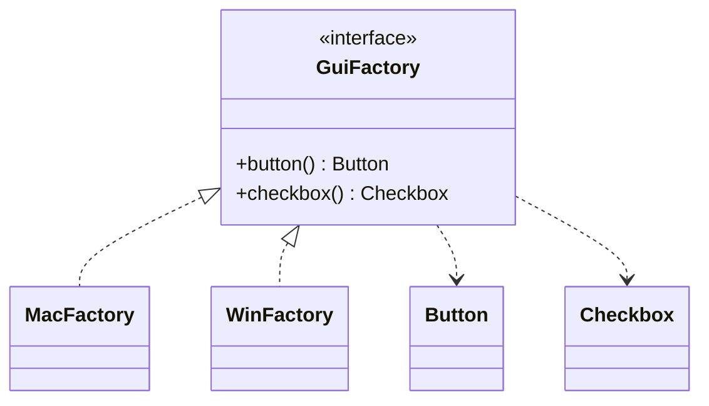

**Creational patterns** abstract the *instantiation* process, decoupling a client from the concrete classes it uses. Done well, they let you change *what* gets created without touching the code that uses it.

## Singleton

Guarantees a single instance with a global access point. Three correct implementations, in order of preference.

**Enum singleton** — Joshua Bloch's recommendation. Thread-safe by the language, serialization-safe, and immune to reflection attacks:

```java
public enum Config {
    INSTANCE;
    private final Properties props = load();
    public String get(String key) { return props.getProperty(key); }
}
// usage: Config.INSTANCE.get("db.url");
```

**Initialization-on-demand holder** — lazy *and* thread-safe with zero locking. The JVM guarantees class initialisation runs once and is thread-safe (JLS §12.4); `Holder` loads only on the first call:

```java
public final class Registry {
    private Registry() {}
    private static class Holder { static final Registry INSTANCE = new Registry(); }
    public static Registry getInstance() { return Holder.INSTANCE; }
}
```

**Double-checked locking** — needed only if construction depends on runtime arguments. The field **must** be `volatile`:

```java
private static volatile Registry instance;
public static Registry getInstance() {
    if (instance == null) {
        synchronized (Registry.class) {
            if (instance == null) instance = new Registry();
        }
    }
    return instance;
}
```

:::gotcha
Without `volatile`, double-checked locking is broken: another thread can observe a *partially constructed* object because the write that publishes the reference may be reordered ahead of the constructor's field writes. A plain lazy `if (instance == null) instance = new Registry();` is simply a data race.
:::

## Factory Method

Defines an interface for creating an object but lets **subclasses decide** which class to instantiate. The creation step is a method subclasses override.

```java
abstract class Dialog {
    abstract Button createButton();           // the factory method
    void render() { createButton().paint(); } // uses the product, ignorant of its type
}
class WindowsDialog extends Dialog { Button createButton() { return new WindowsButton(); } }
class WebDialog     extends Dialog { Button createButton() { return new HtmlButton(); } }
```

## Abstract Factory

Produces **families of related objects** without naming their concrete classes — one factory per family keeps a UI consistently "all Mac" or "all Windows".

```java
interface GuiFactory { Button button(); Checkbox checkbox(); }

class MacFactory implements GuiFactory {
    public Button button()     { return new MacButton(); }
    public Checkbox checkbox() { return new MacCheckbox(); }
}
class WinFactory implements GuiFactory {
    public Button button()     { return new WinButton(); }
    public Checkbox checkbox() { return new WinCheckbox(); }
}
```



JDK examples: `DocumentBuilderFactory`, `javax.xml.transform.TransformerFactory`.

## Builder

Constructs a complex, often **immutable** object step by step — the cure for telescoping constructors and a pile of optional parameters.

```java
public final class HttpRequest {
    private final String url, method;
    private final Duration timeout;
    private HttpRequest(Builder b) { url = b.url; method = b.method; timeout = b.timeout; }

    public static Builder builder(String url) { return new Builder(url); }

    public static final class Builder {
        private final String url;
        private String method = "GET";
        private Duration timeout = Duration.ofSeconds(30);
        private Builder(String url) { this.url = url; }
        public Builder method(String m)   { this.method = m;  return this; }
        public Builder timeout(Duration t){ this.timeout = t; return this; }
        public HttpRequest build()        { return new HttpRequest(this); }
    }
}

var req = HttpRequest.builder("https://api.example.com")
                     .method("POST")
                     .timeout(Duration.ofSeconds(5))
                     .build();
```

The real `java.net.http.HttpRequest.newBuilder()` and `Stream.Builder` follow exactly this shape.

## Prototype

Creates new objects by **copying an existing instance** — useful when construction is expensive or the configuration is easier to clone than to rebuild.

```java
record Point(int x, int y) {}                 // records copy trivially & are immutable

class Maze {                                  // expensive to build from scratch
    private final List<Room> rooms;
    Maze(Maze other) { this.rooms = deepCopy(other.rooms); }  // copy constructor
    Maze copy() { return new Maze(this); }
}
```

:::senior
Prefer a **copy constructor or static copy factory** over `Object.clone()`. `Cloneable` is a broken contract (Bloch, *Effective Java* Item 13): `clone()` is `protected`, bypasses constructors, and forces messy casts. And prefer **static factory methods** over `new` generally (Item 1) — they have names (`List.of`, `Optional.of`, `Integer.valueOf`), can cache/return cached instances, and can return a subtype. Reach for Builder once you pass ~4 parameters or have several optional ones.
:::

## Check yourself

```quiz
title: Creational patterns
questions:
  - q: 'What makes the **enum** singleton the recommended form?'
    options:
      - text: 'The language guarantees one instance, and it is serialization- and reflection-safe for free'
        correct: true
      - 'It is the only lazy option'
      - 'It avoids generating a class file'
    explain: 'An enum constant is instantiated once by the JVM, survives serialization without extra code, and cannot be duplicated via reflection — guarantees you would otherwise hand-code. Bloch recommends it in *Effective Java*.'
  - q: 'Why must the field in double-checked locking be `volatile`?'
    options:
      - text: 'Without it, another thread can observe a **partially constructed** object due to reordering'
        correct: true
      - 'Because `volatile` makes the block run faster'
      - 'Because `synchronized` requires volatile fields'
    explain: 'The write that publishes the reference can be reordered ahead of the constructor''s field writes. `volatile` establishes the happens-before ordering so a reader never sees a half-built instance.'
  - q: 'What distinguishes **Abstract Factory** from **Factory Method**?'
    options:
      - text: 'Abstract Factory creates whole **families** of related products; Factory Method creates one product via a subclass override'
        correct: true
      - 'Abstract Factory is always a singleton'
      - 'Factory Method cannot return an interface type'
    explain: 'Factory Method defers *one* product''s creation to a subclass. Abstract Factory groups several related creations (button + checkbox) behind one factory so a whole family stays consistent.'
```

:::key
Singleton: prefer **enum** or the **static holder**; double-checked locking needs `volatile`. **Factory Method** = one product, subclass chooses. **Abstract Factory** = a *family* of products from one factory. **Builder** = readable, immutable step-by-step construction. **Prototype** = clone an instance — but use a copy constructor, not `Cloneable`.
:::
