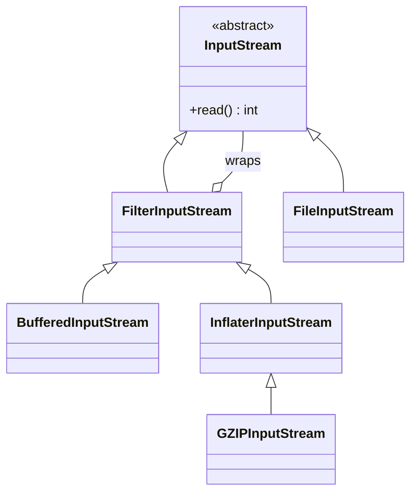

**Structural patterns** are about *composition* — assembling classes and objects into larger structures while keeping them flexible and efficient. Several share a "wrapping" shape but differ entirely in **intent**.

| Pattern | Intent | JDK example |
|---------|--------|-------------|
| Adapter | Make an incompatible interface fit | `InputStreamReader`, `Arrays.asList` |
| Decorator | Add behaviour, same interface | `BufferedInputStream`, `Collections.synchronizedList` |
| Proxy | Control access, same interface | `java.lang.reflect.Proxy`, RMI stubs |
| Facade | Simplify a subsystem | `java.util.logging`, most "Service" classes |
| Composite | Treat tree and leaf uniformly | `java.awt.Container`, Swing `JComponent` |

## Adapter

Converts one interface into another a client expects — the "power plug adapter" of code.

```java
interface PaymentProcessor { void pay(int cents); }      // what our code wants
class LegacyGateway { void makePayment(double dollars) { /* 3rd-party */ } } // what we have

class GatewayAdapter implements PaymentProcessor {
    private final LegacyGateway gw;
    GatewayAdapter(LegacyGateway gw) { this.gw = gw; }
    public void pay(int cents) { gw.makePayment(cents / 100.0); }  // translate the call
}
```

`java.io.InputStreamReader` is a textbook adapter: it adapts a byte `InputStream` to a character `Reader`.

## Decorator

Attaches responsibilities to an object **dynamically** by wrapping it in another object of the same type. **`java.io` is the canonical real-world example** — every stream wraps another stream:

```java
InputStream in = new GZIPInputStream(
                     new BufferedInputStream(
                         new FileInputStream("data.gz")));   // each wrapper IS an InputStream
```



A custom decorator adds cost to a coffee without subclass explosion:

```java
interface Coffee { double cost(); }
class Espresso implements Coffee { public double cost() { return 2.0; } }

abstract class CoffeeDecorator implements Coffee {
    protected final Coffee inner;
    CoffeeDecorator(Coffee c) { this.inner = c; }
}
class Milk extends CoffeeDecorator {
    Milk(Coffee c) { super(c); }
    public double cost() { return inner.cost() + 0.5; }   // delegate + extend
}
// new Milk(new Espresso()).cost() == 2.5
```

`Collections.unmodifiableList` and `synchronizedList` are decorators too.

## Proxy

A stand-in with the **same interface** that controls access — for laziness, security, caching, logging, or remoting.

```java
interface Image { void render(); }
class RealImage implements Image {
    RealImage(String f) { /* expensive load */ }
    public void render() { /* draw */ }
}
class LazyImage implements Image {                // virtual proxy: defer the cost
    private final String file;
    private RealImage real;
    LazyImage(String file) { this.file = file; }
    public void render() {
        if (real == null) real = new RealImage(file);
        real.render();
    }
}
```

**Dynamic proxies** generate the proxy class at runtime via `java.lang.reflect.Proxy` and an `InvocationHandler` — the mechanism behind Spring AOP, Mockito mocks, and many ORMs:

```java
Image proxy = (Image) Proxy.newProxyInstance(
    Image.class.getClassLoader(),
    new Class<?>[]{ Image.class },
    (p, method, args) -> {                        // intercept every call
        System.out.println("calling " + method.getName());
        return method.invoke(realImage, args);
    });
```

:::gotcha
JDK dynamic proxies only proxy **interfaces** — proxying a concrete class needs CGLIB or ByteBuddy (subclassing). And with proxy-based frameworks, **self-invocation** (a bean calling its own `this.method()`) bypasses the proxy entirely, so the `@Transactional`/`@Cacheable` advice silently never runs.
:::

## Facade

Provides a single, simplified entry point over a complicated subsystem. The caller talks to one class instead of orchestrating ten.

```java
class VideoConverter {                            // facade
    public File convert(String name, String format) {
        var file   = new VideoFile(name);
        var codec  = CodecFactory.extract(file);
        var buffer = BitrateReader.read(file, codec);
        var result = new AudioMixer().fix(buffer);
        return result.save();                     // hides the whole pipeline
    }
}
```

## Composite

Lets clients treat **individual objects and compositions uniformly** through a shared interface — ideal for trees.

```java
interface FsNode { long size(); }

record FileNode(String name, long size) implements FsNode {
    public long size() { return size; }           // leaf
}
class Directory implements FsNode {               // composite
    private final List<FsNode> children = new ArrayList<>();
    void add(FsNode n) { children.add(n); }
    public long size() { return children.stream().mapToLong(FsNode::size).sum(); }
}
```

`java.awt.Container` (a `Component` holding `Component`s) and Swing's `JComponent` are Composite in the JDK.

:::senior
Adapter, Decorator, and Proxy all *wrap* an object, which makes them easy to confuse — distinguish them by intent: **Adapter changes the interface**, **Decorator adds behaviour behind the same interface**, **Proxy controls access behind the same interface**. If you find yourself asking "is this a decorator or a proxy?", ask "am I adding capability, or gating access?"
:::

## Check yourself

```quiz
title: Structural patterns
questions:
  - q: 'Adapter, Decorator, and Proxy all wrap an object. What separates a **Decorator** from a **Proxy**?'
    options:
      - text: 'Decorator **adds behaviour** behind the same interface; Proxy **controls access** behind the same interface'
        correct: true
      - 'Decorator changes the interface; Proxy keeps it'
      - 'Proxy adds behaviour; Decorator changes the type'
    explain: 'Both keep the same interface. The intent differs: a decorator layers new capability (buffering, cost); a proxy gates access (lazy loading, security, remoting). Adapter is the odd one out — it *changes* the interface.'
  - q: 'What pattern does `new BufferedInputStream(new FileInputStream(f))` illustrate?'
    options:
      - text: 'Decorator — each stream wraps another of the same type, adding behaviour'
        correct: true
      - 'Adapter — it converts bytes to characters'
      - 'Factory — it builds streams'
    explain: '`java.io` is the canonical Decorator: every wrapper *is* an `InputStream` and adds a responsibility (buffering, decompression). `InputStreamReader`, converting bytes to chars, is the Adapter.'
  - q: 'With Spring''s proxy-based AOP, why might `@Transactional` silently not apply?'
    options:
      - text: 'A bean calling its own method (`this.method()`) bypasses the proxy — the advice never runs'
        correct: true
      - 'Proxies only work on `final` classes'
      - '`@Transactional` requires CGLIB, which Spring never uses'
    explain: 'The advice lives on the proxy wrapping the bean, so internal self-invocation goes straight to the target instance and skips it. JDK dynamic proxies also only proxy interfaces; concrete classes need CGLIB/ByteBuddy.'
```

:::key
Structural patterns compose objects. **Adapter** translates interfaces; **Decorator** layers behaviour (see `java.io`); **Proxy** controls access (static or dynamic via `java.lang.reflect.Proxy`); **Facade** simplifies a subsystem; **Composite** unifies leaves and trees. Several wrap — the difference is always intent.
:::
