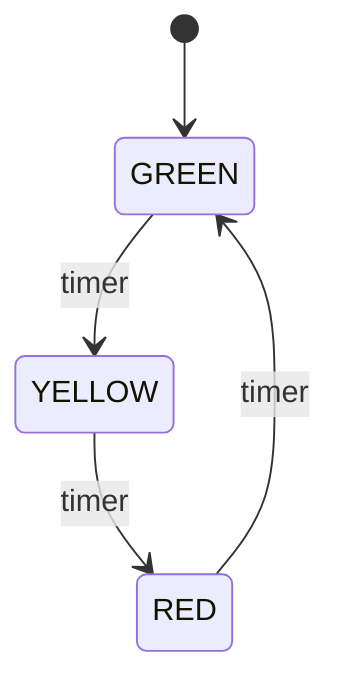

**Behavioral patterns** are about *responsibility and communication* — which object does what, and how they talk. Modern Java (lambdas, functional interfaces, the collections framework) bakes several of these straight into the language.

| Pattern | Intent | JDK example |
|---------|--------|-------------|
| Strategy | Swap interchangeable algorithms | `Comparator`, `java.util.function` |
| Observer | Notify subscribers of changes | `Flow` API, `PropertyChangeListener` |
| Template Method | Skeleton in base, steps in subclass | `AbstractList`, `java.io.InputStream.read` |
| Iterator | Traverse without exposing internals | `Iterator`, the for-each loop |
| Command | Request as an object | `Runnable`, `Callable`, Swing `Action` |
| State | Behaviour changes with state | — |

## Strategy

Encapsulates a family of interchangeable algorithms behind one interface. With a functional interface, **a strategy is just a lambda**:

```java
@FunctionalInterface interface DiscountStrategy { double apply(double price); }

DiscountStrategy none  = price -> price;
DiscountStrategy black = price -> price * 0.80;

double checkout(double price, DiscountStrategy s) { return s.apply(price); }
checkout(100, black);   // 80.0
```

`Comparator` is the JDK's Strategy par excellence: `list.sort(Comparator.comparing(Person::age))` injects the ordering algorithm.

## Observer

A subject maintains a list of dependents and **notifies them of state changes** — the basis of event systems.

```java
interface Observer { void update(int temperature); }

class WeatherStation {
    private final List<Observer> observers = new ArrayList<>();
    void subscribe(Observer o)   { observers.add(o); }
    void unsubscribe(Observer o) { observers.remove(o); }
    void setTemperature(int t)   { observers.forEach(o -> o.update(t)); }
}
```

The old `java.util.Observable`/`Observer` are **deprecated since Java 9**. Use `java.beans.PropertyChangeListener`, GUI listeners, or — for back-pressured streams — the reactive `java.util.concurrent.Flow` API (`Publisher`/`Subscriber`, JEP 266).

:::gotcha
The **lapsed-listener** leak: a long-lived subject holds strong references to observers that forgot to unsubscribe, so they are never garbage-collected. Always provide and call `unsubscribe`, or hold observers via `WeakReference`.
:::

## Template Method

A base class defines the **skeleton of an algorithm** as a `final` method and defers individual steps to subclasses (some with default "hook" implementations).

```java
abstract class DataImporter {
    public final void run() { open(); parse(); close(); }  // fixed skeleton
    protected abstract void open();
    protected abstract void parse();
    protected void close() { }                              // optional hook
}
```

In the JDK: `InputStream.read(byte[])` calls the abstract `read()`; `AbstractList` implements iteration in terms of `get`/`size`; `HttpServlet.service()` dispatches to `doGet`/`doPost`.

## Iterator

Provides sequential access to a collection **without exposing its internal representation**. Implement `Iterable` and the for-each loop just works:

```java
class Range implements Iterable<Integer> {
    private final int from, to;
    Range(int from, int to) { this.from = from; this.to = to; }

    public Iterator<Integer> iterator() {
        return new Iterator<>() {
            int cur = from;
            public boolean hasNext() { return cur < to; }
            public Integer next()    { return cur++; }
        };
    }
}
for (int i : new Range(0, 3)) { /* 0, 1, 2 */ }   // desugars to an Iterator
```

The entire collections framework *is* the Iterator pattern.

## Command

Encapsulates a request as an **object**, so it can be parameterised, queued, logged, or undone.

```java
interface Command { void execute(); }
class Light { void on() {} void off() {} }

class LightOnCommand implements Command {
    private final Light light;
    LightOnCommand(Light light) { this.light = light; }
    public void execute() { light.on(); }
}
class Remote { void submit(Command c) { c.execute(); } }
```

`Runnable` and `Callable` handed to an `ExecutorService` are commands; so is Swing's `Action`.

## State

Lets an object **alter its behaviour when its internal state changes**, replacing sprawling `if`/`switch` chains with polymorphism.

```java
interface State { State next(); String label(); }

enum TrafficLight implements State {
    GREEN  { public State next() { return YELLOW; } },
    YELLOW { public State next() { return RED;    } },
    RED    { public State next() { return GREEN;  } };
    public String label() { return name(); }
}
```



:::senior
**Strategy and State are structurally identical** — an object delegates to a swappable helper object — but their intent differs. A *Strategy* is chosen once by the client and doesn't change itself (e.g. a sort order). A *State* drives its own transitions and the client usually doesn't know or care which concrete state is active. If the wrapped object decides "what comes next", it's State; if the client decides "how to do this", it's Strategy.
:::

## Check yourself

```quiz
title: Behavioral patterns
questions:
  - q: 'In modern Java, a Strategy backed by a single-method interface is most naturally expressed as what?'
    options:
      - text: 'A lambda or method reference — e.g. a `Comparator` passed to `sort`'
        correct: true
      - 'A subclass of an abstract base class'
      - 'An enum constant'
    explain: 'A Strategy is a family of interchangeable algorithms behind one interface; when that interface is functional, a lambda *is* the strategy. `Comparator.comparing(...)` is the JDK''s Strategy par excellence.'
  - q: 'Strategy and State have identical structure. What is the key difference?'
    options:
      - text: 'A Strategy is chosen by the client and stays put; a State drives its own transitions'
        correct: true
      - 'Strategy uses inheritance, State uses composition'
      - 'State cannot be implemented with enums'
    explain: 'Both delegate to a swappable helper. If the wrapped object decides *what comes next* (green → yellow → red), it''s State; if the *client* decides how to do the job (which sort order), it''s Strategy.'
  - q: 'What is the "lapsed-listener" leak in the Observer pattern?'
    options:
      - text: 'A long-lived subject keeps strong references to observers that never unsubscribed, so they are never GC''d'
        correct: true
      - 'Observers receive every update twice'
      - 'The subject forgets to notify its observers'
    explain: 'If observers do not unsubscribe, the subject''s list pins them in memory for its lifetime. Provide and call `unsubscribe`, or hold observers via `WeakReference`.'
```

:::key
Behavioral patterns coordinate objects. **Strategy** swaps algorithms (often a lambda); **Observer** broadcasts changes (prefer `Flow`/listeners over deprecated `Observable`); **Template Method** fixes a skeleton and varies steps; **Iterator** traverses without leaking internals; **Command** turns a request into an object; **State** replaces conditionals with state objects that transition themselves.
:::
