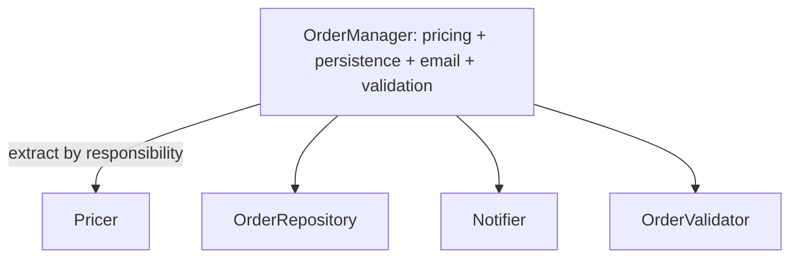

Knowing the patterns is half the craft; the other half is recognising **anti-patterns** — recurring "solutions" that feel productive but quietly rot a codebase. Each smell below pairs with the Java idiom that fixes it.

| Anti-pattern | Why it hurts | Idiom that replaces it |
|--------------|--------------|------------------------|
| God class | One class changes for every reason | SRP + extract collaborators |
| Stringly-typed | Typos become runtime bugs | `enum`, value types |
| Null abuse | NPEs, defensive `null` checks everywhere | `Optional`, `requireNonNull` |
| Telescoping constructors | Unreadable call sites | Builder, records |
| Premature optimization | Complexity with no measured gain | Profile first, then optimise |

## God class

A single class that knows and does everything — thousands of lines, dozens of fields, every change touches it. It violates SRP and becomes a merge-conflict magnet and a testing nightmare.

**Fix:** extract cohesive collaborators. A `OrderManager` doing pricing, persistence, email, and validation becomes `Pricer`, `OrderRepository`, `Notifier`, and `OrderValidator` — each independently testable.



## Stringly-typed code

Using `String` (or bare `int`) for values that actually have a small, fixed domain. The compiler can't help you; a typo surfaces only at runtime.

```java
// Bad: any string compiles, "UP " or "up" silently misbehave
void move(String direction) {
    if (direction.equals("UP")) { /* ... */ }
}

// Good: the type system enforces the domain, and switch can be exhaustive
enum Direction { UP, DOWN, LEFT, RIGHT }
void move(Direction d) {
    switch (d) {
        case UP -> goUp();
        case DOWN, LEFT, RIGHT -> /* ... */ doOther();
    }
}
```

Enums also carry behaviour and data, unlike magic strings or `int` constants.

## Null abuse

Returning `null` to mean "absent" pushes the burden onto every caller, and one forgotten check is a `NullPointerException` in production.

```java
// Bad: caller must remember to null-check, and the type says nothing
User u = repo.find(id);
if (u != null) System.out.println(u.name());

// Good: the type announces "maybe absent" and forces handling
Optional<User> u = repo.find(id);
u.map(User::name).ifPresent(System.out::println);
```

Use `Objects.requireNonNull(arg)` to **fail fast** on bad arguments, and the **Null Object pattern** (a do-nothing implementation) where "no value" has sensible default behaviour.

:::gotcha
`Optional` is for **return types**, not a universal `null` replacement. Don't use it for fields, method parameters, or collection elements (use an empty collection instead), and never call `.get()` without first checking presence — that just trades an NPE for `NoSuchElementException`. An `Optional` field also isn't `Serializable`.
:::

## Telescoping constructors

A ladder of overloaded constructors with ever-longer parameter lists. Call sites become unreadable walls of positional arguments.

```java
// Bad: what do these booleans and numbers mean at the call site?
new Pizza(12);
new Pizza(12, true);
new Pizza(12, true, false, 2, "thin");
```

**Fix:** a Builder for many optional parameters, or a `record` for simple immutable data:

```java
var pizza = Pizza.builder(12).cheese(true).pepperoni(false).extraCheese(2).crust("thin").build();
```

## Premature optimization

Twisting code into knots for performance you never measured. As Knuth put it, *"premature optimization is the root of all evil."* Micro-optimisations obscure intent and often lose to the JIT compiler, which already inlines, unrolls, and eliminates dead code.

```java
// "Optimised" but unreadable and probably no faster than the clear version
StringBuilder sb = new StringBuilder(64);
for (int i = 0; i < n; i++) sb.append(arr[i]).append(',');
// vs. the readable String.join(",", list) — write this until a profiler says otherwise
```

:::senior
Optimise for readability first, then let measurements drive change. Use a real profiler (async-profiler, JFR) to find the actual hotspot, and benchmark candidate fixes with **JMH** — naive `System.nanoTime()` loops are wrecked by JIT warm-up and dead-code elimination, giving numbers that lie. The 3% of code that's hot is the only code worth complicating.
:::

## The idiom underneath them all: immutability

Most of these fixes converge on immutable, well-typed objects. Immutable objects are inherently thread-safe, can't be corrupted after construction, and make great map keys. Records give you immutability, `equals`/`hashCode`, and `toString` for free:

```java
record Money(BigDecimal amount, Currency currency) { }   // immutable value object
```

## Check yourself

```quiz
title: Anti-patterns
questions:
  - q: 'What is the fix for a God class?'
    options:
      - text: 'Extract cohesive collaborators, each with a single responsibility'
        correct: true
      - 'Split it into more methods in the same class'
      - 'Make all of its fields `private`'
    explain: 'A God class violates SRP — it changes for many reasons. Extracting focused collaborators (Pricer, Repository, Notifier, Validator) makes each independently testable and localizes change.'
  - q: 'Which is a recognized `Optional` anti-pattern?'
    options:
      - text: 'Using `Optional` as a field or method parameter'
        correct: true
      - 'Returning `Optional` from a lookup method'
      - 'Chaining `map` on an `Optional`'
    explain: '`Optional` is designed as a *return type* for maybe-absent results. As a field it wastes a wrapper and isn''t `Serializable`; as a parameter it forces every caller to wrap. Use a nullable field/param or a default instead.'
  - q: 'What is the disciplined response to a *suspected* performance problem?'
    options:
      - text: 'Profile to find the real hotspot, then benchmark a fix with JMH'
        correct: true
      - 'Rewrite the hottest-looking loop by hand immediately'
      - 'Replace every `ArrayList` with a raw array'
    explain: 'Guess-driven micro-optimization obscures intent and often loses to the JIT. Measure first (async-profiler, JFR), fix the ~3% that''s actually hot, and verify with JMH — naive `nanoTime` loops lie due to warm-up and dead-code elimination.'
```

:::key
Prefer **small, single-purpose classes** over God classes; **enums** over stringly-typed code; **`Optional`** and `requireNonNull` over null soup; **Builders/records** over telescoping constructors; and **measured optimisation** over guesswork. The common thread is favouring **immutability and strong types** — let the compiler and the type system catch mistakes before runtime does.
:::
