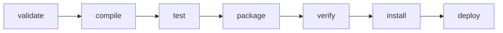

Real projects don't run `javac` by hand. A **build tool** resolves dependencies, compiles, runs tests, and packages a jar — reproducibly, on any machine. On the JVM the choice is almost always **Maven** or **Gradle**. Both pull libraries from repositories like **Maven Central** and share the same conventions, so learning one makes the other familiar.

## Standard project layout

Both tools default to the **Maven Standard Directory Layout**. Follow it and the build "just works" with zero configuration.

```text
my-app/
├── pom.xml  (or build.gradle)
└── src/
    ├── main/
    │   ├── java/        ← production code
    │   └── resources/   ← config, properties, files on the classpath
    └── test/
        ├── java/        ← test code (not shipped)
        └── resources/   ← test-only fixtures
```

Compiled output lands in `target/` (Maven) or `build/` (Gradle) — both are git-ignored.

## Dependency management

You declare dependencies by **coordinates** — `groupId:artifactId:version` (GAV) — and the tool fetches them *plus their transitive dependencies*, resolving version conflicts automatically.

```xml
<!-- Maven: pom.xml -->
<dependency>
    <groupId>org.junit.jupiter</groupId>
    <artifactId>junit-jupiter</artifactId>
    <version>5.11.0</version>
    <scope>test</scope>   <!-- only on the test classpath -->
</dependency>
```

```kotlin
// Gradle: build.gradle.kts
dependencies {
    testImplementation("org.junit.jupiter:junit-jupiter:5.11.0")
    implementation("com.google.guava:guava:33.2.1-jre")
}
```

A dependency's **scope/configuration** controls *which* classpath it joins. The common ones:

| Maven scope | Gradle configuration | Available at | Example |
|-------------|----------------------|--------------|---------|
| `compile` (default) | `implementation` | compile + runtime | Guava |
| `provided` | `compileOnly` | compile only | servlet API |
| `runtime` | `runtimeOnly` | runtime only | JDBC driver |
| `test` | `testImplementation` | test only | JUnit, Mockito |

## Two execution models

This is the core philosophical difference. **Maven is convention-driven**: a fixed **lifecycle** of phases, and running one phase runs every phase before it. **Gradle is a programmable task graph (DAG)**: tasks declare dependencies on each other, and Gradle runs only what's needed.



```bash
# Maven: a phase runs itself + all earlier phases
mvn package        # validate -> compile -> test -> package
mvn clean install  # wipe target/, then build up to local-repo install

# Gradle: invoke a task; its dependencies run first
gradle build       # assemble + check (compile, test, jar)
gradle test        # runs only what 'test' needs
```

Maven binds **goals** (from plugins) to phases; Gradle bakes the same steps into tasks contributed by plugins like `java`.

## Choosing between them

| | **Maven** | **Gradle** |
|---|-----------|------------|
| Config file | `pom.xml` (XML, declarative) | `build.gradle(.kts)` (Groovy/Kotlin code) |
| Model | fixed lifecycle/phases | flexible task DAG |
| Flexibility | conventional, predictable | highly customisable |
| Performance | recompiles broadly | incremental + build cache + daemon → faster |
| Learning curve | gentle, uniform | steeper, more concepts |
| Sweet spot | standard apps, libraries, CI simplicity | large/multi-module builds, Android (default) |

:::senior
Both ship a **wrapper** (`mvnw` / `gradlew`) committed to the repo. It pins the *exact* build-tool version and downloads it on demand, so every developer and CI runner builds identically — the foundation of a reproducible build. Always invoke `./gradlew` / `./mvnw`, never a globally installed binary. Gradle's speed comes from incremental task outputs and a long-lived daemon; the trade-off is that an imperative `build.gradle` can grow into hard-to-debug logic, whereas Maven's rigidity is itself a feature on teams that value uniformity over flexibility.
:::

:::gotcha
A build that passes locally but fails in CI is usually a **classpath leak**: a `test`-scoped dependency (or a transitive one) accidentally used in `main`, or an environment-specific version. Run `mvn dependency:tree` / `gradle dependencies` to see the *resolved* graph and find the culprit.
:::

:::tip
You don't have to pick forever. Both read the same Maven Central artifacts and follow the same layout, so migrating an existing project later is mechanical rather than a rewrite.
:::

## pom.xml vs build.gradle, side by side

The same project — a Java library with a JUnit 5 test dependency — expressed in each tool:

````tabs
tabs:
  - label: 'Maven (pom.xml)'
    body: |
      XML and declarative: coordinates and the `test` scope are spelled out as elements.
      ```xml
      <project>
        <modelVersion>4.0.0</modelVersion>
        <groupId>com.example</groupId>
        <artifactId>my-app</artifactId>
        <version>1.0.0</version>
        <properties>
          <maven.compiler.release>21</maven.compiler.release>
        </properties>
        <dependencies>
          <dependency>
            <groupId>org.junit.jupiter</groupId>
            <artifactId>junit-jupiter</artifactId>
            <version>5.11.0</version>
            <scope>test</scope>
          </dependency>
        </dependencies>
      </project>
      ```
  - label: 'Gradle (build.gradle)'
    body: |
      A Groovy script: the `java` plugin supplies the lifecycle, and a GAV string is one line.
      ```groovy
      plugins {
          id 'java'
      }
      group   = 'com.example'
      version = '1.0.0'
      java {
          toolchain { languageVersion = JavaLanguageVersion.of(21) }
      }
      dependencies {
          testImplementation 'org.junit.jupiter:junit-jupiter:5.11.0'
      }
      test {
          useJUnitPlatform()
      }
      ```
````

## Check your understanding

```quiz
questions:
  - q: 'You run `mvn package`. What else executes?'
    options:
      - 'Only the `package` goal'
      - text: 'Every earlier phase first — `validate`, `compile`, `test`, then `package`'
        correct: true
      - '`package`, then `deploy`'
      - 'Nothing else'
    explain: 'The Maven lifecycle is sequential: invoking a phase runs every phase before it, so `package` implies `compile` and `test` first.'
  - q: 'Which Gradle configuration plays the same role as Maven `test` scope?'
    options:
      - '`implementation`'
      - '`compileOnly`'
      - text: '`testImplementation`'
        correct: true
      - '`runtimeOnly`'
    explain: '`testImplementation` puts a dependency on the test classpath only — the same role as Maven `test` scope (JUnit, Mockito, and the like).'
```

:::key
Maven and Gradle both follow the **standard `src/main` & `src/test` layout**, manage **transitive dependencies** by GAV coordinates, and download from Maven Central. **Maven** = declarative `pom.xml` with a fixed **phase lifecycle** (running a phase runs all prior ones). **Gradle** = scripted `build.gradle` with a flexible **task DAG**, plus incremental builds and caching for speed. Choose Maven for convention and simplicity, Gradle for large/custom/Android builds — and always commit the wrapper.
:::
