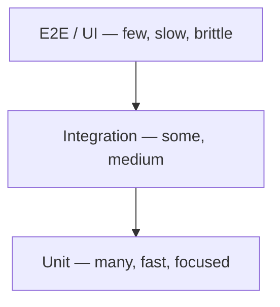
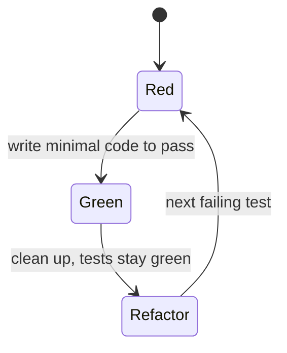

Knowing JUnit and Mockito is mechanics. Knowing *what* to test, *at what level*, and *how to keep the suite trustworthy* is the craft. A good suite gives fast, reliable feedback and the confidence to refactor; a bad one is slow, flaky, and quietly ignored.

## The test pyramid

Mike Cohn's pyramid says: have **many** fast unit tests, **fewer** integration tests, and **few** slow end-to-end tests. Cost and run time grow as you climb; the number of tests should shrink.



The anti-pattern is the **ice-cream cone**: mostly slow E2E tests and almost no unit tests. It feels thorough but gives feedback in minutes, fails intermittently, and rarely pinpoints *where* a bug is.

## Arrange-Act-Assert

Structure every test in three visible blocks (also called **Given-When-Then**). One logical action, one set of related assertions.

```java
@Test
void appliesBulkDiscount() {
    var cart = new Cart(List.of(item(10), item(10), item(10))); // Arrange
    Money total = cart.total();                                 // Act
    assertEquals(Money.of(27), total);                          // Assert (10% off)
}
```

:::gotcha
Avoid **assertion roulette** — many unrelated asserts, or worse, branching/loops inside a test. When it fails you can't tell *which* expectation broke. One behaviour per test; if you're tempted to add an `if`, write a second test (or a `@ParameterizedTest`).
:::

## FIRST principles

Good unit tests are **FIRST**:

| Letter | Principle | Means |
|--------|-----------|-------|
| **F** | Fast | milliseconds — you run thousands without thinking |
| **I** | Independent | no ordering dependencies; any test runnable alone |
| **R** | Repeatable | same result every run, any machine (no clock/network/random) |
| **S** | Self-validating | a pass/fail assertion, never "eyeball the log" |
| **T** | Timely | written alongside the code, not bolted on months later |

## TDD in one breath

**Test-Driven Development** inverts the order: write a failing test *first*, then the minimum code to pass it, then clean up.



**Red → Green → Refactor.** The discipline guarantees every line is covered by a test that once failed, and it pressures you toward small, testable designs. You don't have to do strict TDD everywhere, but the "write the test while the requirement is fresh" instinct is universally valuable.

## What to test — and what not

- **Test:** public behaviour and contracts, business rules, edge cases (empty, null, boundary, negative), and every bug you fix (a regression test).
- **Skip:** trivial getters/setters, generated code, the framework/standard library itself, and **private methods directly** — exercise them through the public API.

:::senior
Test **behaviour, not implementation.** A test that asserts "the service calls `repo.save()` then `repo.flush()`" breaks the moment you refactor internals, even though the observable result is unchanged — these brittle tests punish the refactoring they're meant to enable. Assert on outcomes (return values, state, published events) wherever you can, and lean on interaction verification only at genuine boundaries you can't observe otherwise. The goal is a suite that fails when behaviour regresses and *stays green* when you merely reshape the code.
:::

## The test-double taxonomy

"Mock" is colloquially used for any fake, but Gerard Meszaros's precise terms matter in interviews:

| Double | What it does |
|--------|--------------|
| **Dummy** | passed to fill a parameter, never used |
| **Stub** | returns canned answers to calls (controls *input*) |
| **Spy** | a stub that also records how it was called |
| **Mock** | pre-programmed with expectations it *verifies* (controls *interaction*) |
| **Fake** | a working but simplified implementation (e.g. in-memory DB) |

## Coverage caveats

Code coverage (JaCoCo) measures *which lines executed*, not *whether you asserted anything meaningful*. A test that calls a method and asserts nothing still shows green coverage.

:::gotcha
**High coverage is necessary-ish, never sufficient.** Chasing a 100% target produces assertion-free "coverage theatre" and tests of trivial code. Treat coverage as a tool to find *untested* areas, not a quality score. **Mutation testing** (e.g. PITest) is the stronger signal: it deliberately introduces bugs and checks your tests *catch* them.
:::

:::key
Build a **test pyramid** (many unit, few E2E), structure tests as **Arrange-Act-Assert**, and keep them **FIRST** (Fast, Independent, Repeatable, Self-validating, Timely). **TDD** = Red-Green-Refactor. Test **behaviour and contracts**, not private internals or trivial getters; add a regression test for every bug. Know the double taxonomy (dummy/stub/spy/mock/fake). And remember coverage shows execution, not correctness — mutation testing is the truer measure.
:::
