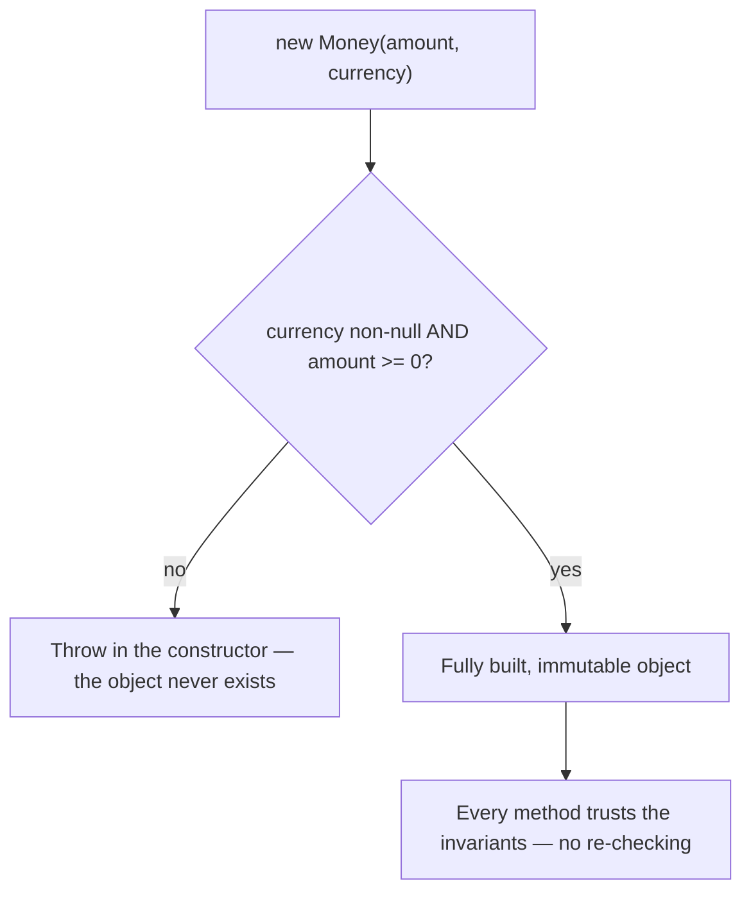

Clean code is an economic argument, not an aesthetic one. Code is read far more often than it is written, and a senior engineer's real output is a codebase the *next* person can change safely. Everything below optimizes for the cost of the second, tenth, and hundredth change — not for how clever the first draft looks.

## Naming is the cheapest documentation

Names are the highest-leverage decision you make, because they appear at every call site. Aim for **intention-revealing** names, and let length scale with scope — a loop index `i` is fine; a field that lives for the life of an object is not.

- Avoid noise words: `Manager`, `Helper`, `Data`, `Info`, `Processor` usually mean you haven't found the real abstraction yet.
- Name booleans as predicates: `isExpired`, `hasNext`, `canRetry`.
- Don't encode types (`strName`, `lstUsers`) — the compiler already knows.
- Prefer domain language: `quote.expiresAt` beats `quote.timestamp2`.

```java
// Before: what is "p"? what does "2" mean?
if (p.s == 2) { /* ... */ }

// After: reads like the domain
if (payment.status() == SETTLED) { /* ... */ }
```

## Small methods that do one thing

A method should operate at a **single level of abstraction**. When it mixes high-level orchestration with low-level string-twiddling, extract the details. The goal isn't a line count; it's that the body reads as one coherent paragraph.

Two rules pay off constantly:

- **Command-Query Separation** — a method either *does* something (returns void, has a side effect) or *answers* something (returns a value, no side effect), never both.
- **No flag arguments** — `render(true)` is unreadable at the call site. Split into `renderExpanded()` / `renderCollapsed()`.

:::tip
A reliable smell detector: if you need a comment to explain *what* a block does (not *why*), that block usually wants to become a well-named method. Comments should capture intent and trade-offs the code can't, not narrate the code.
:::

## Immutability and defensive copying

Immutable objects are automatically thread-safe, trivially cacheable, and can't be corrupted by a caller who holds a reference. Make fields `final`, expose no setters, and reach for `record`s for value types.

The subtle trap is that `final` only freezes the *reference*, not the object it points to. If a constructor stores a caller's mutable array or `Date`, the caller can mutate your internals from the outside:

```java
public final class Schedule {
    private final List<LocalDate> dates;

    public Schedule(List<LocalDate> dates) {
        this.dates = List.copyOf(dates);   // defensive copy IN
    }
    public List<LocalDate> dates() {
        return dates;                       // already unmodifiable
    }
}
```

:::gotcha
`List.copyOf`, `Map.copyOf`, and array `clone()` are **shallow**. They protect the collection's structure, but if the *elements* are mutable a caller can still reach in and change them. True immutability requires the contained types to be immutable too — copying the spine isn't enough.
:::

## Designing packages and APIs

- **Minimize accessibility.** Default to `private`; widen only with a reason. Every `public` member is a promise you must keep forever.
- **Package by feature, not by layer.** `billing/`, `inventory/` localizes change; `controllers/`, `services/`, `repositories/` smears every feature across the whole tree.
- **Program to interfaces** at boundaries — but don't add an interface with a single implementation reflexively; that's speculative generality.
- Return the most general useful type (`List`, not `ArrayList`); accept the most general type you can work with.

## Encapsulating invariants

Encapsulation isn't hiding fields behind getters — it's that an object should **never be observable in an invalid state**. Validate in the constructor and fail fast, so the rest of the code can trust the object unconditionally. Make illegal states unrepresentable.

```java
public record Money(long amountMinor, Currency currency) {
    public Money {                          // compact constructor
        Objects.requireNonNull(currency);
        if (amountMinor < 0) throw new IllegalArgumentException("negative amount");
    }
}
```

A class littered with public setters is usually an anemic data bag whose invariants are enforced — or forgotten — by everyone else.

Validating in the constructor makes an object impossible to observe in an invalid state — every later method can trust its invariants:



## Recognizing code smells

| Smell | What it looks like | Usual fix |
|-------|--------------------|-----------|
| Primitive obsession | `String email`, `long money` everywhere | a value type (`Email`, `Money`) |
| Long parameter list | `new Order(a, b, c, d, e, f)` | parameter object / builder |
| Feature envy | a method using another object's fields more than its own | move the method to that object |
| Shotgun surgery | one change touches ten files | poor cohesion; regroup by feature |
| Stringly-typed | `if (status.equals("OPEN"))` | an `enum` |

:::senior
Smells are *hypotheses*, not verdicts. The senior skill is knowing when **not** to refactor: code that's ugly but stable, well-tested, and rarely touched is cheaper to leave alone than to "clean." Optimize for the expected cost of future change — churn times difficulty. Refactor aggressively where the file changes weekly; tolerate imperfection where it's effectively frozen.
:::

## Check yourself

```quiz
title: Clean code
questions:
  - q: 'A constructor does `this.dates = List.copyOf(dates)`. What does that protect against — and what does it miss?'
    options:
      - text: 'It stops callers mutating the *list structure*, but not mutations to the *elements* if they are mutable'
        correct: true
      - 'It makes the elements immutable too'
      - 'It protects nothing — `copyOf` returns a live view'
    explain: '`List.copyOf`/`Map.copyOf`/array `clone()` are **shallow**: they copy the spine, so the caller can''t add or remove, but a shared mutable element can still be changed. True immutability needs immutable element types too.'
  - q: 'What does Command-Query Separation say a method should do?'
    options:
      - text: 'Either *do* something (side effect, returns void) or *answer* something (returns a value, no side effect) — not both'
        correct: true
      - 'Always return a value, for testability'
      - 'Take a boolean flag to choose its behaviour'
    explain: 'CQS keeps side effects and queries apart so callers can reason about them. A boolean *flag argument* like `render(true)` is a related smell — split it into `renderExpanded()`/`renderCollapsed()`.'
  - q: 'Why prefer packaging *by feature* (`billing/`, `inventory/`) over *by layer* (`controllers/`, `services/`)?'
    options:
      - text: 'A feature change stays local to one package instead of smearing across the whole tree'
        correct: true
      - 'It reduces the total number of classes'
      - 'Layered packages are not allowed in modern Java'
    explain: 'By-feature packaging maximizes cohesion — changing "billing" touches one package. By-layer scatters every feature across controllers/services/repositories, causing shotgun surgery on each change.'
```

:::key
Clean Java optimizes for the *reader* and the *next change*: intention-revealing names, small single-purpose methods, immutability with **deep** defensive copies, minimal accessibility, and objects that enforce their own invariants so they're never seen in an invalid state. Treat code smells as signals to investigate — and know when stability beats tidiness.
:::
