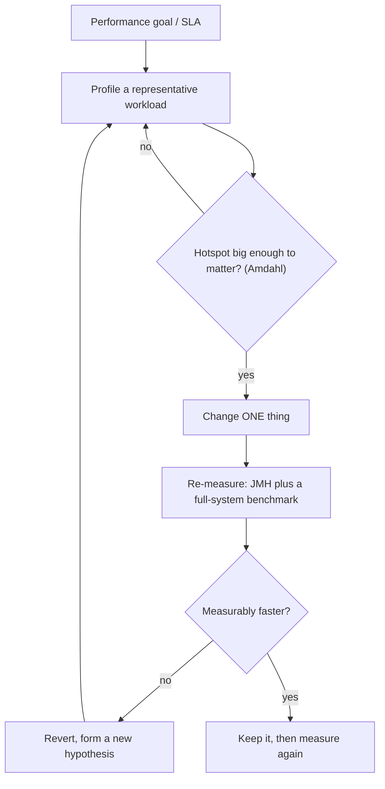

Most Java performance work fails because it starts with a guess. The runtime is adaptive, multi-layered, and full of optimizations that make intuition unreliable. The discipline is simple to state and hard to follow: measure, change one thing, measure again.

## Measure first, always

Knuth's line about premature optimization is quoted to death and still ignored. Before changing anything, **profile a representative workload** and find where time and memory actually go.

- **Sampling profilers** (async-profiler, JDK Flight Recorder) interrupt threads periodically and cost almost nothing — safe to run in production. JFR plus Mission Control is built into the JDK.
- **Instrumenting profilers** count every call precisely but distort timings (the observer effect), especially around inlined methods.
- Profile **CPU**, **allocation**, and **wall-clock/locks** *separately* — a "slow" service is often blocked on I/O or a lock, not burning CPU.

Apply **Amdahl's Law**: optimizing code that's 5% of runtime caps your win at 5%. Find the part that's 80%.

The whole discipline is a loop — profile, change *one* thing, and re-measure to confirm the win is real:



## Microbenchmarking: use JMH, and respect its traps

You cannot benchmark a JIT-compiled, adaptively-optimized runtime with a `System.nanoTime()` loop. The JIT will happily delete code whose result you ignore (**dead-code elimination**), precompute constant expressions (**constant folding**), and your loop measures a cold, interpreted VM before C2 ever kicks in.

Use **JMH** (Java Microbenchmark Harness), which forks a fresh JVM, warms up, and consumes results:

```java
@Benchmark
public void hashing(Blackhole bh) {
    bh.consume(key.hashCode());   // Blackhole defeats dead-code elimination
}
```

:::gotcha
Even with JMH, results lie if you benchmark **constant inputs** (the JIT folds them), let the optimizer **hoist** work out of the measured loop, or mis-scope `@State` and accidentally share data. And a microbenchmark never captures real cache behavior, GC interaction, or megamorphic call sites — always confirm a "win" against a full-system benchmark.
:::

## Reduce allocation and GC pressure

On a modern JVM an allocation is just a pointer bump in a thread-local buffer — *individually* cheap. The cost is **downstream**: a high allocation rate drives frequent young-gen collections, and any object that survives gets copied. The goal is fewer *surviving* objects and lower churn on hot paths.

- Don't pool ordinary objects — the GC is faster than a hand-rolled pool, and pools add complexity and bugs. Pool only genuinely expensive resources (threads, connections, large buffers).
- Trust **escape analysis**: objects that don't escape a method can be scalar-replaced and never touch the heap. Don't fight it with premature manual reuse.
- In tight loops, avoid throwaway collections, iterators, and capturing lambdas.

## Avoid autoboxing

Boxing turns an `int` into a heap `Integer`. In hot loops or large collections it's death by a thousand allocations.

```java
// Silent boxing every iteration — an object created, unboxed, discarded
Long sum = 0L;
for (long x : values) sum += x;   // declare sum as primitive long instead
```

:::gotcha
`Integer` caches −128..127, so `==` *appears* to work for small values and silently breaks for large ones: `Integer.valueOf(127) == Integer.valueOf(127)` is `true`, but at `128` it's `false`. Always compare boxed numbers with `.equals()`, and prefer primitives, `IntStream`/`LongStream`, and `long[]` over `List<Integer>`.
:::

## Efficient string handling

Strings are immutable, so `s = s + x` in a loop is O(n²) — each step copies the whole string. Use `StringBuilder`, pre-sized when you can estimate the length. (For a single straight-line concatenation the compiler already emits an efficient `invokedynamic` via `StringConcatFactory`, so don't uglify those.) Be wary of `String.format` on hot paths and reflexive `intern()`.

## Pick the right data structure

Big-O sets the ceiling; constant factors and **cache locality** decide real performance.

| Need | Reach for | Avoid |
|------|-----------|-------|
| Indexed / sequential list | `ArrayList` | `LinkedList` (pointer chasing, poor locality) |
| Stack / queue / deque | `ArrayDeque` | `Stack`, `LinkedList` |
| Key → value | `HashMap` | `Hashtable` |
| Keyed by an enum | `EnumMap` | `HashMap<MyEnum, ?>` |
| Concurrent map | `ConcurrentHashMap` | `Collections.synchronizedMap` |

`LinkedList` almost never wins in practice — even stack and queue workloads favor `ArrayDeque`'s contiguous array.

## Caching

Caching is the highest-leverage performance lever and the easiest to get wrong. Use a real cache (**Caffeine**) with a **bounded size** and an eviction policy (Caffeine's W-TinyLFU beats naive LRU), and measure the **hit ratio** — a low-hit cache is pure overhead plus a consistency risk.

:::senior
Two failure modes separate seniors from the rest. **Cache stampede / thundering herd:** when a hot key expires, thousands of requests miss simultaneously and hammer the origin — fix with request coalescing (single-flight) or jittered, probabilistic early refresh. And **invalidation** is the genuinely hard problem: prefer short TTLs or event-driven invalidation over hand-managed writes, and never cache without a clear consistency story. A subtly stale cache is worse than no cache.
:::

## Check yourself

```quiz
title: Performance
questions:
  - q: 'Why does `Integer.valueOf(127) == Integer.valueOf(127)` return `true` but the same expression with `128` returns `false`?'
    options:
      - text: '`Integer` caches −128..127, so small boxed values are shared instances; larger ones are distinct objects'
        correct: true
      - '`==` unboxes only for values above 127'
      - '128 overflows a `byte`'
    explain: 'Autoboxing calls `Integer.valueOf`, which caches −128..127. Inside that range `==` compares the *same* cached object; outside it, two distinct objects. Always compare boxed numbers with `.equals()` or unbox first.'
  - q: 'On a modern JVM, why is hand-pooling ordinary short-lived objects usually a mistake?'
    options:
      - text: 'Allocation is a cheap pointer-bump and the GC reclaims young garbage fast; pools add complexity and can defeat escape analysis'
        correct: true
      - 'The JVM forbids object pools'
      - 'Pooled objects are never garbage-collected'
    explain: 'Cost is in *surviving* objects, not in allocation. Escape analysis can even keep non-escaping objects off the heap entirely. Pool only genuinely expensive resources — threads, connections, large buffers.'
  - q: 'Why can''t you microbenchmark with a plain `System.nanoTime()` loop?'
    options:
      - text: 'The JIT deletes results you ignore, folds constants, and your loop measures a cold VM before C2 compiles it'
        correct: true
      - '`nanoTime()` has only millisecond resolution'
      - 'Loops cannot be timed in Java'
    explain: 'Dead-code elimination, constant folding, and warm-up all corrupt naive timing. Use JMH (it forks a JVM, warms up, and consumes results via `Blackhole`) — and still confirm against a full-system benchmark.'
```

:::key
**Measure first** with a sampling profiler, and respect Amdahl's Law. Microbenchmark only with **JMH** — and distrust even that. Cut *surviving* allocations instead of pooling objects, avoid autoboxing (mind the `==` cache trap!), build strings with `StringBuilder`, and choose structures by locality (`ArrayList`/`ArrayDeque` over `LinkedList`). Cache with bounds, eviction, and a real plan for stampedes and invalidation.
:::
