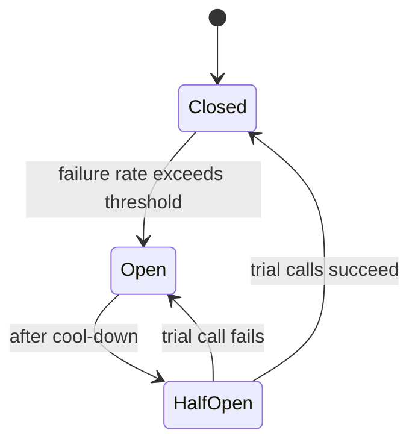

Writing correct Java on one machine is hard; doing it across a fleet that fails partially, reorders messages, and times out at the worst moment is a different discipline. The mindset shift: assume every remote interaction can be slow, duplicated, or lost, and design so that none of those break you.

## Share nothing: immutability and concurrency at scale

At scale, the enemy is **coordination**. Every lock and every piece of shared mutable state is a serialization point that caps throughput and invites races you can't reproduce. The winning pattern is **share-nothing**: pass **immutable** messages and events between components, and confine mutable state to a single owner.

- Immutable objects need no synchronization — publish them freely across threads.
- Prefer message passing and copy-on-write over shared locks.
- Where you must share, reach for `java.util.concurrent` (`ConcurrentHashMap`, `LongAdder`, `Atomic*`) before hand-rolled `synchronized`.

This is also why **statelessness** matters: if app servers hold no per-client state, any node can serve any request, and you scale horizontally simply by adding boxes behind a load balancer. Push state down to the database or a shared cache; treat "sticky sessions" as a smell.

## Statelessness and idempotency

Networks fail partially. A client that times out **does not know** whether the server processed its request, so it retries. With **at-least-once** delivery — the realistic default — every write must be **idempotent**: applying it twice has the same effect as once.

The standard technique is an **idempotency key**: the client sends a unique ID, and the server records "I've handled this ID" atomically, deduping replays.

```java
// Only the first occurrence of the key wins; replays return the stored result
boolean firstTime = processed.putIfAbsent(idempotencyKey, RESULT) == null;
return firstTime ? RESULT : cachedResultFor(idempotencyKey);
```

:::gotcha
"Exactly-once *delivery*" is essentially impossible over an unreliable network; what you actually want is "exactly-once *processing*", achieved by **idempotent consumers** sitting on at-least-once delivery. Design every mutating endpoint to be safely retryable — don't assume the network will cooperate, because it won't.
:::

## Concurrency models: thread-per-request vs reactive vs virtual threads

How you handle concurrent requests is the defining runtime choice.

| Model | How it works | Strengths | Costs |
|-------|--------------|-----------|-------|
| Thread-per-request | one OS thread blocks per request | simple, debuggable, real stack traces | OS threads are heavy (~1 MB stack); a few thousand max |
| Reactive (Reactor/WebFlux) | event loop, non-blocking callbacks | very high concurrency, built-in backpressure | "viral" async types, hard to debug, **no blocking allowed** |
| Virtual threads (Loom, JDK 21+) | millions of cheap JVM threads on few carriers | blocking *style* at huge scale | young; pinning and `ThreadLocal` caveats |

My opinion: for the common **I/O-bound** service, **virtual threads** let you keep the simple blocking programming model while scaling like reactive. They make most *new* reactive adoption hard to justify unless you specifically need streaming operators or explicit backpressure semantics.

:::gotcha
Through JDK 23 a virtual thread **pinned** its carrier when it blocked inside a `synchronized` block; **JDK 24 (JEP 491) removed that**, so on modern JDKs only **native / foreign-function calls** still pin. On JDK 21–23 the workaround was a `ReentrantLock` instead of `synchronized`; from JDK 24 it is unnecessary. Either way, be careful with `ThreadLocal` — millions of virtual threads each holding thread-locals can blow up memory (prefer `ScopedValue`).
:::

## Connection pooling

Opening a TCP + TLS + auth database connection costs milliseconds; reusing one costs microseconds. A pool (**HikariCP**) keeps a bounded set of live connections.

The counterintuitive rule: **small pools win**. A database has limited cores and disks, so flooding it with connections increases contention and context-switching. The classic starting point is roughly `(core_count × 2) + effective_spindle_count` — often *under 20*, not hundreds.

:::senior
Virtual threads break the old "one connection per thread" intuition. With millions of virtual threads you must **not** size the pool to the thread count — keep the pool small and let it become the natural **backpressure / queueing point**. The database is the real bottleneck, and a small pool is how you protect it from being overwhelmed.
:::

## Resilience: assume everything fails

A remote call can be slow, fail, or hang forever. Layer these defenses:

- **Timeouts** — the single most important and most forgotten setting. An unbounded wait turns one slow dependency into thread-pool exhaustion that cascades through the system. Set a timeout on *every* remote call.
- **Retries** — only for **idempotent** operations, with **exponential backoff and jitter**. Naive immediate retries cause *retry storms* that finish off a struggling service.
- **Circuit breakers** — stop calling a failing dependency so it can recover, and fail fast meanwhile (Resilience4j).
- **Bulkheads** — isolate resource pools so one slow dependency can't consume every thread.
- **Backpressure / load shedding** — when overloaded, reject early rather than collapse.



:::key
At scale, minimize coordination: **share-nothing**, immutable messages, **stateless** services. Assume at-least-once delivery, so make every write **idempotent** with idempotency keys. Prefer **virtual threads** for I/O-bound work (mind pinning), keep **connection pools small** as the backpressure point, and wrap every remote call in **timeouts, jittered retries, circuit breakers, and backpressure**. The network is hostile — design for it.
:::
