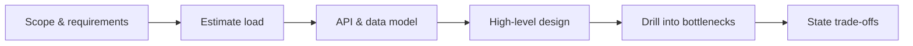

Interviews don't test whether you memorized trivia — they test whether you can be trusted with ambiguity and a production system. The candidate who reasons clearly about trade-offs almost always beats the one who recites more facts. This page is the meta-skill: how to *present* what you know.

## The categories of questions

Most Java interviews draw from a predictable set of buckets. Recognizing the bucket tells you what's really being probed.

| Category | What they're testing |
|----------|----------------------|
| Core language & JVM | depth beyond syntax — memory model, GC, class loading |
| Concurrency | can you reason about shared state and visibility |
| Collections | internals and trade-offs, not just the API |
| OOP & design | modeling, SOLID, patterns *applied* (not named) |
| Coding / DSA | problem-solving and clean code under time pressure |
| System design | architecture, trade-offs, scale (the senior/staff focus) |
| Behavioral | ownership, collaboration, judgment |

## Structuring strong answers

Rambling sinks more interviews than ignorance. Use a tight shape: **direct answer → the mechanism/why → a trade-off or caveat → a concrete example.**

> "Use `ConcurrentHashMap`. It shards locking across bins, so reads are mostly lock-free and writes only contend per-bin — far better than `synchronizedMap`'s single lock. The trade-off is that its iterators are weakly consistent rather than a snapshot. I used it for a per-key request counter where..."

When the honest answer is "it depends," **name the dimensions it depends on** — that naming *is* the senior answer.

## Signaling depth

Seniority shows in precise vocabulary used correctly, not buzzword bingo:

- **JVM:** generational GC, escape analysis, JIT/tiered compilation, heap vs stack.
- **Concurrency:** `happens-before`, `volatile` (visibility, not atomicity), why double-checked locking needs `volatile`, virtual vs platform threads.
- **Collections:** `HashMap` treeifies a bucket at 8 entries, fail-fast iterators, why `equals`/`hashCode` must agree.

:::senior
The strongest signal isn't knowing an answer — it's knowing its **boundaries**: when the technique stops working and what you'd reach for next. "I'd start with an in-memory cache, *but* once it must be shared across instances I'd move to Redis, accepting a network hop and a new failure mode." Demonstrating that you understand trade-offs and failure modes is what separates staff-level from merely correct.
:::

## The coding round

Interviewers grade your *process* as much as your solution:

1. **Clarify** the problem and constraints before typing — input ranges, edge cases, expected scale.
2. **State your approach and its time/space complexity out loud** *before* coding, and get buy-in.
3. **Narrate** as you write; keep names clean.
4. **Test** with edge cases (empty, null, single element, overflow) without being asked.

Jumping straight to code is the most common self-inflicted wound. A working brute force you then optimize beats a perfect solution you never finish.

## A system-design primer

For senior roles this round carries the most weight. Drive it; don't wait to be led.



1. **Scope** — functional and non-functional requirements (latency, consistency, scale). Don't design what wasn't asked for.
2. **Estimate** — back-of-envelope QPS, storage, bandwidth.
3. **API & data model** — define the contract and how data is stored.
4. **High-level design** — a clear component diagram.
5. **Drill into bottlenecks** — caching, sharding, replication, queues.
6. **State trade-offs** — consistency vs availability (CAP), SQL vs NoSQL, sync vs async.

There's rarely one right answer, only defensible ones. They want to watch you *reason*, not recite an architecture.

## Behavioral questions

These decide more offers than engineers admit. Use **STAR** (Situation, Task, Action, Result), say "**I**" rather than "we" (they're hiring *you*), and prepare crisp stories about a conflict, a failure you owned, and a hard technical decision. Quantify the result.

## Red flags to avoid

:::gotcha
What sinks otherwise strong candidates:

- **Bluffing.** Inventing an answer is far worse than "I don't know, but here's how I'd find out." Senior interviewers probe, and confident wrongness is a hard no.
- **Buzzword soup** — naming patterns or tools you can't explain or defend.
- **Ignoring hints.** When the interviewer nudges, they're helping — adjust, don't dig in.
- **Skipping clarification** and confidently solving the wrong problem.
- **Over-engineering** — reaching for microservices, Kafka, and Kubernetes on a problem that needs a table and a cron job.
- **Badmouthing** former employers or teammates.
:::

## Check yourself

```quiz
title: Interview strategy
questions:
  - q: 'What answer shape best signals senior judgment?'
    options:
      - text: 'Direct claim → the mechanism/why → a trade-off or caveat → a concrete example'
        correct: true
      - 'List every fact you know about the topic'
      - 'Give the shortest possible yes/no'
    explain: 'A tight claim-mechanism-tradeoff-example shape shows you understand *why*, not just *what*. When the honest answer is "it depends," naming the dimensions it depends on *is* the senior answer.'
  - q: 'In a coding round, what should you do *before* writing code?'
    options:
      - text: 'Clarify the constraints, then state your approach and its time/space complexity out loud'
        correct: true
      - 'Start typing the optimal solution immediately'
      - 'Ask the interviewer for the answer'
    explain: 'Interviewers grade process. Clarify inputs/edge cases/scale, state the approach and complexity, get buy-in, then narrate as you code and test edge cases unprompted. A working brute force you then optimize beats a perfect solution you never finish.'
  - q: 'An interviewer asks something you genuinely do not know. What is the strongest move?'
    options:
      - text: 'Say you don''t know, then describe how you''d figure it out'
        correct: true
      - 'Confidently invent a plausible-sounding answer'
      - 'Change the subject to something you do know'
    explain: 'Senior interviewers probe, and confident wrongness (bluffing) is a hard no. Honest "I don''t know, but here''s how I''d find out" demonstrates exactly the judgment they are screening for.'
```

:::key
Interviews test whether you can be trusted with ambiguity and production, not trivia recall. Identify the question's **category**, answer in a tight **claim → mechanism → trade-off → example** shape, and signal depth by naming **boundaries and failure modes**. In coding rounds, **clarify and state complexity before typing**; in system design, **drive the structure** and reason about trade-offs. Use **STAR** for behavioral — and above all, never bluff.
:::
