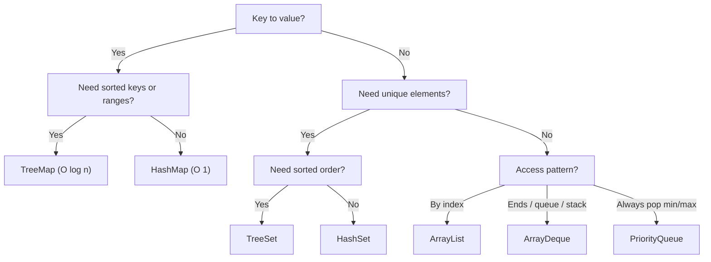

Big-O describes how cost grows with input size `n`, ignoring constant factors. It's the first filter when choosing a data structure — but remember it hides constants and cache effects, so it predicts *scaling*, not absolute speed.

## Growth at a glance

| Class | Name | 1,000 ops feels like |
|---|---|---|
| `O(1)` | constant | instant |
| `O(log n)` | logarithmic | ~10 steps |
| `O(n)` | linear | 1,000 steps |
| `O(n log n)` | linearithmic | ~10,000 steps |
| `O(n²)` | quadratic | 1,000,000 steps |
| `O(2ⁿ)` | exponential | hopeless past ~30 |

## List implementations

| Operation | `ArrayList` | `LinkedList` |
|---|---|---|
| `get(i)` / `set(i)` | **O(1)** | O(n) |
| `add(e)` (append) | O(1)* | O(1) |
| add/remove at **ends** | O(1)* / O(n) at front | **O(1)** |
| add/remove at index `i` | O(n) | O(n) (walk) + O(1) splice |
| `contains` / `indexOf` | O(n) | O(n) |
| iterate | O(n) | O(n) |

*\*Amortized. A backing-array resize is O(n) but happens rarely (capacity doubles).*

## Map & Set implementations

| Operation | `HashMap` / `HashSet` | `TreeMap` / `TreeSet` | `LinkedHashMap` / `LinkedHashSet` |
|---|---|---|---|
| `get` / `put` / `add` | **O(1)** avg | O(log n) | O(1) avg |
| `containsKey` / `contains` | **O(1)** avg | O(log n) | O(1) avg |
| `remove` | O(1) avg | O(log n) | O(1) avg |
| ordered traversal | n/a (no order) | O(n) in **sorted** order | O(n) in **insertion** order |
| `firstKey` / `floor` / `ceiling` / `higher` | n/a | **O(log n)** | n/a |

*Hash worst case is O(n) on pathological collisions; since Java 8 a bucket of ≥ 8 entries (table ≥ 64) "treeifies" to **O(log n)** when keys are `Comparable`.*

## Queue & Deque implementations

| Operation | `ArrayDeque` | `PriorityQueue` |
|---|---|---|
| `offer` / `add` | O(1)* | **O(log n)** |
| `poll` / `remove()` (head) | O(1) | O(log n) |
| `peek` | O(1) | **O(1)** |
| `contains` / `remove(obj)` | O(n) | O(n) |
| build from a collection | O(n) | O(n) (heapify) |

*`PriorityQueue` keeps only the head (min by default) ordered — it is **not** a sorted list.*

## Space complexity

All store `n` elements in O(n) space; the difference is the per-element overhead.

| Collection | Space | Overhead note |
|---|---|---|
| `ArrayList` | O(n) | one array; up to ~50% slack after a grow |
| `LinkedList` | O(n) | each node = element + 2 references (heavy) |
| `HashMap` / `HashSet` | O(n) | bucket array + `Node` per entry; load factor 0.75 |
| `TreeMap` / `TreeSet` | O(n) | red-black-tree node per entry (color + 3 refs) |
| `ArrayDeque` | O(n) | circular array, power-of-two capacity |
| `PriorityQueue` | O(n) | binary heap packed in an array |

## Sorting algorithms

| Algorithm | Best | Average | Worst | Space | Stable |
|---|---|---|---|---|---|
| Insertion sort | O(n) | O(n²) | O(n²) | O(1) | Yes |
| Selection sort | O(n²) | O(n²) | O(n²) | O(1) | No |
| Bubble sort | O(n) | O(n²) | O(n²) | O(1) | Yes |
| Quicksort | O(n log n) | O(n log n) | **O(n²)** | O(log n) | No |
| Merge sort | O(n log n) | O(n log n) | O(n log n) | O(n) | Yes |
| Heap sort | O(n log n) | O(n log n) | O(n log n) | O(1) | No |
| Counting sort | O(n + k) | O(n + k) | O(n + k) | O(n + k) | Yes |
| Radix sort | O(d(n + k)) | O(d(n + k)) | O(d(n + k)) | O(n + k) | Yes |
| **TimSort** (Java objects) | O(n) | O(n log n) | O(n log n) | O(n) | Yes |
| **Dual-Pivot Quicksort** (Java primitives) | O(n log n) | O(n log n) | O(n²) | O(log n) | n/a |

## Choosing by complexity



| Need | Pick | Because |
|---|---|---|
| Random access by index | `ArrayList` | O(1) `get` |
| Queue or stack | `ArrayDeque` | O(1) at both ends, cache-friendly |
| Lookup by key, no order | `HashMap` | O(1) average |
| Sorted keys / range / floor-ceiling | `TreeMap` | O(log n) navigation |
| Fast lookup + insertion order | `LinkedHashMap` | O(1) with predictable iteration |
| Repeatedly take smallest/largest | `PriorityQueue` | O(log n) push/pop |
| Membership testing | `HashSet` | O(1) `contains` |

:::gotcha
`LinkedList` is almost never the right answer. Its O(1) insert only helps when you already hold the node (via a `ListIterator`); `get(i)` is O(n), and pointer-chasing wrecks cache locality. For a list use `ArrayList`; for a queue/stack/deque use `ArrayDeque` — both beat `LinkedList` in practice.
:::

:::senior
`Collections.sort` / `Arrays.sort(Object[])` use **TimSort** (stable, adaptive — near O(n) on partially sorted data), while `Arrays.sort(int[])` uses **Dual-Pivot Quicksort** (no stability needed for primitives, and it's cache-friendly). That's why sorting objects is stable but sorting primitives is not — and why pre-sorted data sorts dramatically faster for objects.
:::

:::tip
Big-O hides constants. For tiny `n` (say < 16), an O(n) `ArrayList.contains` often beats an O(1) `HashSet` lookup because there's no hashing overhead and the array sits in one cache line. Profile before micro-optimizing.
:::

:::key
Index access → `ArrayList` (O(1)); key lookup → `HashMap` (O(1) avg); sorted/range queries → `TreeMap`/`TreeSet` (O(log n)); ends/queue/stack → `ArrayDeque` (O(1)); repeated min/max → `PriorityQueue` (O(log n)). Hash ops are O(1) *average* (worst O(n), or O(log n) after treeify); tree ops are a guaranteed O(log n).
:::

## Watch O(log n) in action

Press play to see why **binary search** only needs ~log₂n comparisons — each step throws away half the array.

```walkthrough
title: Binary search — looking for 7
code: |
  int lo = 0, hi = n - 1;
  while (lo <= hi) {
    int mid = (lo + hi) / 2;
    if (a[mid] == target) return mid;
    if (a[mid] < target) lo = mid + 1;
    else hi = mid - 1;
  }
steps:
  - text: 'Search the sorted array for **7**. Start with `lo = 0`, `hi = 5`.'
    array: [1, 3, 5, 7, 9, 11]
    pointers: { 0: 'lo', 5: 'hi' }
    line: 1
  - text: '`mid = (0 + 5) / 2 = 2`. `a[2] = 5`, which is **< 7** → discard the left half.'
    array: [1, 3, 5, 7, 9, 11]
    highlight: [2]
    pointers: { 0: 'lo', 2: 'mid', 5: 'hi' }
    line: 5
  - text: 'Move `lo = mid + 1 = 3`. The search window is now just indices 3–5.'
    array: [1, 3, 5, 7, 9, 11]
    pointers: { 3: 'lo', 5: 'hi' }
    line: 5
  - text: '`mid = (3 + 5) / 2 = 4`. `a[4] = 9`, which is **> 7** → discard the right half.'
    array: [1, 3, 5, 7, 9, 11]
    highlight: [4]
    pointers: { 3: 'lo', 4: 'mid', 5: 'hi' }
    line: 6
  - text: 'Move `hi = mid - 1 = 3`. Window collapses to a single element, index 3.'
    array: [1, 3, 5, 7, 9, 11]
    pointers: { 3: 'lo' }
    line: 2
  - text: '`mid = 3`, `a[3] = 7` — **found it!** Just 3 comparisons for 6 elements ≈ log₂6.'
    array: [1, 3, 5, 7, 9, 11]
    sorted: [3]
    pointers: { 3: 'mid' }
    line: 4
```
