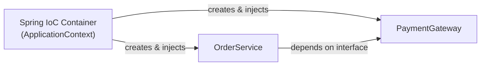

Almost every Java backend role expects Spring. Beyond the [one-page overview](/java/topic/senior/spring-overview), interviews probe *how* the container works: **inversion of control**, how beans are wired, and why constructor injection is the idiomatic choice.

## Inversion of Control — who calls `new`?

Normally your code constructs its collaborators. With **IoC**, you declare what you need and the **container** builds and supplies it. Your classes stop depending on concrete constructors and depend on **abstractions** instead — [Dependency Inversion](/java/topic/design/solid) made systematic.



## Dependency injection — three styles, one winner

````tabs
tabs:
  - label: Constructor (preferred)
    body: |
      Dependencies are **final**, guaranteed non-null, and the object is fully valid once built. Testable with a plain `new`.
      ```java
      @Service
      class OrderService {
          private final PaymentGateway gateway;
          OrderService(PaymentGateway gateway) {   // Spring injects automatically
              this.gateway = gateway;
          }
      }
      ```
  - label: Field (avoid)
    body: |
      Concise but **hides** dependencies, can't be `final`, and needs reflection to test.
      ```java
      @Service
      class OrderService {
          @Autowired private PaymentGateway gateway; // discouraged
      }
      ```
  - label: Setter (optional deps)
    body: |
      Reserve for genuinely **optional** or reconfigurable collaborators.
      ```java
      @Autowired(required = false)
      void setGateway(PaymentGateway g) { this.gateway = g; }
      ```
````

:::senior
Say "**constructor injection**" and know why: it makes dependencies explicit and mandatory, allows `final` fields (immutable, thread-safe), fails fast on a missing bean, exposes over-injection (a 6-arg constructor screams "this class does too much"), and needs no Spring at all to unit-test. Since Spring 4.3 a single constructor needs no `@Autowired`.
:::

## Declaring beans

| Annotation | Meaning |
|--|--|
| `@Component` | generic Spring-managed bean |
| `@Service` | business-logic bean (a `@Component` with intent) |
| `@Repository` | data-access bean (also translates persistence exceptions) |
| `@Configuration` + `@Bean` | Java-config factory for beans you don't own |

```java
@Configuration
class AppConfig {
    @Bean
    PaymentGateway stripeGateway(@Value("${stripe.key}") String key) {
        return new StripeGateway(key);   // wire a third-party class you can't annotate
    }
}
```

## Scopes & lifecycle

The default scope is **singleton** — *one instance per container* (not the [Singleton pattern's](/java/topic/design/creational) one-per-JVM). Others: `prototype` (new each injection), and the web scopes `request`/`session`.

:::gotcha
A Spring **singleton** bean is shared across all threads, so it must be **stateless** (or thread-safe). Storing per-request data in a singleton field is a classic concurrency bug — inject request-scoped state or pass it as a parameter instead.
:::

## Spring Boot: convention over configuration

Spring Boot layers **auto-configuration** on top: `@SpringBootApplication` bundles `@Configuration`, `@ComponentScan`, and `@EnableAutoConfiguration`. Seeing `spring-boot-starter-data-jpa` on the classpath, it wires a `DataSource`, an `EntityManager`, and transactions — you override only what you need in `application.yml`.

```java
@SpringBootApplication
public class ShopApp {
    public static void main(String[] args) { SpringApplication.run(ShopApp.class, args); }
}
```

## Check yourself

```quiz
title: Spring core check
questions:
  - q: 'Why is constructor injection preferred over field injection?'
    options:
      - text: 'Dependencies can be final and non-null, the object is valid once built, and it is testable without Spring/reflection'
        correct: true
      - 'It is the only style Spring supports'
      - 'It makes beans prototype-scoped'
    explain: 'Constructor injection makes dependencies explicit and mandatory, enables immutability, fails fast on missing beans, and surfaces over-injection — all reasons it is the idiomatic choice.'
  - q: 'A default-scoped (singleton) Spring bean stores per-request data in a field. What is the risk?'
    options:
      - text: 'The single shared instance is used by many threads concurrently, so mutable field state is a race condition'
        correct: true
      - 'Nothing — Spring synchronizes all beans'
      - 'It creates a new instance per request automatically'
    explain: 'Singleton scope means one shared instance for the whole container; mutable per-request state on it is shared across threads. Keep singletons stateless.'
  - q: 'What does `@EnableAutoConfiguration` (via @SpringBootApplication) do?'
    options:
      - text: 'Configures beans automatically based on classpath dependencies and properties, which you can override'
        correct: true
      - 'Disables all manual configuration'
      - 'Makes the app single-threaded'
    explain: 'Boot inspects the classpath and sensible defaults to auto-wire infrastructure (DataSource, MVC, etc.), reducing boilerplate while remaining overridable.'
```

:::key
Spring's **IoC container** builds and injects your collaborators, inverting control so classes depend on abstractions. Prefer **constructor injection** (final, non-null, testable). Declare beans with `@Component`/`@Service`/`@Repository` or `@Configuration`+`@Bean`. The default **singleton** scope is one shared instance — keep it **stateless**. Spring Boot's **auto-configuration** wires infrastructure from the classpath.
:::
