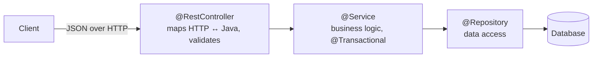

A Spring Boot web service is a thin **controller** layer over your business **services** and **repositories**. Interviews check that you know the annotations *and* the layering discipline that keeps a codebase maintainable.

## The three layers



Keep each layer honest: controllers do **no** business logic, services know **nothing** about HTTP, repositories only persist.

## The controller

```java
@RestController
@RequestMapping("/api/orders")
class OrderController {
    private final OrderService orders;
    OrderController(OrderService orders) { this.orders = orders; }

    @GetMapping("/{id}")
    OrderDto get(@PathVariable long id) {
        return orders.findById(id);                 // 200 OK
    }

    @GetMapping
    Page<OrderDto> list(@RequestParam(defaultValue = "0") int page) {
        return orders.list(page);                   // pagination via query param
    }

    @PostMapping
    @ResponseStatus(HttpStatus.CREATED)             // 201
    OrderDto create(@Valid @RequestBody CreateOrderRequest req) {
        return orders.create(req);
    }

    @DeleteMapping("/{id}")
    @ResponseStatus(HttpStatus.NO_CONTENT)          // 204
    void cancel(@PathVariable long id) { orders.cancel(id); }
}
```

| Annotation | Role |
|--|--|
| `@RestController` | `@Controller` + `@ResponseBody` — return values become the JSON body |
| `@GetMapping` / `@PostMapping` / … | map an HTTP method + path |
| `@PathVariable` / `@RequestParam` | bind URL path segments / query params |
| `@RequestBody` | deserialize the JSON body (via Jackson) into an object |
| `ResponseEntity<T>` | full control of status, headers, and body |

## DTOs, not entities

:::gotcha
**Never expose JPA entities directly** in your API. It leaks your schema, invites lazy-loading exceptions during serialization, risks mass-assignment security holes, and couples the API contract to the database. Map to a **DTO** (a `record` is perfect) at the boundary.
:::

```java
record OrderDto(long id, String status, BigDecimal total) {}
record CreateOrderRequest(
    @NotNull Long customerId,
    @Size(min = 1) List<@Valid LineItem> items) {}
```

## Validation

`@Valid` on a `@RequestBody` triggers **Bean Validation** (`@NotNull`, `@Size`, `@Email`, `@Positive`, …). A violation throws `MethodArgumentNotValidException` before your code runs — handle it centrally (below) to return a clean **400**.

## Centralized error handling

Don't scatter try/catch in controllers. One `@RestControllerAdvice` maps exceptions to HTTP responses for the whole app:

```java
@RestControllerAdvice
class ApiExceptionHandler {
    @ExceptionHandler(NoSuchElementException.class)
    @ResponseStatus(HttpStatus.NOT_FOUND)           // 404
    ProblemDetail notFound(NoSuchElementException e) {
        return ProblemDetail.forStatusAndDetail(HttpStatus.NOT_FOUND, e.getMessage());
    }

    @ExceptionHandler(MethodArgumentNotValidException.class)
    @ResponseStatus(HttpStatus.BAD_REQUEST)         // 400
    ProblemDetail invalid(MethodArgumentNotValidException e) {
        return ProblemDetail.forStatusAndDetail(HttpStatus.BAD_REQUEST, "Validation failed");
    }
}
```

:::senior
Use the right status codes — they *are* the API contract: **200** read, **201** created (with a `Location` header), **204** no content, **400** bad input, **401/403** auth, **404** missing, **409** conflict, **422** semantic validation, **500** server. `ProblemDetail` (RFC 9457, built into Spring 6) is the standard machine-readable error body. And keep controllers thin: if there's an `if` with business meaning in a controller, it belongs in the service.
:::

## Check yourself

```quiz
title: Spring REST check
questions:
  - q: 'Why return a DTO instead of the JPA entity from a controller?'
    options:
      - text: 'It decouples the API contract from the DB schema and avoids leaking fields, lazy-loading errors, and mass-assignment risks'
        correct: true
      - 'Entities cannot be serialized to JSON'
      - 'DTOs are faster to construct'
    explain: 'Exposing entities couples your API to your schema and causes serialization/lazy-init and security problems. A DTO (often a record) is the stable boundary contract.'
  - q: 'What does `@Valid` on a `@RequestBody` parameter do?'
    options:
      - text: 'Runs Bean Validation on the deserialized object and throws before the handler if constraints fail'
        correct: true
      - 'Validates the database connection'
      - 'Caches the request'
    explain: 'It triggers JSR-380 validation (@NotNull, @Size, …); a violation raises MethodArgumentNotValidException, which you map to a 400 centrally.'
  - q: 'Where should you handle exceptions across all controllers?'
    options:
      - 'A try/catch in every controller method'
      - text: 'A single @RestControllerAdvice with @ExceptionHandler methods mapping exceptions to statuses'
        correct: true
      - 'In the repository layer'
    explain: '@RestControllerAdvice centralizes exception-to-HTTP mapping, keeping controllers clean and responses consistent.'
```

:::key
A Spring Boot API is **Controller → Service → Repository**, each ignorant of the others' concerns. Controllers map HTTP with `@RestController`/`@GetMapping`/`@RequestBody`, expose **DTOs (not entities)**, validate with `@Valid`, and delegate to services. Centralize errors in a `@RestControllerAdvice` and return correct **status codes** — they are the contract.
:::
