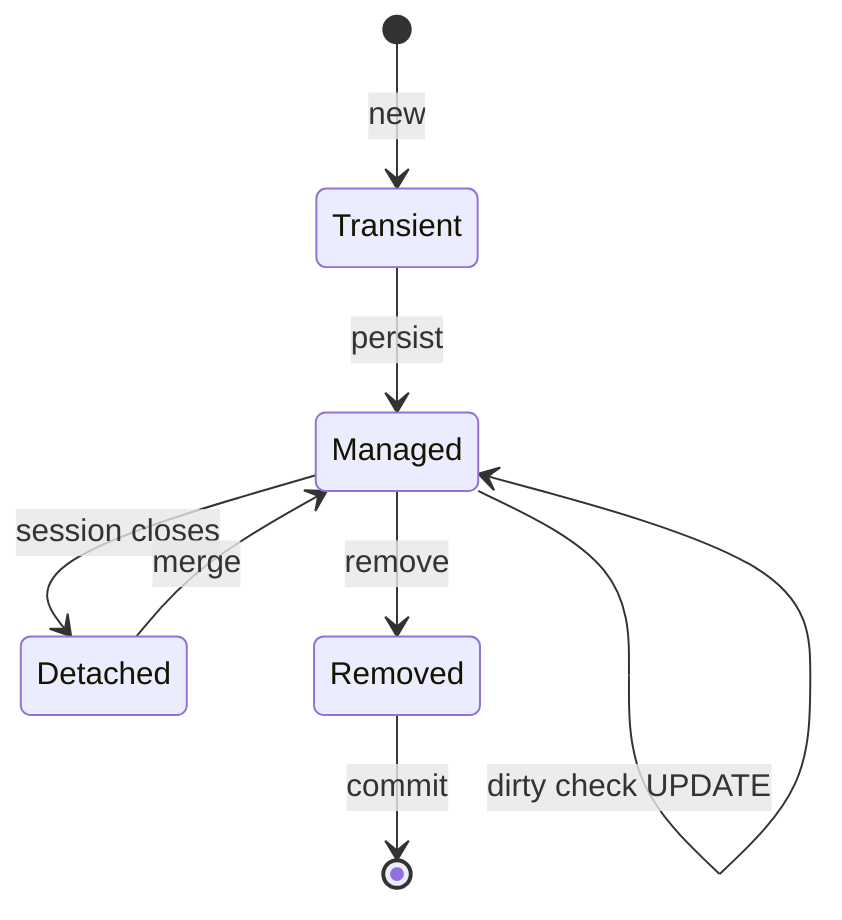

**JPA** is the ORM specification; **Hibernate** is its dominant implementation. It maps objects to rows so you write Java, not SQL — but the abstraction leaks in ways interviewers love to probe, above all the **N+1 problem**.

## Entities and relationships

```java
@Entity
class Order {
    @Id @GeneratedValue(strategy = GenerationType.IDENTITY)
    private Long id;

    @ManyToOne(fetch = FetchType.LAZY)          // many orders → one customer
    @JoinColumn(name = "customer_id")
    private Customer customer;

    @OneToMany(mappedBy = "order", cascade = CascadeType.ALL, orphanRemoval = true)
    private List<LineItem> items = new ArrayList<>();   // one order → many items
}
```

`mappedBy` marks the **inverse** side — the side that does *not* own the foreign key. Cascades propagate operations to children; `orphanRemoval` deletes a child removed from the collection.

## Fetch types — the default that bites

| Association | Default fetch |
|--|--|
| `@ManyToOne`, `@OneToOne` | **EAGER** |
| `@OneToMany`, `@ManyToMany` | **LAZY** |

:::gotcha
Accessing a **LAZY** association after the persistence context (Hibernate session) has closed throws `LazyInitializationException`. Fix it by fetching what you need **inside** the transaction (a `JOIN FETCH` query or an `@EntityGraph`) or by mapping to a DTO — *not* by switching everything to EAGER (which causes the N+1 problem below) and *not* by leaning on Open-Session-In-View.
:::

## The N+1 problem

Load N orders, then touch each order's `customer` (or `items`) lazily → **1 query for the list + N queries for the associations**. On 1,000 orders that's 1,001 round-trips.

```walkthrough
title: N+1 — one list query spawns N more
code: |
  List<Order> orders = repo.findAll();        // 1 query: SELECT * FROM orders
  for (Order o : orders)
      o.getCustomer().getName();              // N queries: one SELECT per order
steps:
  - text: 'Query 1 loads 3 orders. customer is LAZY, so no join yet.'
    array: ['orders', '·', '·', '·']
    highlight: [0]
    line: 1
  - text: 'Touching order[0].customer fires a SELECT customer WHERE id = ... (query 2).'
    array: ['orders', 'q2', '·', '·']
    highlight: [1]
    line: 3
  - text: 'order[1].customer → query 3. order[2].customer → query 4.'
    array: ['orders', 'q2', 'q3', 'q4']
    highlight: [2, 3]
    line: 3
  - text: '1 + N = 4 queries for 3 orders. At scale this is a latency disaster.'
    array: ['1', '+', 'N', '=1+N']
    sorted: [0, 1, 2, 3]
    line: 3
```

**Fixes** — collapse it to a single query:

````tabs
tabs:
  - label: JOIN FETCH (JPQL)
    body: |
      One query pulls parents and children together.
      ```java
      @Query("SELECT o FROM Order o JOIN FETCH o.customer WHERE o.status = :s")
      List<Order> withCustomers(@Param("s") Status s);
      ```
  - label: EntityGraph
    body: |
      Declarative fetch plan on a derived query — no JPQL needed.
      ```java
      @EntityGraph(attributePaths = {"customer", "items"})
      List<Order> findByStatus(Status status);
      ```
  - label: Batch fetching
    body: |
      Turn N selects into ⌈N/size⌉ by loading lazy associations in batches.
      ```properties
      hibernate.default_batch_fetch_size=100
      ```
````

## The persistence context

Within a transaction, the persistence context is a **first-level cache** and an identity map: load the same row twice and you get the *same* object. It also does **dirty checking** — change a managed entity's field and Hibernate auto-generates the `UPDATE` on flush; you never call `save()` for an already-managed entity.

An entity moves through four lifecycle states relative to that context — only a **managed** entity is dirty-checked:



## Spring Data repositories

```java
interface OrderRepository extends JpaRepository<Order, Long> {
    List<Order> findByCustomerIdAndStatus(Long customerId, Status status); // derived query
    @Query("SELECT o FROM Order o WHERE o.total > :min")
    List<Order> bigOrders(@Param("min") BigDecimal min);                   // explicit JPQL
}
```

Spring generates the implementation from the method name. Drop to `@Query` (JPQL or native) when the derived name would get unwieldy.

:::senior
When asked "how do you find a performance problem in a JPA app," the expected answer is: **enable SQL logging** (`show_sql` / datasource-proxy), watch for **N+1** bursts and accidental EAGER graphs, then fix with `JOIN FETCH`/`@EntityGraph`/batch size. Also know that a `JOIN FETCH` on **two** collections causes a cartesian product (fetch one collection per query, or use `@BatchSize`), and that read-heavy paths often skip the entity graph entirely with a **DTO projection**.
:::

## Check yourself

```quiz
title: JPA / Hibernate check
questions:
  - q: 'What causes the N+1 query problem?'
    options:
      - text: 'Loading a list (1 query) then lazily accessing an association on each element (N more queries)'
        correct: true
      - 'Using too many database indexes'
      - 'Declaring an @Id field'
    explain: 'Each lazy association access triggers its own SELECT; 1 list query + N per-row queries = N+1. Fix with JOIN FETCH, @EntityGraph, or batch fetching.'
  - q: 'A LazyInitializationException means:'
    options:
      - text: 'A lazy association was accessed after the persistence context/session closed'
        correct: true
      - 'The entity has no primary key'
      - 'The database is down'
    explain: 'Lazy loading needs an open session; touching the association after the transaction ends fails. Fetch it within the transaction or map to a DTO.'
  - q: 'You change a field on a managed entity inside a transaction but never call save(). What happens?'
    options:
      - 'Nothing is persisted'
      - text: 'Hibernate dirty-checks the entity and issues an UPDATE on flush automatically'
        correct: true
      - 'It throws an exception'
    explain: 'Managed entities in the persistence context are dirty-checked; changes are flushed as UPDATEs without an explicit save.'
```

:::key
JPA maps entities and relationships; `@ManyToOne`/`@OneToOne` are **EAGER** by default, collections **LAZY**. The signature interview trap is **N+1** — a list query plus one query per lazily-touched association — fixed with **JOIN FETCH / `@EntityGraph` / batch fetching**. The persistence context is a first-level cache that **dirty-checks** managed entities. Never expose entities across a closed session (`LazyInitializationException`).
:::
