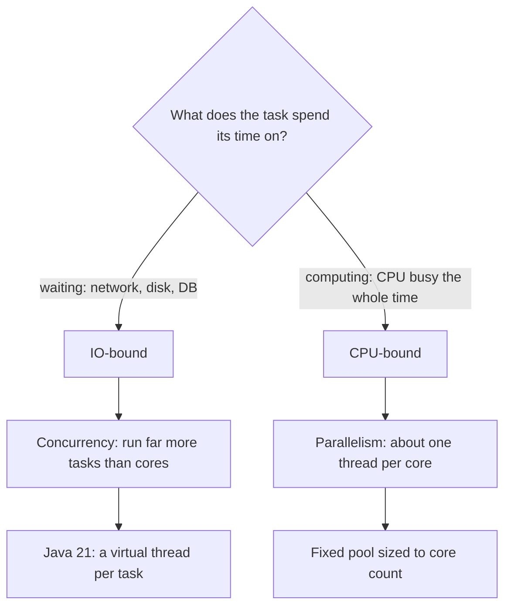

**Concurrency** is the art of *structuring* a program as independent tasks that can make
progress without waiting for one another to finish. **Parallelism** is *executing* multiple
tasks at literally the same instant on multiple cores. They are related but not the same — and
confusing them is the first mistake in most threading interviews.

The one-line version, from Rob Pike: concurrency is about **dealing with** many things at once;
parallelism is about **doing** many things at once. One is a design property; the other is a
runtime property.

## One core takes turns; two cores overlap

The same two tasks, `A` and `B`, run two ways. Each cell below is one **time slice**; the pointer
shows which task owns a core in that slice. Step through it:

```walkthrough
title: Concurrency interleaves on one core; parallelism overlaps on two
steps:
  - text: 'Two independent tasks, **A** and **B**. The row is a **timeline** — each cell is one time slice. First we run them on a **single core**.'
    array: ['—', '—', '—', '—']
    pointers: { 0: 't1', 1: 't2', 2: 't3', 3: 't4' }
  - text: '**t1:** the scheduler hands the one core to **A**. A executes; B just waits its turn.'
    array: ['A', '—', '—', '—']
    highlight: [0]
    pointers: { 0: 'core -> A' }
  - text: '**t2:** a **context switch** — the core is taken from A and given to **B**. Note: only ever *one* task runs at any instant.'
    array: ['A', 'B', '—', '—']
    highlight: [1]
    pointers: { 1: 'core -> B' }
  - text: '**t3 and t4:** the core keeps **interleaving** A and B until both finish at t4. Both progressed, but by *taking turns*. That is **concurrency** — structure, not simultaneity.'
    array: ['A', 'B', 'A', 'B']
    highlight: [2, 3]
    pointers: { 3: 'both done at t4' }
  - text: 'Now the **same tasks on two cores**. **t1:** **A runs on core 1 while B runs on core 2 — at the same instant**, in one slice.'
    array: ['A | B', '—', '—', '—']
    highlight: [0]
    pointers: { 0: 'core1 A, core2 B' }
  - text: '**t2:** both tasks are already complete. Real hardware parallelism finished the work in **half the wall-clock time**.'
    array: ['A | B', 'A | B', '—', '—']
    highlight: [1]
    pointers: { 1: 'both done at t2' }
  - text: 'Same tasks, two outcomes. **Concurrency** (top, 1 core) *interleaves* to stay responsive. **Parallelism** (bottom, 2 cores) *overlaps* to go faster. Structure vs execution.'
    array: ['A | B', 'A | B']
    sorted: [0, 1]
    pointers: { 0: 'parallel', 1: 'finished sooner' }
```

The key insight: a concurrent program *can* run on one core (interleaved) or many cores (parallel)
with **no change to its structure**. Parallelism is one possible *execution* of a concurrent design.

## Concurrency is not parallelism

| | Concurrency | Parallelism |
|--|--|--|
| The question it answers | How do I *structure* code that deals with many tasks? | How do I *execute* many tasks at once? |
| Needs multiple cores? | No — works on one core by interleaving | Yes — requires real parallel hardware |
| Primary goal | Responsiveness, juggling many tasks | Throughput, finishing sooner |
| Example | One core serving 1,000 network requests | 8 cores summing 8 chunks of an array |

## Where each one helps: IO-bound vs CPU-bound

Whether concurrency alone is enough — or you truly need parallelism — depends on what your tasks
*do* with their time.

````tabs
tabs:
  - label: IO-bound (concurrency wins)
    body: |
      The task mostly **waits** — on the network, disk, or a database. While it waits it uses no CPU.
      ```java
      // Each task parks most of its life waiting for bytes
      for (String url : urls)
          pool.submit(() -> download(url));
      ```
      One core can juggle **thousands** of these: while one waits, another runs. More threads than
      cores is not just fine, it is the point.
  - label: CPU-bound (parallelism wins)
    body: |
      The task mostly **computes** — it burns the CPU the whole time, never idle.
      ```java
      // Each task pegs a core doing real math
      for (int[] chunk : chunks)
          pool.submit(() -> sum(chunk));
      ```
      Interleaving on one core buys nothing — the core is already saturated. Speedup needs **real
      cores**. The sweet spot is about the number of cores; extra threads only add switching cost.
````

The classification drives every sizing decision you will make later in this track:



This is also the modern Java 21 answer: **IO-bound** workloads map naturally onto **virtual
threads** (one cheap thread per task, blocking is fine), while **CPU-bound** workloads still want a
**platform-thread pool sized to the core count** — virtual threads add nothing when every task pegs
a core, because the limiting resource is hardware, not thread bookkeeping.

:::gotcha
"More threads = faster" is a myth. For **CPU-bound** work on a single core, extra threads just
time-slice one busy CPU and *add* context-switch overhead — throughput can go **down**. Parallel
speedup needs parallel hardware AND independent work, not just more threads.
:::

:::senior
Because concurrency is *design* and parallelism is *runtime*, a well-structured concurrent program
(tasks + a scheduler) runs unchanged on 1 core or 64 — that decoupling is exactly why you design for
concurrency even before you have the cores. And when you do add cores, **Amdahl's law** bites: the
serial fraction of your program caps the achievable speedup, so past a point more cores buy almost
nothing. Measure the serial fraction before you promise linear scaling.
:::

## Check yourself

```quiz
title: Concurrency vs parallelism check
questions:
  - q: 'What is the sharpest distinction between concurrency and parallelism?'
    options:
      - text: 'Concurrency structures independent tasks that interleave; parallelism runs tasks at the same instant on multiple cores'
        correct: true
      - 'They are two words for the exact same thing'
      - 'Parallelism works on one core; concurrency needs many cores'
    explain: 'Concurrency is a structural/design property (tasks that can interleave); parallelism is a runtime property (simultaneous execution) that requires multiple cores.'
  - q: 'A single-core server handles 1,000 mostly-idle network requests that spend their time waiting on I/O. What helps most?'
    options:
      - text: 'Concurrency — while one request waits on the network, another runs; one core is plenty'
        correct: true
      - 'Nothing can help without adding more CPU cores'
      - 'Only raw parallelism, so the sole fix is more cores'
    explain: 'The work is IO-bound, so tasks mostly wait. Interleaving them on one core keeps it busy and responsive — no extra cores required.'
  - q: 'On a single core, you run a CPU-bound job and keep adding worker threads. What happens?'
    options:
      - text: 'It does not speed up and may slow down, because threads time-slice one busy CPU and add context-switch overhead'
        correct: true
      - 'Throughput scales linearly with the number of threads'
      - 'Each new thread doubles the work done per second'
    explain: 'CPU-bound work already saturates the core. More threads just fight over it and pay switching costs — you need more cores, not more threads.'
```

:::key
**Concurrency** is about *structure* — dealing with many tasks so they can interleave. **Parallelism**
is about *execution* — doing many tasks at the same instant on multiple cores. Concurrency helps most
for **IO-bound** work (tasks that wait); parallelism helps for **CPU-bound** work (tasks that compute).
A concurrent design runs unchanged on 1 core or many — parallelism is just one way to execute it.
:::
