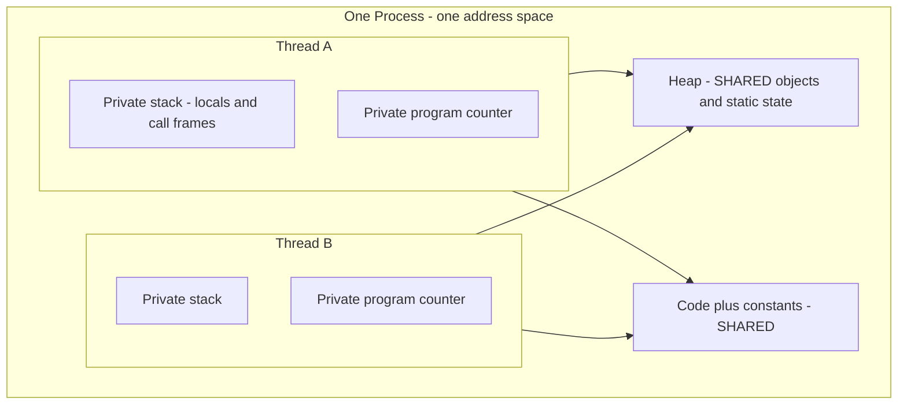

A **process** is a running program with its own isolated block of memory — an *address space* — that
the OS hands it and protects from every other process. A **thread** is a single line of execution
*inside* a process. One process can host many threads, and here is the crux: those threads **share the
process's heap and code**, but each gets its **own stack and program counter**.

## Anatomy: one process, many threads

Everything inside the box is one address space. The heap and code are shared by every thread; each
thread owns only its stack and program counter (PC).



- **Shared** (one copy for the whole process): the **heap** — every `new` object and every `static`
  field lives here — plus loaded code and open file handles.
- **Private** (one per thread): the **stack** (local variables and the chain of call frames), the
  **program counter** (which instruction is next), and CPU registers.

Because locals live on a thread's own stack, they are automatically thread-safe. Because objects live
on the *shared* heap, two threads can touch the same one at the same time — and that is where trouble
begins.

## Process vs thread at a glance

| | Process | Thread |
|--|--|--|
| Memory | Own private address space | Shares the process heap and code |
| Isolation | Strong — a crash is contained to that process | Weak — one thread can corrupt shared state for all |
| Creation cost | Heavy — megabytes and OS setup | Light — a small stack, fast to spawn |
| Communication | IPC: pipes, sockets, shared-memory segments | Read/write shared objects directly — fast but dangerous |
| Context switch | Expensive — swap address space, flush TLB | Cheaper — same address space stays mapped |

## Creating each in Java

````tabs
tabs:
  - label: Thread (shared memory)
    body: |
      A thread runs inside *this* JVM and sees the same heap, so passing data is just a field or a
      reference.
      ```java
      Thread t = new Thread(() -> doWork(sharedList));
      t.start();   // same address space; cheap to spawn
      ```
      Communication is a plain method call or object read — nanoseconds — but every shared object is
      now a potential race.
  - label: Process (isolated memory)
    body: |
      A separate program with its own address space. It cannot see your objects, so you must
      **serialize** data across a boundary.
      ```java
      Process p = new ProcessBuilder("worker", "input.txt").start();
      // talk via its stdin/stdout, a socket, or a file — never a shared reference
      ```
      Heavier to start and slower to talk to, but a crash or corruption stays contained.
````

:::gotcha
The very thing that makes threads cheap — a **shared heap** — is what makes them dangerous. Shared
*mutable* state means two threads can read and write the same object concurrently, and that is the
root of every **race condition**. Isolation buys safety; sharing buys speed. Threads chose speed, and
handed you the bill.
:::

:::senior
"Thread" is overloaded. A classic Java `Thread` is a thin wrapper over an **OS (platform) thread** —
kernel-scheduled, roughly a 1 MB stack, expensive enough that you pool them rather than spawn per task.
**Virtual threads** (Project Loom, Java 21) are user-mode threads the JVM multiplexes onto a handful of
OS threads, so millions become cheap and blocking on I/O is fine. But note what did *not* change: they
still share the same heap and inherit the same race conditions. Cheaper threads do not make shared
mutable state safe.
:::

## Check yourself

```quiz
title: Process vs thread check
questions:
  - q: 'Two threads run in the same process. What do they share, and what is private to each?'
    options:
      - text: 'They share the heap and code; each has its own stack and program counter'
        correct: true
      - 'Nothing is shared — every thread is fully isolated like a process'
      - 'They share the stack; the heap is private per thread'
    explain: 'Threads in a process share the heap (objects, statics) and code, but each owns its stack (locals, call frames) and program counter.'
  - q: 'Why is communication between threads faster but riskier than between processes?'
    options:
      - text: 'Threads share memory, so they exchange data by reading/writing the same objects — fast, but it exposes them to races'
        correct: true
      - 'Threads must use network sockets, which are slow but perfectly safe'
      - 'Processes can share object references directly, so they never need serialization'
    explain: 'Shared memory makes thread-to-thread data exchange a direct read/write (very fast), but concurrent access to the same object is exactly what causes race conditions.'
  - q: 'Why is spawning a new process much heavier than starting a new thread?'
    options:
      - text: 'A process needs a whole new, isolated address space set up by the OS; a thread reuses the process it already lives in'
        correct: true
      - 'A thread must copy the entire heap, while a process shares it'
      - 'Processes are written in a slower language than threads'
    explain: 'Creating a process means the OS builds a fresh address space and bookkeeping (megabytes of setup). A thread just adds a stack inside an existing address space.'
```

:::key
A **process** is an isolated address space; a **thread** is a worker inside it. Threads in one process
**share the heap and code** but each own a **stack and program counter**. Sharing makes threads cheap
to create and fast to communicate — and makes **shared mutable state** the source of races. Strong
isolation (processes) is safety; shared memory (threads) is speed.
:::
