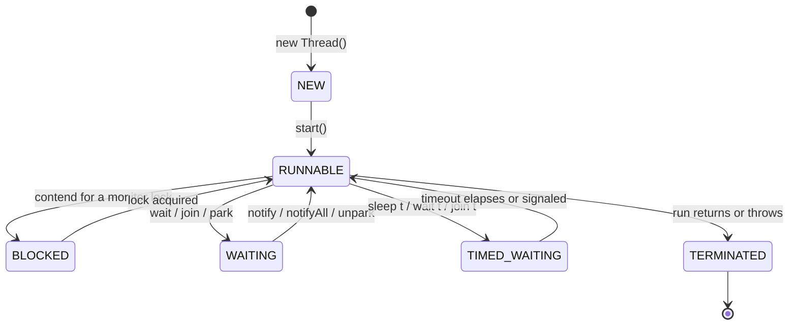

Every Java thread is, at any instant, in exactly one of **six states** — the values of the
`Thread.State` enum. Interviewers love this because each *transition* names a real mechanism: starting,
contending for a lock, waiting for a signal, sleeping, finishing. Learn the state machine and you can
read a thread dump and say precisely *why a thread is stuck*.

## The state machine



Notice the shape: `RUNNABLE` is the hub. A live thread always returns *through* `RUNNABLE` — it cannot
jump straight from `BLOCKED` to `WAITING`. It leaves the hub to wait for something, then comes back to
be scheduled again.

## What each state means

| State | The thread is... | Gets there by | Leaves when |
|--|--|--|--|
| `NEW` | created but not yet started | `new Thread(r)` | you call `start()` |
| `RUNNABLE` | running, or ready and waiting for a CPU | `start()` | it needs a lock, waits, sleeps, or finishes |
| `BLOCKED` | waiting to acquire a monitor lock | entering a `synchronized` block another thread holds | the lock is released and it grabs it |
| `WAITING` | waiting indefinitely for a signal | `wait()`, `join()`, `LockSupport.park()` | `notify()`/`notifyAll()`, the joined thread ends, or `unpark()` |
| `TIMED_WAITING` | waiting, but with a deadline | `sleep(t)`, `wait(t)`, `join(t)` | the timeout elapses or it is signaled early |
| `TERMINATED` | finished | `run()` returns or throws | never — it is the end state |

## The three "not running" states, compared

`BLOCKED`, `WAITING`, and `TIMED_WAITING` all mean the thread is off the CPU — but for very different
reasons, which is exactly what an interviewer probes.

````tabs
tabs:
  - label: BLOCKED
    body: |
      Stuck at the door of a `synchronized` block another thread is inside. Pure **lock contention** —
      the thread wants the monitor and will proceed the instant it is free.
      ```java
      synchronized (lock) { ... }   // BLOCKED here if another thread holds lock
      ```
      No timeout, no signal needed — just waiting for a lock.
  - label: WAITING
    body: |
      Voluntarily parked with **no deadline**, waiting for another thread to wake it. This is
      **coordination**, not contention.
      ```java
      synchronized (lock) { lock.wait(); }   // sleeps until notify()
      otherThread.join();                    // sleeps until otherThread ends
      ```
      It *cannot* proceed until someone signals it — forget to, and it waits forever.
  - label: TIMED_WAITING
    body: |
      Like `WAITING`, but with a **clock**. It wakes on a signal or when the time runs out — whichever
      comes first.
      ```java
      Thread.sleep(1000);   // wakes after 1s no matter what
      lock.wait(1000);      // wakes on notify() OR after 1s
      ```
      The deadline is a safety net against waiting forever.
````

:::gotcha
`RUNNABLE` does **not** mean "running right now." The JVM lumps *running* and *ready-to-run* into one
state — and, crucially, a thread blocked on **I/O** (reading a socket, waiting on disk) also shows as
`RUNNABLE`, not `BLOCKED`. `BLOCKED` means one specific thing: waiting for a **monitor lock**. Do not
read a thread dump as if `RUNNABLE` equals healthy.
:::

:::senior
The split between `BLOCKED` and `WAITING` maps to two different failure modes. `BLOCKED` is lock
**contention** — the thread proceeds the moment the monitor frees, so a thread stuck `BLOCKED` forever
usually smells of **deadlock** (a lock cycle). `WAITING` is **coordination** — the thread parked itself
and depends on someone else to signal it, so a thread stuck `WAITING` forever usually means a **lost
signal** or a condition that never became true. Same "hung thread" in a dump; opposite root causes and
opposite fixes. Reach for a thread dump first — the state alone narrows the diagnosis by half.
:::

## Check yourself

```quiz
title: Thread lifecycle check
questions:
  - q: 'You call `new Thread(r)` but have not yet called `start()`. What state is the thread in?'
    options:
      - text: 'NEW'
        correct: true
      - 'RUNNABLE'
      - 'BLOCKED'
    explain: 'A Thread object that has been constructed but not started is in NEW. It moves to RUNNABLE only when start() is called.'
  - q: 'A thread tries to enter a `synchronized` block that another thread currently holds. What state is it in?'
    options:
      - text: 'BLOCKED'
        correct: true
      - 'WAITING'
      - 'TIMED_WAITING'
    explain: 'BLOCKED specifically means the thread is waiting to acquire a monitor lock held by someone else. It resumes the instant the lock is released.'
  - q: 'What is the difference between WAITING and TIMED_WAITING?'
    options:
      - text: 'TIMED_WAITING has a deadline (sleep(t), wait(t), join(t)); WAITING waits indefinitely for a signal'
        correct: true
      - 'WAITING is only for I/O; TIMED_WAITING is only for locks'
      - 'They are identical — TIMED_WAITING is just an alias'
    explain: 'Both are off-CPU waits, but TIMED_WAITING wakes when its timeout elapses (or on an early signal), while WAITING has no timeout and depends entirely on being signaled.'
```

:::key
A Java thread is always in one of six `Thread.State` values: `NEW` → `RUNNABLE` →
(`BLOCKED` / `WAITING` / `TIMED_WAITING`) → `RUNNABLE` → `TERMINATED`. `RUNNABLE` is the hub and covers
both *running* and *ready* (and I/O waits). `BLOCKED` is **lock contention**; `WAITING` is **indefinite
coordination**; `TIMED_WAITING` is the same with a **deadline**. Knowing which is which turns a hung
thread dump into a diagnosis.
:::
