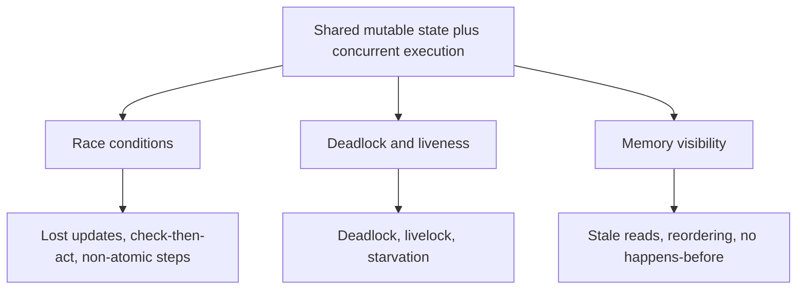

Sequential code runs one statement after another, exactly as written. The moment two threads share
**mutable state**, that guarantee evaporates: instructions from different threads **interleave** in
orders you never chose, and the compiler and CPU are free to **reorder** memory operations for speed.
Almost every concurrency bug falls into one of **three hazard families**.

## The three hazard families



One root cause branches into three failure modes. Keep the root in mind — every fix in this track is
ultimately about controlling **who touches shared state, when, and in what order**.

## A taste of each

Three tiny programs, three different ways to be wrong. Each looks innocent.

````tabs
tabs:
  - label: Race condition
    body: |
      Two threads read-modify-write the same field; an update vanishes.
      ```java
      count++;   // really: read, add 1, write — another thread can slip in between
      ```
      Correctness depends on **timing**. Fix: make the step **atomic**. Covered next in the
      **Shared-State** module.
  - label: Deadlock and liveness
    body: |
      Each thread holds one lock and waits for the other's — forever.
      ```java
      // T1: synchronized(a) { synchronized(b) {...} }
      // T2: synchronized(b) { synchronized(a) {...} }
      ```
      Nobody makes **progress**. Fix: consistent lock ordering, timeouts. Covered in the **locks and
      liveness** module.
  - label: Memory visibility
    body: |
      One thread sets a flag; the other never sees the write and loops forever.
      ```java
      boolean running = true;   // not volatile
      // reader: while (running) {}   // may spin forever on a stale cached value
      ```
      The write is never made **visible**. Fix: `volatile`, locks, a happens-before edge. Covered in
      the **Java Memory Model** module.
````

### 1. Race conditions — the *interleaving* hazard

Timing decides the answer. Because a step like `count++` is secretly **read-modify-write**, two threads
can both read the same value and both write it back, losing an update. Change the interleaving and you
change the result. This is the star of the very next module, **The Shared-State Problem**.

### 2. Deadlock and liveness — the *progress* hazard

Here threads do not corrupt data — they simply stop making progress. **Deadlock**: a cycle of threads
each waiting on a lock another holds. **Livelock**: threads keep reacting to each other and spin without
advancing. **Starvation**: one thread is perpetually denied a resource. We tackle these in the module on
**locks and liveness**.

### 3. Memory visibility — the *ordering* hazard

Even with no interleaving problem, a write made by one thread may **never become visible** to another —
values sit in a CPU cache or register, and the compiler may **reorder** operations. Without an explicit
**happens-before** relationship, a reader can loop forever on a flag a writer already flipped. This is
the domain of the **Java Memory Model** module.

:::gotcha
The cruelest property of all three: they are **non-deterministic**. The bad interleaving is rare, so
your tests pass, it works on your laptop, and it corrupts data in production under load. "It works on my
machine" is not evidence of thread-safety — you cannot *test* your way to confidence here, you have to
**reason** about it.
:::

:::senior
Notice the single common cause under every branch: **shared mutable state**. Remove any one of those
three words and the hazards shrink. No **sharing** (thread confinement, per-thread copies) — no races.
No **mutation** (immutability, `final` fields) — nothing to corrupt or leave stale. That is why the
senior playbook is a hierarchy: first *do not share mutable state*; if you must share, make it
**immutable**; only if it must change do you reach for a lock or an atomic — and then guard *every*
access with the *same* one. Every mechanism in the rest of this track is a tool for exactly that.
:::

## Check yourself

```quiz
title: Why concurrency is hard check
questions:
  - q: 'Which of these is NOT one of the three core concurrency hazard families?'
    options:
      - text: 'Compile-time type errors'
        correct: true
      - 'Race conditions'
      - 'Memory visibility'
    explain: 'The three hazard families are race conditions, deadlock/liveness, and memory visibility. Type errors are caught by the compiler and are unrelated to concurrency.'
  - q: 'What single root cause underlies all three hazard families?'
    options:
      - text: 'Shared mutable state accessed by concurrent threads'
        correct: true
      - 'CPUs that are too slow to keep up'
      - 'Using too few threads for the workload'
    explain: 'Sharing state that can change, while multiple threads run, is the common root. Remove sharing or remove mutation and the hazards largely disappear.'
  - q: 'Why are these bugs so hard to catch before production?'
    options:
      - text: 'They are non-deterministic — the bad interleaving is rare and timing-dependent, so tests usually pass'
        correct: true
      - 'They always throw a clear exception the first time they run'
      - 'They only occur on specialized server hardware, never on a laptop'
    explain: 'The faulty ordering is just one of many possible interleavings, so the program usually behaves — until real load makes the rare bad case surface. You must reason about correctness, not rely on testing.'
```

:::key
Concurrency is hard because sharing **mutable state** across threads breaks sequential intuition in
three ways: **race conditions** (interleaving), **deadlock and liveness** (progress), and **memory
visibility** (ordering). All three share one root — *shared mutable state* — and all three are
**non-deterministic**, so testing cannot prove their absence. The rest of this track is the toolkit:
confinement, immutability, locks, atomics, and the memory model. Next up: **The Shared-State Problem**.
:::
