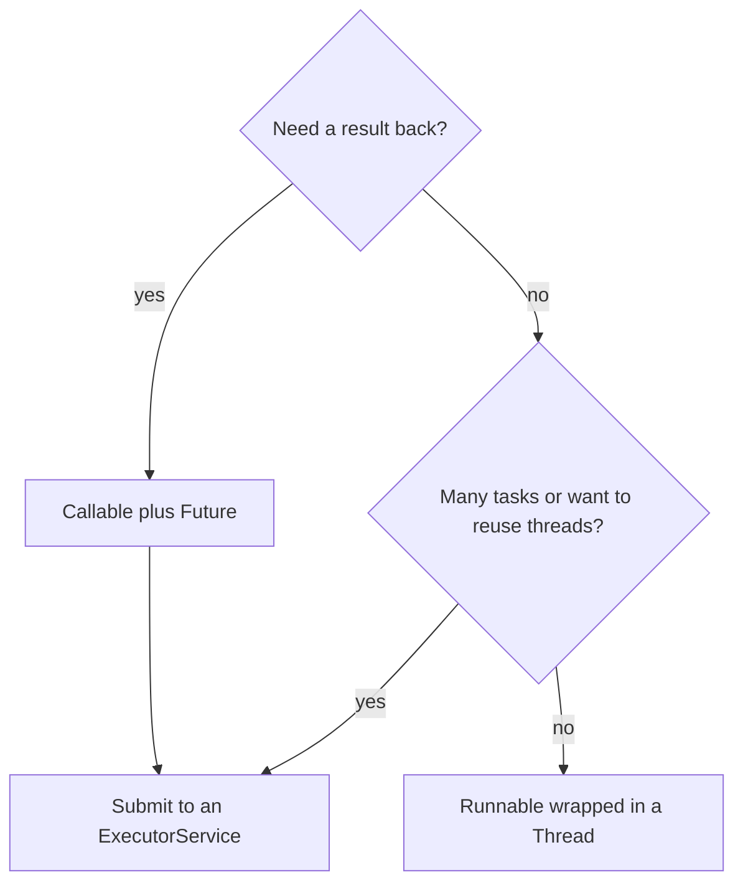

A **thread** is an independent path of execution with its own call stack, scheduled by the JVM onto
an OS thread. Java gives you four common ways to get code running on one — they differ in *what*
you pass, whether you get a **result back**, and how well they **scale**.

## Which one should I reach for?

Two questions settle almost every case: do you need a **value back**, and are you running **one task
or many**?



Notice both arrows lead toward an **ExecutorService**: in real code you rarely `new Thread()` by hand.

## The four approaches, side by side

The centerpiece — the same "print a message off the main thread" task, four ways:

````tabs
tabs:
  - label: extends Thread
    body: |
      Subclass `Thread` and override `run()`. Simple, but it **burns your one superclass** and
      welds *what to run* to *how to run it*.
      ```java
      class Worker extends Thread {
        @Override public void run() {
          System.out.println("hi from " + getName());
        }
      }
      new Worker().start();   // start(), never run()
      ```
  - label: implements Runnable
    body: |
      Put the work in a `Runnable` and hand it to a `Thread`. Your class stays free to extend
      something else — the **preferred low-level form**.
      ```java
      Runnable task = () -> System.out.println("hi from a thread");
      new Thread(task).start();
      ```
      A `Runnable` returns `void` and cannot throw checked exceptions.
  - label: Callable + Future
    body: |
      A `Callable<V>` **returns a value** and may throw a checked exception. You get a `Future<V>`
      to fetch the result later; `future.get()` **blocks** until it is ready.
      ```java
      Callable<Integer> task = () -> 6 * 7;
      Future<Integer> f = executor.submit(task);
      Integer answer = f.get();   // blocks, returns 42
      ```
  - label: ExecutorService (recommended)
    body: |
      Don't manage threads yourself — submit tasks to a **pool** that reuses a bounded set of
      threads. Accepts both `Runnable` and `Callable`.
      ```java
      ExecutorService pool = Executors.newFixedThreadPool(4);
      pool.submit(() -> System.out.println("pooled task"));
      Future<Integer> f = pool.submit(() -> 6 * 7);
      pool.shutdown();
      ```
      The default for anything beyond a one-off thread.
````

**Runnable and Callable are just tasks** — a chunk of work. `Thread` and `ExecutorService` are the
*machinery* that runs them. Separating the two is why the interface forms win.

:::gotcha
Subclassing `Thread` uses up Java's single inheritance slot and tangles your business logic with
thread management. Prefer implementing `Runnable`/`Callable` and passing the task to a `Thread` or,
better, an executor. Also, spinning up a **raw `new Thread()` per task** doesn't scale — thousands of
threads exhaust memory and thrash the scheduler. That's what pools are for.
:::

:::senior
Modern Java rarely creates `Thread` objects directly. Use an `ExecutorService` so thread lifecycle,
sizing, and queuing are managed for you. And since Java 21, **virtual threads** (Project Loom,
`Executors.newVirtualThreadPerTaskExecutor()`) make one-thread-per-task cheap again — millions of
lightweight threads that park instead of blocking an OS thread — which changes the old "always pool"
advice for blocking I/O workloads.
:::

## Check yourself

```quiz
title: Creating threads check
questions:
  - q: 'Why is implementing `Runnable` usually preferred over extending `Thread`?'
    options:
      - text: 'It keeps your one inheritance slot free and separates the task from the thread that runs it'
        correct: true
      - 'Runnable runs faster than a Thread subclass'
      - 'Only Runnable can be started with start()'
    explain: 'Java allows a single superclass; subclassing Thread wastes it and couples work to mechanism. A Runnable is just a task you can hand to any Thread or executor.'
  - q: 'What does a `Callable` give you that a `Runnable` does not?'
    options:
      - text: 'It returns a value (and can throw a checked exception), retrievable via a Future'
        correct: true
      - 'It runs without needing a thread'
      - 'It cannot be submitted to an ExecutorService'
    explain: 'Runnable.run() returns void; Callable.call() returns a result and may throw checked exceptions. You read that result from the Future the executor hands back.'
  - q: 'For running many short tasks, what is the recommended approach?'
    options:
      - 'Create a new Thread for each task'
      - text: 'Submit them to an ExecutorService that reuses a pool of threads'
        correct: true
      - 'Extend Thread and override run() for each'
    explain: 'A pool bounds and reuses threads, avoiding the cost and memory blow-up of creating one OS thread per task.'
```

:::key
A **Runnable/Callable is the task**; a **Thread/ExecutorService is the runner**. Prefer the interface
forms over `extends Thread`. Use **Callable + Future** when you need a **result**, and reach for an
**ExecutorService** (or virtual threads on Java 21+) instead of hand-rolling `new Thread()` for
anything more than a one-off.
:::
