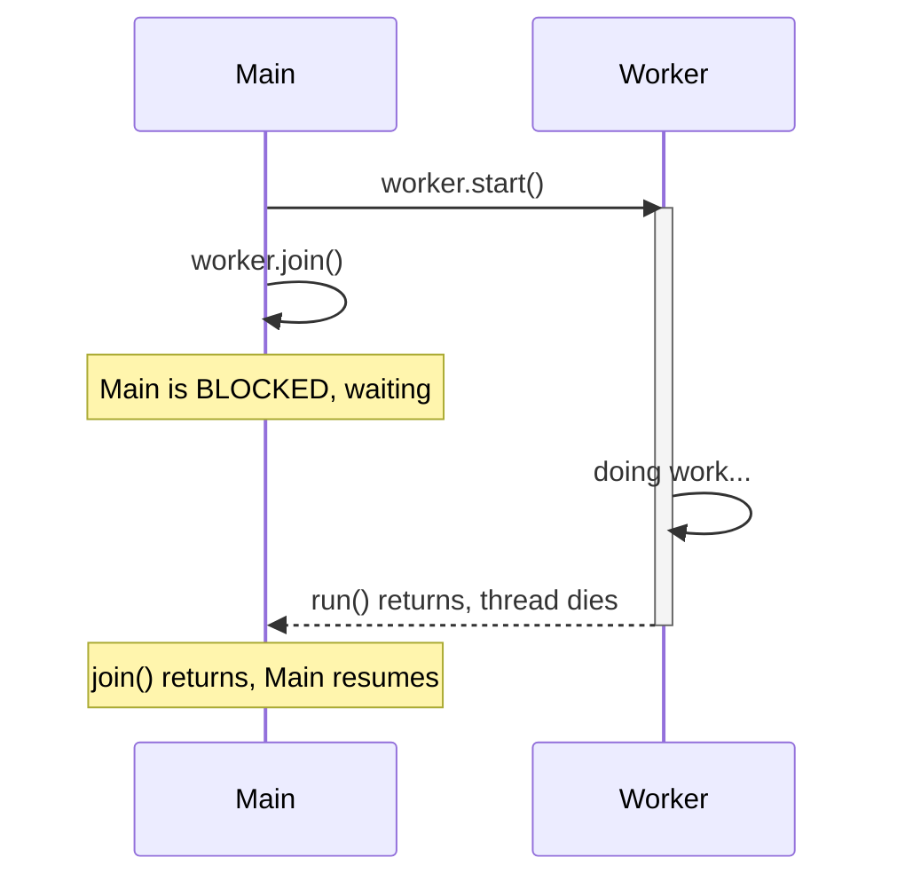

Once you have a thread, a handful of methods drive it. The two that matter most in interviews are
**`start()`** — which actually launches a new thread — and **`join()`** — which makes one thread
*wait* for another to finish.

## `join()` — waiting for a worker to finish

The most common coordination pattern: `main` launches a worker, then **blocks on `join()`** until
the worker's `run()` returns. Only then does `main` continue.



Without the `join()`, `main` would race ahead and might read the worker's results before they exist.

## The method cheat sheet

| Method | Static? | What it does | Key nuance |
|--|--|--|--|
| `start()` | no | Creates a new thread; the JVM calls `run()` on it | Call **once** per thread |
| `run()` | no | The body of work | Calling it *directly* does **not** start a thread |
| `join()` | no | Block the caller until this thread dies | Has a timed variant `join(ms)` |
| `sleep(ms)` | yes | Pause the **current** thread for a duration | **Keeps** any locks it holds |
| `yield()` | yes | Hint the scheduler to let others run | Advisory — often a no-op |
| `setName()`/`getName()` | no | Label the thread | Priceless in logs and stack dumps |
| `isAlive()` | no | Has it started but not yet died? | — |

## `start()` vs `run()` — the classic trap

```java
Thread t = new Thread(() -> System.out.println(Thread.currentThread().getName()));

t.start();   // prints "Thread-0"  -> runs on a NEW thread
t.run();     // prints "main"      -> just a plain method call, no new thread
```

The two operations most people confuse are the pausing ones — here is how `sleep`, `yield`, and
`join` differ:

````tabs
tabs:
  - label: sleep
    body: |
      Pause the **current** thread for a fixed time. It stays off the CPU but **holds every lock it
      owns**.
      ```java
      Thread.sleep(1000);   // this thread naps for ~1s
      ```
      Throws `InterruptedException` — someone can wake it early.
  - label: yield
    body: |
      A *hint* that the current thread is willing to give up the CPU. The scheduler is free to
      **ignore it**, so it is almost never load-bearing.
      ```java
      Thread.yield();   // "others may go now" — maybe
      ```
  - label: join
    body: |
      Wait for **another** thread to finish before continuing.
      ```java
      worker.start();
      worker.join();          // block until worker dies
      worker.join(500);       // ...but at most 500ms
      ```
      Used to collect results or enforce ordering across threads.
````

:::gotcha
Calling **`t.run()` runs the body on the current thread** — no new thread is created, no concurrency
happens. Only **`t.start()`** spawns a thread and has the JVM invoke `run()`. Calling `start()`
**twice** on the same `Thread` throws `IllegalThreadStateException`.
:::

:::senior
`sleep()` does **not** release locks — a thread that sleeps inside a `synchronized` block keeps the
monitor, so everyone waiting on that lock stays blocked. That is the crucial difference from
`Object.wait()`, which *does* release the monitor while it waits. Reaching for `sleep()` to
"coordinate" threads is an anti-pattern (busy-wait / lost-wakeup risk); use `join()`, a latch, or a
condition instead. And `Thread.sleep(n)` guarantees *at least* `n` ms, not exactly `n` — it depends
on OS timer granularity and scheduling.
:::

## Check yourself

```quiz
title: Thread operations check
questions:
  - q: 'You call `t.run()` instead of `t.start()`. What happens?'
    options:
      - text: 'The code runs synchronously on the current thread — no new thread is created'
        correct: true
      - 'A new thread starts, same as start()'
      - 'It throws IllegalThreadStateException'
    explain: 'run() is just a normal method call. Only start() asks the JVM to create a new thread and invoke run() on it.'
  - q: 'What does `worker.join()` do when called from main?'
    options:
      - text: 'Blocks main until the worker thread finishes'
        correct: true
      - 'Merges the worker thread into main to run twice as fast'
      - 'Immediately stops the worker thread'
    explain: 'join() makes the caller wait for the target thread to die, which is how you wait for results or enforce ordering.'
  - q: 'A thread calls `Thread.sleep()` while holding a lock. What happens to the lock?'
    options:
      - 'It is released for the duration of the sleep'
      - text: 'It is kept — sleep does not release locks'
        correct: true
      - 'It is downgraded to a read lock'
    explain: 'sleep() only pauses the thread; it retains all monitors it holds. That is the key contrast with Object.wait(), which releases the monitor.'
```

:::key
**`start()`** spawns a thread and runs `run()` on it; calling **`run()`** directly just executes on
the current thread. **`join()`** blocks the caller until a thread finishes. **`sleep()`** pauses the
current thread **without releasing locks**; **`yield()`** is an ignorable hint. Always name your
threads — it pays off the first time you read a stack dump.
:::
