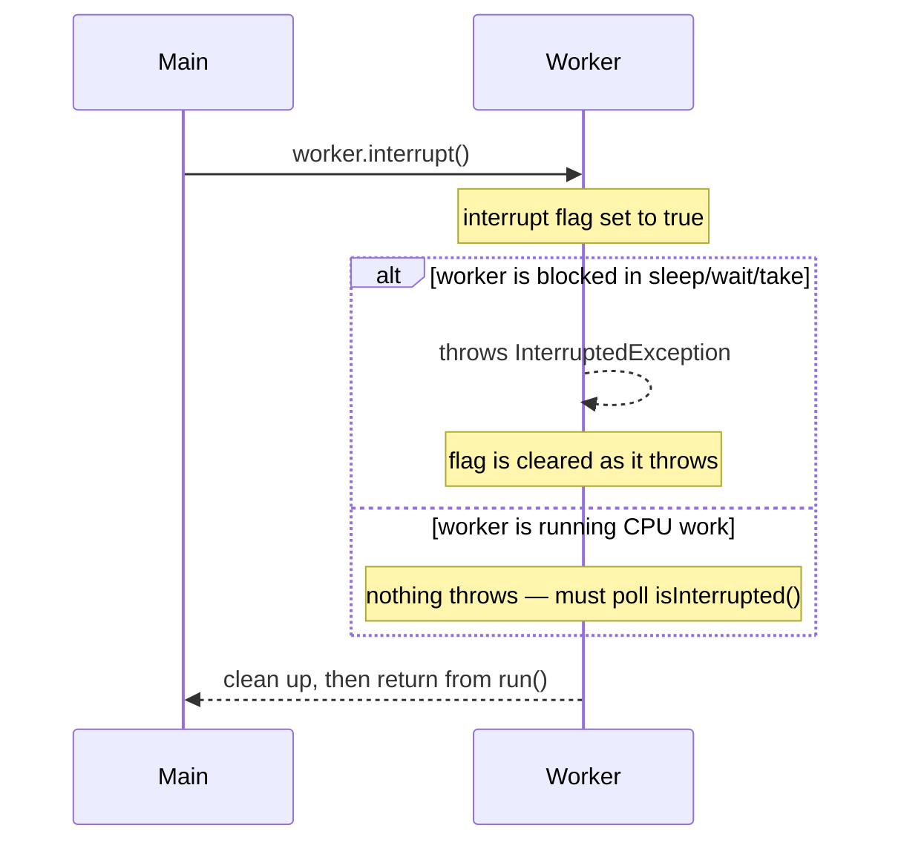

Java deliberately has **no safe way to force-kill a thread**. Instead, cancellation is
**cooperative**: **`interrupt()`** *asks* a thread to stop, and the thread is responsible for
noticing and winding down cleanly. Think of an interrupt as a **polite request**, not a kill switch.

## How an interrupt travels

Calling `worker.interrupt()` does one of two things depending on what the worker is doing:



Two channels, one signal: a **blocking call throws**, a **busy loop must check the flag**.

## Watch the interrupt flag

Step through the state of the interrupt flag as a worker is cancelled while sleeping:

```walkthrough
title: Cooperative cancellation — the interrupt flag
steps:
  - text: 'Worker runs normally. Its **interrupt flag** is `false` — no one has asked it to stop.'
    array: ['false']
    pointers: { 0: 'flag' }
  - text: 'Main calls `worker.interrupt()`. The JVM **sets the flag to true**. The worker is not stopped — it has only been *asked*.'
    array: ['true']
    highlight: [0]
    pointers: { 0: 'flag' }
  - text: 'The worker is blocked in `Thread.sleep(...)`. That call notices the flag, **throws `InterruptedException`**, and **clears the flag back to false** as it throws.'
    array: ['false']
    highlight: [0]
    pointers: { 0: 'flag' }
  - text: 'The `catch` block runs. If we **swallow** the exception here and keep going, the cancellation signal is now completely **lost**.'
    array: ['false']
    pointers: { 0: 'signal lost' }
  - text: 'Correct handling: **restore the flag** with `Thread.currentThread().interrupt()` so callers up the stack can still see it.'
    array: ['true']
    highlight: [0]
    pointers: { 0: 'flag' }
  - text: 'The worker sees the flag, runs its cleanup, and **returns from `run()`** — a clean, cooperative exit.'
    array: ['done']
    sorted: [0]
    pointers: { 0: 'exit' }
```

## The three methods

| Call | Static? | Effect on the flag |
|--|--|--|
| `thread.interrupt()` | no | **Sets** the target's flag (or makes its blocking call throw) |
| `thread.isInterrupted()` | no | **Reads** the flag — does **not** clear it |
| `Thread.interrupted()` | yes | Reads **and clears** the *current* thread's flag |

So the two ways a thread observes cancellation are polling a loop versus catching an exception:

````tabs
tabs:
  - label: Busy loop — poll the flag
    body: |
      CPU-bound work never blocks, so nothing throws. You must **check the flag yourself** and bail
      out.
      ```java
      while (!Thread.currentThread().isInterrupted()) {
        crunch();   // do a chunk of work
      }
      // interrupted: fall out of the loop and clean up
      ```
  - label: Blocking call — catch the exception
    body: |
      `sleep`, `wait`, `join`, `BlockingQueue.take`, and friends **throw `InterruptedException`** when
      interrupted. Handle it — don't ignore it.
      ```java
      try {
        queue.take();               // blocks
      } catch (InterruptedException e) {
        Thread.currentThread().interrupt();  // restore the flag
        return;                     // stop working
      }
      ```
````

:::gotcha
The number-one interrupt bug is **swallowing `InterruptedException`**:
```java
try { Thread.sleep(1000); }
catch (InterruptedException e) { }   // BUG: signal thrown away
```
The throw **already cleared the flag**, so if you also eat the exception, nobody upstream ever learns
the thread was asked to stop — cancellation silently breaks. Either **rethrow** it or **restore the
flag** via `Thread.currentThread().interrupt()` before returning.
:::

:::senior
`Thread.stop()` has been **disabled since JDK 20** (it now throws `UnsupportedOperationException`) and is deprecated for removal. It was fundamentally **unsafe**: it forcibly threw a
`ThreadDeath` at an arbitrary point and **released all of the thread's locks immediately**, leaving
shared objects in a **half-updated, invariant-violating state** with no chance to finish or roll
back. `suspend()`/`resume()` are deprecated too — suspending a thread while it holds a lock is a
textbook **deadlock**. Cooperative interruption is the *only* safe model precisely because the target
gets to stop at a point where its invariants hold.
:::

## Drill the interrupt API

Three near-identical method names with three different behaviors — this is pure recall material,
and interviewers use it as a quick filter.

```flashcards
title: Interruption recall
cards:
  - front: '`thread.interrupt()` — what exactly happens?'
    back: 'Sets the target''s **interrupt flag**. If the target is blocked in `sleep`/`wait`/`join`/`take`, that call wakes up, **throws `InterruptedException`, and clears the flag**. A busy thread just keeps the flag set until it polls.'
  - front: '`thread.isInterrupted()` vs `Thread.interrupted()`'
    back: 'Instance `isInterrupted()` **reads** the flag, leaves it set. Static `Thread.interrupted()` reads **and clears** the *current* thread''s flag — call it twice in a row and the second returns `false`.'
  - front: 'Which JDK calls throw `InterruptedException`?'
    back: '`sleep`, `wait`, `join`, `BlockingQueue.put/take`, `Future.get`, `Semaphore.acquire`, `CountDownLatch.await`, `lockInterruptibly()`. **Not** interrupt-responsive: `synchronized` monitor entry and plain `Lock.lock()`.'
  - front: 'Interrupt arrives *before* the thread reaches a blocking call?'
    back: 'The flag stays set; the **next** blocking call throws `InterruptedException` immediately on entry. The signal is never lost by arriving early — only by being swallowed.'
  - front: 'Correct responses to catching `InterruptedException`?'
    back: 'Either **propagate** it (declare `throws`), or **restore the flag** — `Thread.currentThread().interrupt()` — and stop working. An empty catch block destroys the cancellation signal.'
```

## Check yourself

```quiz
title: Interruption check
questions:
  - q: 'What does calling `thread.interrupt()` actually do to a running (non-blocked) thread?'
    options:
      - text: 'Sets its interrupt flag — the thread must poll it and choose to stop'
        correct: true
      - 'Immediately terminates the thread'
      - 'Throws InterruptedException on the calling thread'
    explain: 'Interruption is cooperative. For CPU-bound code it just sets a flag the target must check via isInterrupted(); it does not force a stop.'
  - q: 'You catch `InterruptedException` from `Thread.sleep()` and do nothing. Why is that a bug?'
    options:
      - text: 'The throw already cleared the flag, so swallowing the exception loses the cancellation signal entirely'
        correct: true
      - 'It leaks memory'
      - 'It restarts the thread automatically'
    explain: 'InterruptedException clears the flag as it is thrown. If you also discard the exception, no code upstream can tell the thread was interrupted. Restore the flag or rethrow.'
  - q: 'Why is `Thread.stop()` deprecated?'
    options:
      - 'It is too slow'
      - text: 'It releases all locks abruptly and can leave shared state corrupted mid-update'
        correct: true
      - 'It only works on daemon threads'
    explain: 'stop() (disabled since JDK 20) threw ThreadDeath at an arbitrary point and unlocked everything immediately, so objects could be left half-modified with broken invariants. Cooperative interruption avoids that.'
```

:::key
Cancellation in Java is **cooperative**. `interrupt()` sets a flag (or makes a blocking call throw
`InterruptedException`); the target must **poll `isInterrupted()`** or **catch the exception** and
wind down. Never **swallow** `InterruptedException` — **rethrow it or restore the flag**. Force-stop
APIs (`stop`/`suspend`) are deprecated because they corrupt state and deadlock.
:::
