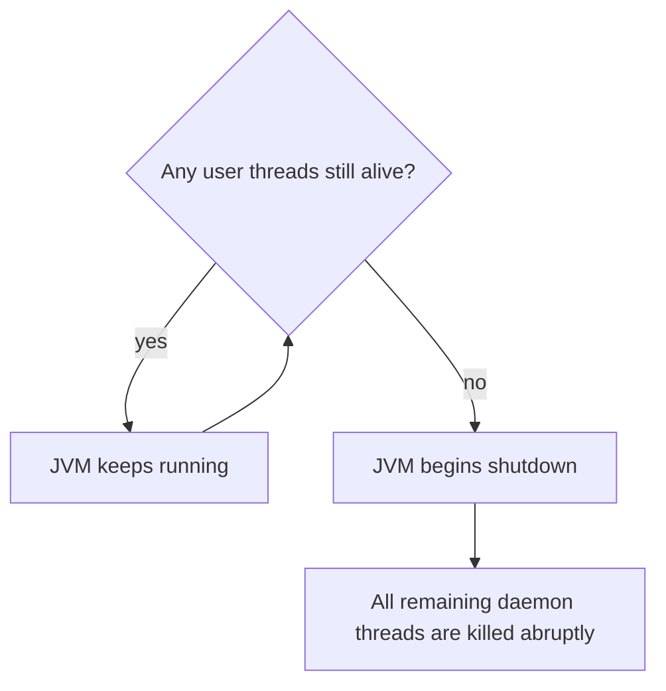

Every Java thread is either a **user thread** or a **daemon thread**, and that single flag decides
one thing: **whether the JVM is allowed to exit while the thread is still running.** Daemons are
background helpers (think GC, monitoring) — the JVM won't wait around for them.

## When does the JVM exit?

The rule: the JVM shuts down once **the last user thread finishes**. Any daemon threads still running
are then **killed abruptly**.



## User vs daemon at a glance

| | User thread | Daemon thread |
|--|--|--|
| Keeps JVM alive? | **Yes** | No |
| Fate at JVM exit | Runs to completion | **Killed abruptly** |
| Default for `new Thread()` | Yes (inherits from creator) | Only if you call `setDaemon(true)` |
| Typical use | Application work that must finish | Background chores — heartbeats, cache eviction, GC |

Set the flag **before** you start the thread:

````tabs
tabs:
  - label: User thread (default)
    body: |
      The JVM waits for it. `main` can return and the program stays alive until this finishes.
      ```java
      Thread t = new Thread(this::importantWork);
      t.start();               // JVM will NOT exit until this ends
      ```
  - label: Daemon thread
    body: |
      Background helper. The moment the last user thread ends, the JVM leaves without waiting.
      ```java
      Thread t = new Thread(this::heartbeat);
      t.setDaemon(true);       // must be set BEFORE start()
      t.start();               // JVM may exit and kill this mid-run
      ```
  - label: Priorities (hints only)
    body: |
      A number 1–10 nudging the scheduler. **Advisory** — the OS may collapse or ignore it entirely.
      ```java
      t.setPriority(Thread.MAX_PRIORITY);   // 10; NORM=5, MIN=1
      ```
      Never build correctness on priority ordering.
````

:::gotcha
Daemon threads are **killed abruptly** when the JVM exits — their `finally` blocks and cleanup code
may **not run**, buffers may not flush, and files may be left half-written. Never use a daemon for
work that **must complete** (writing records, releasing external resources). Also: `setDaemon(true)`
must be called **before `start()`**, or you get `IllegalThreadStateException`.
:::

:::senior
Thread **priorities are portability quicksand**. They map onto native OS priorities differently on
every platform — Windows, Linux, and macOS collapse Java's 1–10 range in different ways, and some
schedulers ignore them outright. Relying on priority for correctness invites **starvation** (a
low-priority thread never runs) and **priority inversion** (a high-priority thread waits on a lock
held by a low-priority one). Treat priorities as a faint hint at best; encode real ordering with
explicit coordination (queues, latches, `join()`), not scheduler nudges.
:::

## Check yourself

```quiz
title: Daemon and priority check
questions:
  - q: 'What determines whether the JVM keeps running?'
    options:
      - text: 'At least one user (non-daemon) thread is still alive'
        correct: true
      - 'At least one thread of any kind is alive'
      - 'The main thread has not returned'
    explain: 'The JVM exits when the last user thread finishes. Daemon threads never keep it alive, and main returning does not matter if other user threads are running.'
  - q: 'Why should you not run must-complete work on a daemon thread?'
    options:
      - 'Daemon threads run slower'
      - text: 'They are killed abruptly at JVM exit, so cleanup and finally blocks may not run'
        correct: true
      - 'They cannot access shared memory'
    explain: 'When the last user thread ends, remaining daemons are terminated without a chance to finish, risking lost writes and un-flushed buffers.'
  - q: 'How reliable is `setPriority()` for controlling execution order?'
    options:
      - 'Fully reliable — higher priority always runs first'
      - text: 'It is only an OS-dependent hint the scheduler may ignore'
        correct: true
      - 'It guarantees the thread never sleeps'
    explain: 'Priorities are advisory and map to native priorities inconsistently across platforms. Use explicit coordination for real ordering, not priority.'
```

:::key
**User threads keep the JVM alive; daemon threads do not** — the JVM exits when the last user thread
ends and **kills remaining daemons abruptly**, so never put must-finish work on a daemon. Call
`setDaemon(true)` **before `start()`**. Thread **priorities (1–10) are OS-dependent hints** — useful
as a nudge, never as a correctness guarantee.
:::
