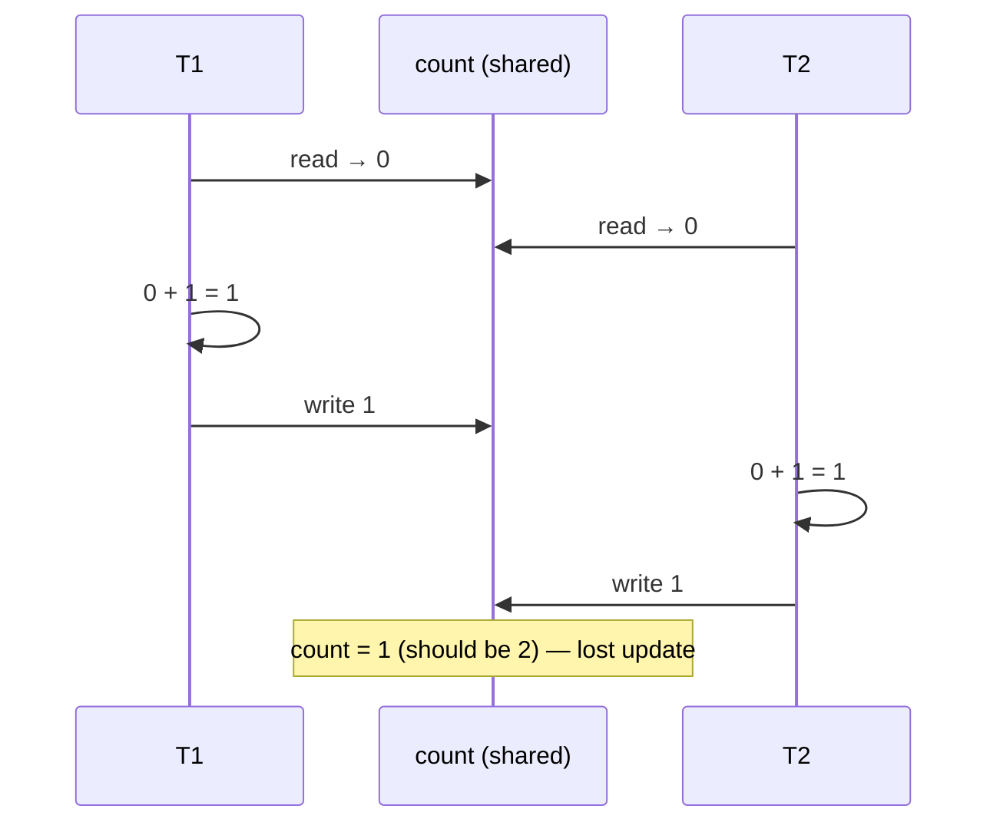

A **race condition** is when the correctness of a program depends on the *timing* of threads — the
order in which their operations happen to interleave. Change the timing and you change the answer.
The classic is the **lost update**: two threads increment a shared counter, and one increment
silently disappears.

## `count++` is a lie

`count++` reads as a single atomic step, but the CPU splits it into **three** — read, modify, write:

```java
// count++  is really three separate operations:
int r = count;   // 1. READ  the current value into a register
r = r + 1;       // 2. MODIFY the register
count = r;       // 3. WRITE the register back to memory
```

Between any two of those steps, another thread can run. If two threads interleave their read-modify-write on the same `count`, they can both read the same starting value and both write back the same result — two `++`s, but the counter only moved by one.

## Watch the update get lost

Two threads, `T1` and `T2`, each run `count++` once. `count` starts at `0`, so the correct final
value is `2`. Step through one unlucky interleaving:

```walkthrough
title: The lost update — two threads, one counter
code: |
  int r = count;   // 1. read
  r = r + 1;       // 2. modify
  count = r;       // 3. write
steps:
  - text: '`count` starts at **0**. Each thread has its own private register (`r`). Nothing has run yet.'
    array: ['—', 0, '—']
    pointers: { 0: 'T1.r', 1: 'count', 2: 'T2.r' }
    line: 1
  - text: '**T1 reads** `count` (0) into its register. `T1.r = 0`.'
    array: [0, 0, '—']
    highlight: [0]
    pointers: { 0: 'T1.r', 1: 'count', 2: 'T2.r' }
    line: 1
  - text: '**T2 is scheduled before T1 finishes** and also reads `count` (still 0). `T2.r = 0`. Both threads now hold a stale `0`.'
    array: [0, 0, 0]
    highlight: [2]
    pointers: { 0: 'T1.r', 1: 'count', 2: 'T2.r' }
    line: 1
  - text: '**T1 modifies** its register: `0 + 1 = 1`.'
    array: [1, 0, 0]
    highlight: [0]
    pointers: { 0: 'T1.r', 1: 'count', 2: 'T2.r' }
    line: 2
  - text: '**T1 writes** `1` back to `count`. So far so good — `count = 1`.'
    array: [1, 1, 0]
    highlight: [1]
    pointers: { 0: 'T1.r', 1: 'count', 2: 'T2.r' }
    line: 3
  - text: '**T2 modifies** its *stale* register: `0 + 1 = 1`. It never saw T1''s write.'
    array: [1, 1, 1]
    highlight: [2]
    pointers: { 0: 'T1.r', 1: 'count', 2: 'T2.r' }
    line: 2
  - text: '**T2 writes** `1`, clobbering T1''s update. `count = 1`.'
    array: [1, 1, 1]
    highlight: [1]
    pointers: { 0: 'T1.r', 1: 'count', 2: 'T2.r' }
    line: 3
  - text: 'Two increments ran, but **`count = 1`, not 2**. One update was *lost*. Run it a million times and you get a different wrong answer each time.'
    array: ['✓', 1, '✓']
    sorted: [1]
    pointers: { 1: 'expected 2' }
    line: 3
```

The same interleaving as a timeline — note how T2's read slips in **before** T1's write:



:::gotcha
This bug is **non-deterministic**. The interleaving above is only *one* possibility — most of the
time the threads don't overlap and you get the right answer. That's what makes race conditions so
dangerous: tests pass, it works on your laptop, and it corrupts data in production under load.
:::

## Fixing it — make the read-modify-write atomic

The bug is that steps 1–3 can be interrupted. The fix is to make them **indivisible** so no other
thread can slip in between. Three standard ways, cheapest concurrency-cost last:

````tabs
tabs:
  - label: AtomicInteger (best here)
    body: |
      A single hardware **compare-and-swap** does read-modify-write atomically — no locking, no blocking.
      ```java
      AtomicInteger count = new AtomicInteger(0);
      count.incrementAndGet();   // atomic ++, returns the new value
      ```
      Ideal for counters and flags. Scales better than a lock under contention.
  - label: synchronized
    body: |
      A mutual-exclusion lock: only one thread can be inside the block at a time, so the three steps
      run without interruption.
      ```java
      synchronized (lock) {
        count++;          // now indivisible w.r.t. other synchronized(lock) blocks
      }
      ```
      Simple and general, but threads **block** waiting for the monitor.
  - label: LongAdder (high contention)
    body: |
      Under heavy write contention, `LongAdder` keeps **per-thread cells** and sums them on read —
      far less cache-line fighting than a single `AtomicInteger`.
      ```java
      LongAdder count = new LongAdder();
      count.increment();
      long total = count.sum();   // read when you need the total
      ```
      Great for hot metrics/counters; slightly stale reads are fine.
````

:::senior
"Atomic" and "thread-safe" are not the same as "correct." `AtomicInteger` fixes a *single*
read-modify-write, but if your invariant spans **two** atomics (e.g. "`a` and `b` must always sum
to 100"), each being atomic doesn't protect the *pair*. Compound invariants still need a lock or a
single atomic reference to an immutable snapshot. Identify the **invariant**, then pick the guard.
:::

## Check yourself

```quiz
title: Race conditions check
questions:
  - q: 'Why can two threads each running `count++` once leave `count` at 1 instead of 2?'
    options:
      - text: '`count++` is read-modify-write; both can read the same value before either writes'
        correct: true
      - 'Integers overflow at high speed'
      - '`++` rounds down when threads collide'
    explain: '`count++` is three steps. If both threads read the old value before either writes, both compute and store the same result — one increment is lost.'
  - q: 'Which best fixes a shared integer counter incremented from many threads?'
    options:
      - 'Mark the field `volatile`'
      - text: 'Use `AtomicInteger.incrementAndGet()`'
        correct: true
      - 'Give each thread a higher priority'
    explain: '`volatile` fixes *visibility* but not atomicity — `count++` is still three steps. `AtomicInteger` makes the whole read-modify-write atomic via compare-and-swap.'
  - q: 'What makes race conditions especially hard to catch?'
    options:
      - 'They always crash immediately'
      - text: 'They are timing-dependent and non-deterministic — often invisible in testing'
        correct: true
      - 'They only occur on a single core'
    explain: 'The buggy interleaving is just one of many possible orderings, so the program usually works — until timing under real load triggers the rare bad case.'
```

:::key
A **race condition** = correctness depends on thread timing. The classic **lost update** comes from
a non-atomic **read-modify-write** (`count++` is really read, modify, write). Fix it by making that
sequence **atomic** — `AtomicInteger`/`LongAdder` for counters, a lock (`synchronized`) for compound
invariants. `volatile` alone is *not* enough.
:::
