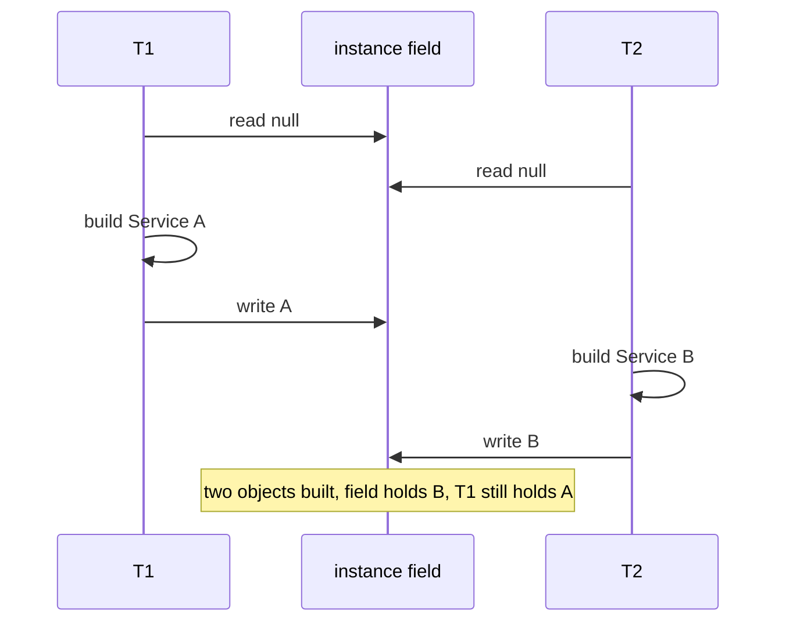

A **critical section** is a stretch of code that touches shared state and must not be run by two
threads at once. The real danger is rarely a single machine instruction — it is a **compound
action**: several steps that must happen as one indivisible unit but can be interrupted partway.

Two shapes show up constantly:

- **read-modify-write** — `count++` reads, adds, then writes (the lost update from the last topic).
- **check-then-act** — test a condition, then act on it: `if (instance == null) instance = new Service();`.
  If the state changes between the *check* and the *act*, you act on a fact that is already stale.

Each is correct only if the whole sequence is **atomic** — all-or-nothing, with no other thread able
to observe or change the state midway.

## Two threads, one lazy singleton

The classic check-then-act: lazily create a single `Service` the first time it is needed.

```java
private Service instance;          // shared, starts null

Service getInstance() {
    if (instance == null) {        // 1. CHECK
        instance = new Service();  // 2. ACT  (construct + publish)
    }
    return instance;
}
```

If two threads call `getInstance()` at once on a fresh field, both can pass the `null` check before
either assigns — and the "singleton" gets built twice.

```walkthrough
title: Check-then-act — the singleton built twice
code: |
  if (instance == null) {        // 1. check
      instance = new Service();  // 2. act
  }
  return instance;               // 3. return
steps:
  - text: 'Nothing is initialized. `instance` is **null**. T1 and T2 both call `getInstance()`.'
    array: ['—', 'null', '—']
    pointers: { 0: 'T1', 1: 'instance', 2: 'T2' }
    line: 1
  - text: '**T1 checks** `instance == null` -> **true**. It has decided to construct.'
    array: ['—', 'null', '—']
    highlight: [1]
    pointers: { 0: 'T1', 1: 'instance', 2: 'T2' }
    line: 1
  - text: '**T2 is scheduled before T1 assigns** and checks the same field -> still **null** -> **true**. Both threads have now passed the guard.'
    array: ['—', 'null', '—']
    highlight: [1]
    pointers: { 0: 'T1', 1: 'instance', 2: 'T2' }
    line: 1
  - text: '**T1 runs the constructor** and publishes object **A**. The field now points to A.'
    array: ['A', 'A', '—']
    highlight: [1]
    pointers: { 0: 'T1 ret', 1: 'instance', 2: 'T2' }
    line: 2
  - text: '**T2 still believes the field is null** — it already passed the check — so it constructs object **B**, overwriting the field.'
    array: ['A', 'B', 'B']
    highlight: [1]
    pointers: { 0: 'T1 ret', 1: 'instance', 2: 'T2 ret' }
    line: 2
  - text: 'The constructor ran **twice**. If it opened a connection pool or registered a listener, you now have two of everything.'
    array: ['A', 'B', 'B']
    highlight: [0, 2]
    pointers: { 0: 'T1 ret', 1: 'instance', 2: 'T2 ret' }
    line: 2
  - text: 'And the "singleton" is not unique: **T1 holds A while the field and T2 hold B**. Identity comparisons now break.'
    array: ['A', 'B', 'B']
    sorted: [1]
    pointers: { 0: 'A != B', 1: 'instance', 2: 'B' }
    line: 3
```

The same interleaving as a timeline — T2's read slips in **before** T1's write:



:::gotcha
Thread-safe **building blocks do not make a compound action atomic**. On a `ConcurrentHashMap`,
`if (!map.containsKey(k)) map.put(k, v);` is still a race — each call is safe, but another thread can
insert between the two. Use the single atomic method: `map.putIfAbsent(k, v)` or `map.computeIfAbsent(k, ...)`.
:::

## Make the whole sequence atomic

The fix is to run check-and-act as one indivisible step — hold a lock across both, or use a single
method the platform makes atomic for you.

````tabs
tabs:
  - label: synchronized
    body: |
      Put the compound action in a critical section so only one thread is ever inside it.
      ```java
      synchronized Service getInstance() {
          if (instance == null) {
              instance = new Service();
          }
          return instance;
      }
      ```
      Correct and simple. Cost: every caller acquires the monitor, even long after init.
  - label: Holder idiom (best)
    body: |
      Let the **JVM** do the locking. A class is initialized lazily, and the class-init lock
      guarantees the initializer runs exactly once.
      ```java
      private static class Holder {
          static final Service INSTANCE = new Service();
      }
      static Service getInstance() { return Holder.INSTANCE; }
      ```
      Lazy, lock-free on the hot path, and no `volatile` needed — the gold standard for lazy singletons.
  - label: AtomicReference
    body: |
      A lock-free **compare-and-set** performs the check and the act as one atomic step.
      ```java
      AtomicReference<Service> ref = new AtomicReference<>();
      Service getInstance() {
          Service s = ref.get();
          if (s == null) {
              s = new Service();
              if (!ref.compareAndSet(null, s)) s = ref.get(); // lost the race, use the winner
          }
          return s;
      }
      ```
      May build a spare that loses the CAS, but it never *publishes* two.
````

:::senior
Size the critical section deliberately: **as small as possible, but no smaller.** Too wide and you
serialize threads that never conflict, wrecking throughput; too narrow and the invariant leaks out.
And atomic parts **do not compose** — two individually atomic operations run back-to-back are *not*
atomic together. If an invariant spans several fields, one lock (or one atomic reference to an
immutable snapshot) must cover the whole invariant.
:::

## Check yourself

```quiz
title: Atomicity check
questions:
  - q: 'Why can two threads both create the object in `if (instance == null) instance = new Service();`?'
    options:
      - text: 'check-then-act is not atomic — both can pass the null check before either assigns'
        correct: true
      - 'Constructors are never thread-safe'
      - '`new` returns null on the first call'
    explain: 'The check and the act are separate steps. If T2 reads the field before T1 writes it, both see null, both construct, and the field is written twice.'
  - q: 'On a `ConcurrentHashMap`, which is safe for insert-if-absent?'
    options:
      - '`if (!map.containsKey(k)) map.put(k, v);`'
      - text: '`map.putIfAbsent(k, v)`'
        correct: true
      - 'Wrapping both calls in `volatile`'
    explain: 'containsKey-then-put is a check-then-act race even though each call is thread-safe. putIfAbsent performs the whole operation atomically.'
  - q: 'What is a critical section?'
    options:
      - 'Any method marked `static`'
      - text: 'Code accessing shared state that must not run in two threads at once'
        correct: true
      - 'The slowest part of the program'
    explain: 'A critical section guards a compound action on shared state; it must run atomically, enforced by a lock or an atomic operation.'
```

:::key
A **critical section** guards a **compound action** — check-then-act or read-modify-write — that must
run as one indivisible unit. Individually atomic operations do **not** compose into an atomic
sequence. Make the whole action atomic: a lock (`synchronized`), a single atomic method
(`putIfAbsent`, `compareAndSet`), or the class-init lock (the holder idiom).
:::
