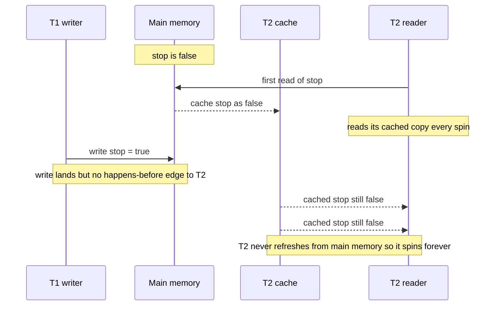

The **Java Memory Model (JMM)** is the contract that decides *when* a write made by one thread is
guaranteed to be visible to a read on another. Without a rule connecting them, a thread may keep
reading a **cached** copy from a register or CPU cache and never see the update — and the compiler
and CPU are both free to **reorder** your instructions.

The JMM governs two hazards (atomicity, the third, was covered earlier):

- **Visibility** — will T2 *ever* see the value T1 wrote?
- **Ordering** — in what order do T1's writes *appear* to T2? Not necessarily program order.

## A write that never arrives

A plain `boolean` flag used to stop a loop. T1 sets it; T2 spins until it flips. It can spin
**forever**.

```java
boolean stop = false;   // plain (non-volatile) field

// T2 — worker loop
while (!stop) {
    // do work
}
System.out.println("stopped");   // may never run

// T1 — some time later
stop = true;                     // may never become visible to T2
```



With no **happens-before** edge, the JMM never *requires* T2 to refresh its view — and the JIT is
even allowed to hoist the non-volatile read out of the loop, compiling `while (!stop)` into
`if (!stop) while (true)`. T1's write is real, but T2 is guaranteed nothing.

## Reordering

Within a single thread, results always look like program order — the **as-if-serial** guarantee.
Across threads, with no synchronization, all bets are off: the compiler and CPU may reorder
independent reads and writes. The classic casualty is **unsafe publication**:

```java
Config cfg;          // plain
boolean ready;       // plain

// T1
cfg = new Config();  // (a)
ready = true;        // (b)  -- may appear to T2 before (a)
```

T2 can observe `ready == true` yet read a `null` or half-initialized `cfg`, because without a
happens-before edge the two writes may become visible out of order.

## happens-before: the fix for both

The JMM is defined by the **happens-before** relation. If action A *happens-before* B, then A's memory
effects are visible to, and ordered before, B. Create such an edge between T1's write and T2's read
and both the visibility and the ordering problem disappear.

````tabs
tabs:
  - label: volatile
    body: |
      A **volatile write happens-before every later volatile read** of the same field.
      ```java
      volatile boolean stop = false;
      ```
      T2's read now always fetches from main memory and cannot be hoisted, so it sees `true` promptly.
  - label: synchronized
    body: |
      **Releasing a monitor happens-before any later acquire** of the same monitor, so both threads
      synchronize their memory through the lock.
      ```java
      synchronized (lock) { stop = true; }   // T1
      synchronized (lock) { done = stop; }   // T2 is guaranteed to see it
      ```
  - label: start / join
    body: |
      **`Thread.start()` happens-before the new thread's first action; the thread's last action
      happens-before another thread returning from `join()`.**
      ```java
      Thread t = new Thread(job);
      t.start();   // everything before start() is visible to the job
      t.join();    // everything the job did is visible after join() returns
      ```
````

:::gotcha
A data race is not just a "torn value." With no happens-before edge the JIT may **hoist a
non-volatile read out of a loop**, so `while (!stop)` becomes an infinite `while (true)` even though
T1 definitely wrote `stop = true`. And a non-volatile `long` or `double` write can **tear** into two
32-bit halves, letting another thread read a value that was never actually written.
:::

:::senior
The main **happens-before** rules to name in an interview:

- **Program order** — within one thread, each action happens-before the next.
- **Monitor lock** — unlocking a monitor happens-before any subsequent lock of the same monitor.
- **Volatile** — a write to a volatile field happens-before every subsequent read of that field.
- **Thread start** — `Thread.start()` happens-before every action in the started thread.
- **Thread join** — every action in a thread happens-before another thread's return from `join()` on it.
- **Transitivity** — if A happens-before B and B happens-before C, then A happens-before C.

happens-before is a **partial order**, not wall-clock time: it constrains *visibility and ordering*,
not which thread physically ran first.
:::

## Drill the happens-before rules

These rules *are* the JMM as far as interviews go — recite them, then apply them to any "will T2
see it?" puzzle.

```flashcards
title: The happens-before rules
cards:
  - front: 'Program order rule'
    back: 'Each action in a thread happens-before every later action **in that same thread**. Within one thread, execution always *appears* in program order (as-if-serial).'
  - front: 'Monitor lock rule'
    back: 'An **unlock** of a monitor happens-before every subsequent **lock** of that *same* monitor. This is why `synchronized` gives you visibility, not just mutual exclusion.'
  - front: 'Volatile rule'
    back: 'A **write** to a volatile field happens-before every subsequent **read** of that field.'
  - front: 'Thread start rule'
    back: '`t.start()` happens-before every action in `t` — the new thread sees everything the parent set up before starting it.'
  - front: 'Thread join rule'
    back: 'Every action in `t` happens-before another thread''s `t.join()` returning — after join you see all of the thread''s writes.'
  - front: 'Interruption rule'
    back: 'A call to `t.interrupt()` happens-before `t` detecting the interrupt (via thrown `InterruptedException` or a flag check).'
  - front: 'Transitivity'
    back: 'A hb B and B hb C ⇒ A hb C. This is why one volatile flag can publish a whole batch of **plain** writes made before it — the "piggybacking" idiom.'
  - front: 'No rule applies?'
    back: 'Then there is **no edge** — a data race. Reads may return stale or apparently reordered values, and the JIT may legally hoist them out of loops. "It worked in the test" proves nothing.'
```

## Check yourself

```quiz
title: Java Memory Model check
questions:
  - q: 'Why might `while (!stop) {}` never terminate even after another thread sets `stop = true`?'
    options:
      - text: 'No happens-before edge, so T2 may keep reading a cached value and the read can be hoisted out of the loop'
        correct: true
      - 'Booleans cannot be changed once read'
      - 'The JVM runs loops on a dedicated core that ignores writes'
    explain: 'With a plain field the JMM never requires T2 to refresh its cached copy, and the JIT may lift the non-volatile read out of the loop, giving an infinite loop.'
  - q: 'What does "A happens-before B" guarantee?'
    options:
      - text: 'A''s memory effects are visible to and ordered before B'
        correct: true
      - 'A executed earlier in wall-clock time than B'
      - 'A and B run on the same thread'
    explain: 'happens-before is about the visibility and ordering of memory effects — a partial order, not a statement about physical execution time.'
  - q: 'Which pair does NOT establish a happens-before edge between two threads?'
    options:
      - 'A volatile write then a volatile read of the same field'
      - 'Unlocking then locking the same monitor'
      - text: 'Two plain writes to different ordinary fields'
        correct: true
    explain: 'Volatile access, monitor lock/unlock, and thread start/join create happens-before edges; plain writes to ordinary fields do not.'
```

:::key
The **JMM** decides when one thread's write is visible to and ordered for another. Plain fields give
**no guarantee** — writes can be invisible or reordered, so a flag loop can spin forever. Correctness
requires a **happens-before edge** (volatile, monitor lock/unlock, thread start/join, or transitivity
through them) between the write and the read.
:::
