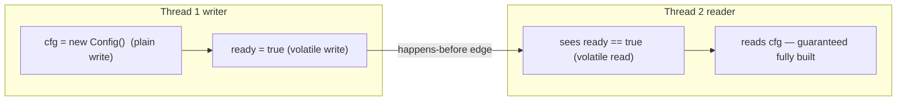

**`volatile`** is the lightest synchronization tool in Java. Marking a field `volatile` guarantees two
things: every read sees the **most recent write** (visibility), and reads and writes are **not
reordered** around it (ordering). What it does *not* give you is **atomicity** — and that one gap is
where people get burned.

A volatile write **happens-before** every later volatile read of the same field, so `volatile` is
exactly the missing edge from the previous topic.

## Fixing the stop flag

Make the loop flag `volatile` and the write is guaranteed to reach the reader.

```java
volatile boolean running = true;

// T2 — worker
while (running) {
    doWork();
}

// T1 — later
running = false;   // volatile write, flushed to main memory
```

```walkthrough
title: volatile makes the write visible
code: |
  volatile boolean running = true;
  while (running) { doWork(); }   // T2
  running = false;                // T1
steps:
  - text: '`running` is **true** in main memory. T2 loops, and every check is a **volatile read** taken straight from main memory.'
    array: ['true', 'true', '—']
    pointers: { 0: 'T2 reads', 1: 'running', 2: 'T1' }
    line: 2
  - text: '**T2 reads true**, runs `doWork()`, and loops again. Still true.'
    array: ['true', 'true', '—']
    highlight: [0]
    pointers: { 0: 'T2 reads', 1: 'running', 2: 'T1' }
    line: 2
  - text: '**T1 writes `running = false`.** A volatile write is flushed to main memory immediately, never parked in a private cache.'
    array: ['true', 'false', 'false']
    highlight: [1]
    pointers: { 0: 'T2 reads', 1: 'running', 2: 'T1 wrote' }
    line: 3
  - text: 'On its next turn **T2 does a volatile read** — it must re-fetch from main memory, so it now sees **false**.'
    array: ['false', 'false', 'false']
    highlight: [0]
    pointers: { 0: 'T2 reads', 1: 'running', 2: 'T1 wrote' }
    line: 2
  - text: 'The volatile write **happens-before** this read, so everything T1 did before it is visible too. The loop condition is now false.'
    array: ['false', 'false', 'false']
    highlight: [1]
    pointers: { 0: 'T2 reads', 1: 'running', 2: 'T1 wrote' }
    line: 2
  - text: 'T2 exits the loop **cleanly** — no spinning forever. One writer, one flag: `volatile` is exactly enough.'
    array: ['false', 'false', 'false']
    sorted: [0, 1, 2]
    pointers: { 1: 'running' }
    line: 2
```

## But volatile is NOT atomic

The trap: `volatile` *publishes* a value, it does not make a compound action indivisible.

```java
volatile int count = 0;
count++;   // STILL read-modify-write: read, +1, write — three steps
```

Two threads can both read the same `count`, both increment, and both write back the same number — the
exact **lost update** from the race-conditions topic. Watch it happen *with* volatile — every access
goes straight to main memory, visibility is perfect, and the update is still lost:

| Step | Thread A | Thread B | volatile `count` |
|--|--|--|--|
| 1 | volatile read → 5 | — | 5 |
| 2 | — | volatile read → 5 | 5 |
| 3 | +1 in register → 6 | — | 5 |
| 4 | volatile write 6 | — | 6 |
| 5 | — | +1 in its register → 6 | 6 |
| 6 | — | volatile write 6 | **6 — A's increment lost** |

Every single read and write obeyed volatile semantics. The bug is the **gap between B's read (step
2) and B's write (step 6)** — volatile does nothing to close it. Visibility was never the problem
here; atomicity was.

````tabs
tabs:
  - label: Good — single-writer flag
    body: |
      One thread flips it, others only read. Visibility is all you need.
      ```java
      volatile boolean shutdown = false;   // set by one thread, polled by many
      ```
  - label: Bad — shared counter
    body: |
      `count++` is read-modify-write; `volatile` does not fix it.
      ```java
      volatile int count;                  // WRONG for a shared counter
      AtomicInteger safe = new AtomicInteger();
      safe.incrementAndGet();              // atomic read-modify-write — correct
      ```
  - label: Good — safe publication
    body: |
      Publish an **immutable** object through a volatile reference; readers always see a fully-built object.
      ```java
      volatile Config cfg;                 // swap whole immutable snapshots
      void reload() { cfg = load(); }      // one atomic reference write
      ```
````

Safe publication works because of the **piggyback effect**: the happens-before edge from the
volatile write to the volatile read carries *all* of the writer's earlier plain writes with it.



Program order gives `A hb B`, the volatile rule gives `B hb C`, program order gives `C hb D` —
transitivity chains them, so the plain `cfg` write is visible even though `cfg` itself is not
volatile. Remove the volatile from `ready` and the whole chain collapses.

:::gotcha
`volatile` does **not** make `count++` atomic. It is read-modify-write no matter how the field is
qualified, so two threads still lose updates. Marking a shared counter `volatile` is a classic
non-fix — reach for `AtomicInteger` / `LongAdder` or a lock instead.
:::

:::senior
`volatile` is safe when **exactly one thread writes** (or writers never depend on the current value)
and everyone else only reads — stop flags, `ready` gates, a published immutable reference. Because a
volatile write establishes a happens-before edge, swapping a `volatile` reference to an **immutable**
object safely publishes all of its fields. It breaks down the moment an update is **conditional on the
current value** (`count++`, `if (!init) init()`): that is a compound action needing an atomic or a
lock, not merely visibility.
:::

## Check yourself

```quiz
title: volatile check
questions:
  - q: 'What does `volatile` guarantee?'
    options:
      - text: 'Visibility and ordering — reads see the latest write and are not reordered around the access'
        correct: true
      - 'That compound updates like `count++` become atomic'
      - 'Mutual exclusion, like a lock'
    explain: 'volatile guarantees a read sees the most recent write and prevents reordering across the access, but it provides no atomicity and no mutual exclusion.'
  - q: 'Is `volatile int count; count++;` safe for a counter shared by many threads?'
    options:
      - text: 'No — count++ is still read-modify-write, so updates are lost'
        correct: true
      - 'Yes — volatile makes it atomic'
      - 'Yes — as long as count starts at 0'
    explain: 'volatile fixes visibility, not atomicity. The three-step read-modify-write can still interleave and lose updates; use AtomicInteger or a lock.'
  - q: 'When is `volatile` the right, sufficient tool?'
    options:
      - 'A running total incremented from many threads'
      - text: 'A single-writer stop flag polled by other threads'
        correct: true
      - 'Guarding a multi-field invariant'
    explain: 'A one-writer flag needs only visibility, which volatile provides. Counters and multi-field invariants are compound actions that need atomics or locks.'
```

:::key
`volatile` buys **visibility + ordering**, never **atomicity**. It is the right tool for a
**single-writer flag** or for **publishing an immutable reference** (the happens-before edge from the
JMM). It is the *wrong* tool for `count++` or any read-modify-write / check-then-act — those are
compound actions that need `AtomicInteger`, `LongAdder`, or a lock.
:::
