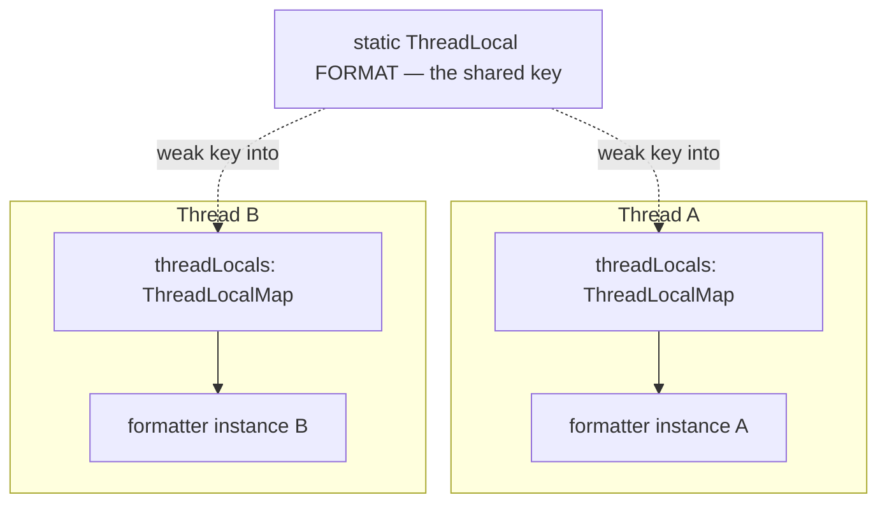

The cheapest way to make shared state safe is to **not share it**. `ThreadLocal<T>` gives every thread its **own independent copy** of a variable — no locks, no visibility rules, because no two threads ever touch the same instance. This is **thread confinement** made explicit.

## The API

```java
// One shared ThreadLocal; each thread that calls get() sees its own value.
static final ThreadLocal<SimpleDateFormat> FORMAT =
    ThreadLocal.withInitial(() -> new SimpleDateFormat("yyyy-MM-dd"));

String today() {
    return FORMAT.get().format(new Date());   // this thread's own formatter
}
```

`SimpleDateFormat` is famously **not thread-safe**; a `ThreadLocal` gives each thread a private one instead of synchronizing a shared instance.

:::note
`SimpleDateFormat` is the classic teaching example, but the modern fix is **immutability, not
confinement**: `java.time.DateTimeFormatter` is immutable and freely shareable across threads — no
`ThreadLocal` needed. Reach for confinement only when a mutable, non-thread-safe object genuinely
must be reused per thread.
:::

## How it is wired under the hood

The values do not live inside the `ThreadLocal` — they live in a `ThreadLocalMap` **owned by each
Thread**. The shared `ThreadLocal` object is only the *key*:



`get()` reads `Thread.currentThread().threadLocals` and probes that map with the `ThreadLocal` as
key — an open-addressed table with **weak keys and strong values**. Because a thread only ever
touches *its own* map, there is no lock and no contention anywhere on this path; a `get()` costs a
few nanoseconds regardless of thread count. The weak key also explains the leak's exact shape: if
the `ThreadLocal` itself becomes unreachable, its key entry can be collected, but the **value stays
strongly referenced by the live thread** until the map happens to expunge the stale slot on a later
probe — which may be never on an idle pooled worker.

## Where it earns its keep

| Use | Why ThreadLocal |
|--|--|
| Non-thread-safe or contended helpers (`SimpleDateFormat`; `Random` before `ThreadLocalRandom` in Java 7) | a private copy per thread avoids locking |
| Ambient context (user/security/tenant, trace IDs) | pass "invisible" context without threading it through every method |
| Per-thread transaction/connection (Spring's `TransactionSynchronizationManager`) | bind a resource to the running thread |

## The leak that gets people fired

:::gotcha
A `ThreadLocal`'s values live in a map **owned by the Thread**. In a **thread pool**, worker threads are reused and effectively immortal — so a value you `set()` but never `remove()` stays referenced **forever**, leaking memory and, worse, bleeding one request's data into the next task that runs on that thread. In pooled code, **always `remove()` in a `finally`**:
:::

```java
try {
    USER_CONTEXT.set(currentUser);
    handleRequest();
} finally {
    USER_CONTEXT.remove();     // mandatory on pooled threads
}
```

(The map's *keys* are weak references to the `ThreadLocal`, but the *values* are strong — which is exactly why a live thread pins them until you remove them.)

## Inheritance and the virtual-thread successor

- **`InheritableThreadLocal`** copies values to **child** threads at creation — handy for propagating context, but a trap with pools (children may inherit stale context).
- With **millions of [virtual threads](/multithreading/topic/models/virtual-threads)**, a per-thread `ThreadLocal` copy is wasteful and mutable. Java's answer is **`ScopedValue`** (JEP finalized in the 21→25 line): an **immutable**, bounded binding that's rebound per dynamic scope and shared structurally instead of copied.

```java
// ScopedValue — immutable, auto-cleaned at the end of the scope
private static final ScopedValue<User> USER = ScopedValue.newInstance();

ScopedValue.where(USER, currentUser).run(() -> handleRequest());  // no remove() needed
```

:::senior
Frame it as a spectrum of "how do I make state safe?": **immutability** (share freely), **confinement** (`ThreadLocal` / stack) so it's never shared, then **synchronization** only when threads genuinely must share mutable state. `ThreadLocal` is confinement — reach for it before reaching for a lock, but treat `remove()` as non-negotiable on any pooled or long-lived thread, and prefer `ScopedValue` for new virtual-thread code.
:::

## Check yourself

```quiz
title: ThreadLocal check
questions:
  - q: 'Why does ThreadLocal make a value thread-safe without locks?'
    options:
      - text: 'Each thread gets its own independent copy, so the value is confined to one thread and never shared'
        correct: true
      - 'It synchronizes every access internally'
      - 'It makes the value immutable'
    explain: 'ThreadLocal is thread confinement: there is no shared instance to race on, so no synchronization is needed.'
  - q: 'What is the danger of ThreadLocal in a thread pool?'
    options:
      - text: 'Reused, long-lived threads keep set values alive — a memory leak and cross-request data bleed unless you remove()'
        correct: true
      - 'The values are garbage-collected too early'
      - 'It disables the thread pool'
    explain: 'Because the value map is owned by the (immortal) worker thread, a value that is set but never removed persists across tasks. Always remove() in a finally.'
  - q: 'What is the recommended replacement for ThreadLocal in virtual-thread code?'
    options:
      - 'A synchronized block'
      - text: 'ScopedValue — an immutable, scope-bounded binding'
        correct: true
      - 'A static field'
    explain: 'ScopedValue binds an immutable value for a dynamic scope and is shared structurally rather than copied per thread — a better fit for millions of virtual threads, with automatic cleanup.'
```

:::key
`ThreadLocal<T>` gives each thread its **own copy** — confinement, so no locks needed (classic use: `SimpleDateFormat`, ambient context). The killer bug: on **pooled/long-lived threads**, a value you `set()` but never `remove()` leaks and bleeds across tasks — always `remove()` in `finally`. For virtual threads, prefer the immutable, auto-cleaned **`ScopedValue`**.
:::
