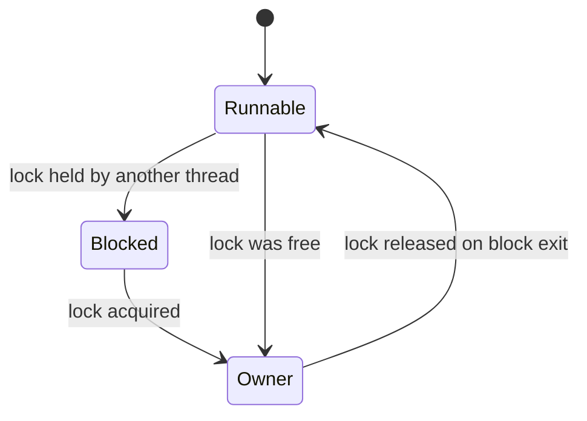

Every Java object carries a hidden **intrinsic lock** — a *monitor*. The `synchronized` keyword
**acquires** that monitor on entry and **releases** it on exit, so at most one thread can be inside a
given `synchronized` region at a time. That turns a critical section into a strictly one-at-a-time zone
and, as a bonus, establishes a **happens-before** edge: everything one thread did before releasing is
visible to the next thread that acquires.

## One monitor per object

A monitor has an **owner** (the holding thread) and an **entry set** (threads waiting to get in). When
the monitor is free, an arriving thread takes it and runs. When it is held, arriving threads are parked
in the entry set in state **`BLOCKED`** — burning no CPU — until the owner releases it.

## Watch a thread block and then proceed

Two threads, `T1` and `T2`, both run the same `synchronized (lock)` block. Step through one interleaving
and note how T2 is forced to **wait**:

```walkthrough
title: Two threads contend for one monitor
code: |
  synchronized (lock) {   // acquire monitor on entry
    critical();           // only one thread in here
  }                       // release monitor on exit
steps:
  - text: 'Both threads want the same `synchronized (lock)` block. The monitor is **free**; both are `RUNNABLE`.'
    array: ['RUNNABLE', 'free', 'RUNNABLE']
    pointers: { 0: 'T1', 1: 'monitor', 2: 'T2' }
    line: 1
  - text: '**T1 enters** the block and **acquires** the monitor. It is now the sole owner.'
    array: ['in CS', 'T1', 'RUNNABLE']
    highlight: [1]
    pointers: { 0: 'T1', 1: 'monitor', 2: 'T2' }
    line: 1
  - text: '**T1 runs the critical section.** The lock is held for the whole block body.'
    array: ['in CS', 'T1', 'RUNNABLE']
    highlight: [0]
    pointers: { 0: 'T1', 1: 'monitor', 2: 'T2' }
    line: 2
  - text: '**T2 reaches** the same `synchronized (lock)` and finds the monitor taken. It cannot enter, so T2 goes **`BLOCKED`**.'
    array: ['in CS', 'T1', 'BLOCKED']
    highlight: [2]
    pointers: { 0: 'T1', 1: 'monitor', 2: 'T2' }
    line: 1
  - text: 'T2 parks in the monitor **entry set**, using no CPU, while T1 keeps working. Only one thread is ever inside.'
    array: ['in CS', 'T1', 'BLOCKED']
    highlight: [2]
    pointers: { 0: 'T1', 1: 'monitor', 2: 'T2' }
    line: 2
  - text: '**T1 exits** the block and **releases** the monitor. Its writes are now visible to whoever acquires next.'
    array: ['done', 'free', 'BLOCKED']
    highlight: [1]
    pointers: { 0: 'T1', 1: 'monitor', 2: 'T2' }
    line: 3
  - text: '**T2 wakes, acquires** the freed monitor, returns to `RUNNABLE`, and enters the critical section.'
    array: ['done', 'T2', 'in CS']
    highlight: [2]
    pointers: { 0: 'T1', 1: 'monitor', 2: 'T2' }
    line: 1
  - text: 'T2 finishes and releases. **Mutual exclusion held throughout** — the two threads were never inside together.'
    array: ['done', 'free', 'done']
    sorted: [0, 1, 2]
    pointers: { 0: 'T1', 1: 'monitor', 2: 'T2' }
    line: 3
```

From the thread's point of view, entering a held monitor is a `RUNNABLE` to `BLOCKED` to `RUNNABLE`
round trip:



## What object am I locking on?

`synchronized` always locks *some object's* monitor. Which one depends on how you write it:

````tabs
tabs:
  - label: Instance method
    body: |
      A `synchronized` instance method locks on **`this`** — the receiver object.
      ```java
      class Counter {
          synchronized void inc() { count++; }   // locks on this
      }
      ```
      Two threads calling `inc()` on the **same** `Counter` exclude each other; on **different**
      instances they do not — each object has its own monitor.
  - label: Static method
    body: |
      A `synchronized` **static** method locks on the **Class object** (`Counter.class`), not any instance.
      ```java
      class Counter {
          synchronized static void tick() { total++; }   // locks on Counter.class
      }
      ```
      The instance lock and the class lock are **different monitors** — a `synchronized` instance method
      and a `synchronized static` method can run at the same time.
  - label: Block on a private lock
    body: |
      Lock only the lines you need, on an object you control.
      ```java
      private final Object lock = new Object();
      void inc() {
          synchronized (lock) { count++; }   // narrow, private critical section
      }
      ```
      Smaller critical sections mean less contention, and a **private** lock cannot be grabbed by outside code.
````

## Reentrancy

Intrinsic locks are **reentrant**: a thread that already owns a monitor can acquire it again without
deadlocking itself. The JVM keeps a hold count that increments on each re-entry and decrements on exit;
the lock is released only when the count returns to zero. This is what lets one `synchronized` method
call another on the same object:

```java
synchronized void outer() { inner(); }   // already holds this...
synchronized void inner() { /* ... */ }  // ...re-enters, no deadlock
```

:::gotcha
**Lock on the wrong object and your `synchronized` protects nothing.** Three classic traps:
`synchronized (Integer.valueOf(1))` — autoboxing caches small `Integer`s, so unrelated code that
locks on the same boxed value shares your monitor. `synchronized ("LOCK")` — string literals are
**interned** JVM-wide, so any other class using that literal contends with you. And `synchronized (this)`
in a public class **leaks** your lock — outside code can lock your object and starve or deadlock you.
Always lock a `private final Object lock = new Object();` you fully control.
:::

:::senior
Never synchronize on a field you also **reassign**. If the lock object changes, two threads can end up
synchronizing on *different* monitors and both enter the critical section. Make lock references
`final`. Also weigh **granularity**: one coarse lock is simple but serializes everything; many fine
locks scale better but invite lock-ordering deadlocks. Start coarse, split only where a profiler shows
real contention.
:::

## Check yourself

```quiz
title: Synchronized check
questions:
  - q: 'A `synchronized` instance method and a `synchronized static` method of the same class are called concurrently. Can they run at the same time?'
    options:
      - text: 'Yes — they lock different monitors: the instance vs the Class object'
        correct: true
      - 'No — a class has exactly one monitor shared by both'
      - 'Only if the instance is null'
    explain: 'An instance method locks on `this`; a static method locks on `ClassName.class`. Those are two separate monitors, so the two calls do not exclude each other.'
  - q: 'Why is `synchronized ("LOCK")` a dangerous choice of lock object?'
    options:
      - 'String literals cannot be used as locks'
      - text: 'String literals are interned JVM-wide, so unrelated code using the same literal shares your monitor'
        correct: true
      - 'Strings are immutable so the lock never releases'
    explain: 'Interned literals are shared across the whole JVM. Any other class that synchronizes on the same literal contends with you, producing surprising blocking or deadlock.'
  - q: 'What does it mean that intrinsic locks are reentrant?'
    options:
      - 'Multiple threads may hold the same monitor at once'
      - text: 'A thread that already owns the monitor can acquire it again without blocking itself'
        correct: true
      - 'The lock automatically retries on failure'
    explain: 'Reentrancy tracks a per-thread hold count, so a synchronized method can call another synchronized method on the same object. The monitor frees only when the count hits zero.'
```

:::key
`synchronized` acquires an object's **intrinsic monitor** on entry and releases it on exit, giving
**mutual exclusion** plus a release-to-acquire **happens-before** edge. Contending threads wait in state
**`BLOCKED`**. Instance methods lock `this`; static methods lock the `Class`. Monitors are **reentrant**.
Lock a **private final** object — never a boxed number, an interned string, or a leaked `this`.
:::
