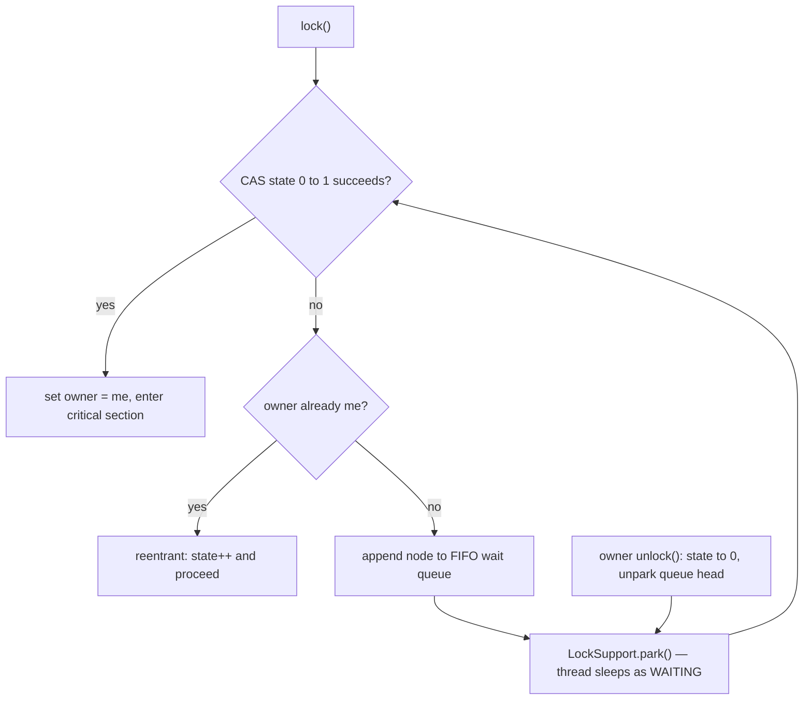

**`ReentrantLock`** does everything `synchronized` does — mutual exclusion, reentrancy, happens-before —
but as an explicit object you `lock()` and `unlock()` yourself. Handing over that control buys features
the intrinsic monitor simply cannot offer: **`tryLock`**, **timed** and **interruptible** acquisition,
**fairness**, and multiple wait-sets via `Condition`.

## The core trade: control for a mandatory `finally`

With `synchronized` the JVM releases the monitor for you on every exit path — normal return *or*
exception. With `ReentrantLock` **you** are responsible for the release, which is why `unlock()` must
live in a `finally`:

````tabs
tabs:
  - label: synchronized
    body: |
      Implicit acquire and release, scoped to a block.
      ```java
      private final Object lock = new Object();

      void transfer() {
          synchronized (lock) {   // acquire on entry
              // critical section
          }                       // auto-release, even if it throws
      }
      ```
      Zero release bookkeeping. But you cannot time out, cannot be interrupted while waiting, and
      the wait is all-or-nothing.
  - label: ReentrantLock
    body: |
      Explicit acquire and release — the release goes in `finally`.
      ```java
      private final ReentrantLock lock = new ReentrantLock();

      void transfer() {
          lock.lock();            // explicit acquire
          try {
              // critical section
          } finally {
              lock.unlock();      // YOU must release, on every path
          }
      }
      ```
      More ceremony, but now you get `tryLock`, timed and interruptible waits, fairness, and
      `newCondition()`.
````

## Reentrancy is a hold count

Like the intrinsic monitor, `ReentrantLock` is reentrant: the same thread can `lock()` again while
already holding it. Each acquire bumps a **hold count**; the lock frees only when the count returns to
zero. Watch it rise and fall as a thread re-enters, while a second thread waits the whole time:

```walkthrough
title: Reentrant hold count — the lock frees only at zero
code: |
  lock.lock();      // acquire: hold count 0 -> 1
  helper();         // re-enters: lock() -> 2, then unlock() -> 1
  lock.unlock();    // hold count 1 -> 0: released
steps:
  - text: 'Nobody holds the lock. Hold count is **0**. `T2` also wants it.'
    array: ['free', 0, 'RUNNABLE']
    pointers: { 0: 'owner', 1: 'holds', 2: 'T2' }
    line: 1
  - text: '**T1 calls `lock()`** (outer). It becomes owner; hold count goes **0 to 1**.'
    array: ['T1', 1, 'RUNNABLE']
    highlight: [0, 1]
    pointers: { 0: 'owner', 1: 'holds', 2: 'T2' }
    line: 1
  - text: '**T2 calls `lock()`** but T1 owns it, so T2 goes **`BLOCKED`** and waits.'
    array: ['T1', 1, 'BLOCKED']
    highlight: [2]
    pointers: { 0: 'owner', 1: 'holds', 2: 'T2' }
    line: 1
  - text: '`helper()` calls **`lock()` again** on the same thread. Reentrant, so no self-deadlock — hold count **1 to 2**.'
    array: ['T1', 2, 'BLOCKED']
    highlight: [1]
    pointers: { 0: 'owner', 1: 'holds', 2: 'T2' }
    line: 2
  - text: '`helper()` returns and **`unlock()`s** once. Hold count **2 to 1** — still held, T2 still waits.'
    array: ['T1', 1, 'BLOCKED']
    highlight: [1]
    pointers: { 0: 'owner', 1: 'holds', 2: 'T2' }
    line: 2
  - text: '**Outer `unlock()`** drops the count **1 to 0**. Now the lock is truly free.'
    array: ['free', 0, 'BLOCKED']
    highlight: [0, 1]
    pointers: { 0: 'owner', 1: 'holds', 2: 'T2' }
    line: 3
  - text: '**T2 acquires** the freed lock and runs. Mutual exclusion held the whole time.'
    array: ['T2', 1, 'RUNNABLE']
    sorted: [0, 1, 2]
    pointers: { 0: 'owner', 1: 'holds', 2: 'T2' }
    line: 3
```

## The superpowers `synchronized` lacks

Because acquisition is a method call, it can **fail, time out, or be interrupted** instead of blocking
forever:

```java
// Give up after 2 seconds instead of blocking indefinitely — stay responsive.
if (lock.tryLock(2, TimeUnit.SECONDS)) {
    try { /* got it */ } finally { lock.unlock(); }
} else {
    // back off, retry, or report — the thread was never stuck
}

lock.lockInterruptibly();   // abandon the wait if the thread is interrupted
lock.tryLock();             // non-blocking: grab it now or return false immediately
```

`tryLock` is the standard tool for **deadlock avoidance**: instead of blocking on a second lock you may
never get, try it, and if it fails, release what you hold and retry.

## Under the hood: AQS in one diagram

`ReentrantLock` (like `Semaphore`, `CountDownLatch`, and most of `java.util.concurrent`) is built on
**AbstractQueuedSynchronizer (AQS)**: an atomic `int state` (the hold count here) plus a FIFO queue
of parked waiter threads. `lock()` is conceptually this flow:



Two details worth saying in an interview: the fast path is **one CAS, no queue, no kernel call** —
that is why an uncontended `ReentrantLock` costs nanoseconds; and parked waiters show up in thread
dumps as `WAITING (parking)`, not `BLOCKED` — only intrinsic monitors produce `BLOCKED`.

## Fairness

`new ReentrantLock(true)` builds a **fair** lock that grants acquisition in arrival order, preventing
starvation. `new ReentrantLock()` (the default) is **unfair**: an arriving thread may *barge* ahead of
longer waiters — in AQS terms, a new arrival tries the CAS *before* checking whether the queue is
empty. A fair lock checks the queue first, which is exactly what makes it slower. Unfair is the
default for a reason — it has far higher throughput.

:::gotcha
**Forget `unlock()` in a `finally` and you create a permanent lock.** If the critical section throws,
or you `return` early, the release never runs — and every future acquirer blocks forever. This is the
one bug `synchronized` cannot have. Equally: put `lock()` **before** the `try`, never inside it. If
`lock()` itself throws, a `finally { unlock(); }` would try to release a lock you never took, raising
`IllegalMonitorStateException` and masking the real error.
:::

:::senior
**Fairness is expensive.** A fair lock disables barging, so nearly every handoff forces a context switch
to the queued thread — throughput can drop by an order of magnitude. Prefer the default unfair lock and
reach for fairness only when a profiler shows real starvation. Note two subtleties: `tryLock()` with no
timeout **barges even on a fair lock** (use `tryLock(0, SECONDS)` to honor fairness), and if you do not
need any of the extra powers, plain `synchronized` is simpler and just as fast under the JIT.
:::

## Check yourself

```quiz
title: ReentrantLock check
questions:
  - q: 'Why must `ReentrantLock.unlock()` go in a `finally` block?'
    options:
      - text: 'So the lock is released on every exit path, including exceptions — otherwise it is held forever'
        correct: true
      - 'Because unlock() can only be called from a finally block'
      - 'To make the lock reentrant'
    explain: 'Unlike synchronized, the JVM does not auto-release a ReentrantLock. If the critical section throws and unlock() is not in finally, the lock is never released and all future acquirers block permanently.'
  - q: 'Which capability does `ReentrantLock` provide that intrinsic `synchronized` cannot?'
    options:
      - 'Reentrancy'
      - text: 'Timed and interruptible acquisition via tryLock and lockInterruptibly'
        correct: true
      - 'Automatic release on exception'
    explain: 'Both are reentrant, but only ReentrantLock lets you time out, poll, or be interrupted while waiting. synchronized always blocks uninterruptibly until it gets the monitor.'
  - q: 'What is the main downside of constructing a fair lock with `new ReentrantLock(true)`?'
    options:
      - 'It can deadlock more easily'
      - 'It is not reentrant'
      - text: 'Much lower throughput, because disabling barging forces more context switches'
        correct: true
    explain: 'Fairness grants the lock in arrival order, which prevents starvation but eliminates barging. The extra handoffs and context switches sharply reduce throughput, so unfair is the default.'
```

:::key
`ReentrantLock` is `synchronized` plus **`tryLock`, timed/interruptible acquisition, fairness, and
Conditions** — at the price of an explicit `unlock()` you must place in `finally` (forget it and the
lock is held forever). It is **reentrant** via a hold count that must reach zero. Use `tryLock` to
avoid deadlock; keep the default **unfair** lock unless you measure starvation.
:::
