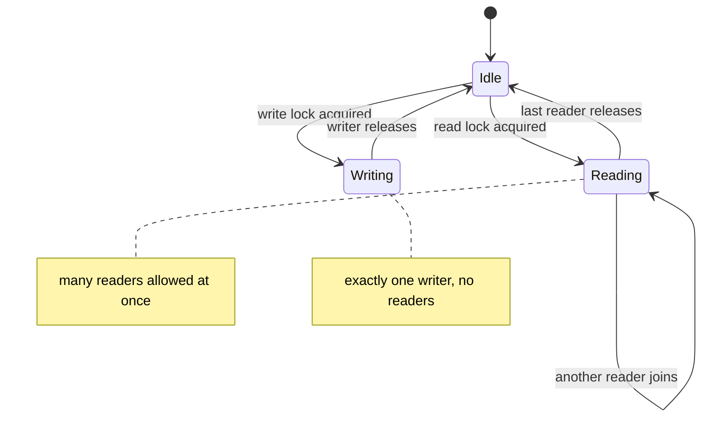

A plain mutex is wasteful when access is mostly read-only: two readers never conflict, yet
`synchronized` still serializes them. A **`ReadWriteLock`** splits one lock into two coordinated views —
a **read lock** many threads can hold at once, and a **write lock** exactly one thread holds alone.
The rule is simple: **many readers XOR one writer**.

## Readers share, writers exclude



While the lock is in **Reading**, more readers may join freely, but a writer must wait for the last
reader to leave. While in **Writing**, everyone else — readers and writers — waits. In Java this is
`ReentrantReadWriteLock`:

```java
private final ReentrantReadWriteLock rw = new ReentrantReadWriteLock();
private final Lock r = rw.readLock();
private final Lock w = rw.writeLock();

V get(K key) {
    r.lock();
    try { return map.get(key); }        // many readers concurrently
    finally { r.unlock(); }
}
void put(K key, V val) {
    w.lock();
    try { map.put(key, val); }          // exclusive
    finally { w.unlock(); }
}
```

## StampedLock's optimistic read: don't lock at all

`ReadWriteLock` still forces readers to take a lock (contended writes on a shared counter). `StampedLock`
adds a third, cheaper mode: **`tryOptimisticRead()`** returns a *stamp* (a version number) **without
locking anything**. You read the fields, then call **`validate(stamp)`**. If no writer intervened, your
read was consistent and you paid almost nothing. If a writer did move, validation fails and you fall
back to a real read lock. Watch the unlucky path:

```walkthrough
title: StampedLock optimistic read — validate, then fall back
code: |
  long stamp = sl.tryOptimisticRead();  // no lock, just a version stamp
  int b = balance;                      // optimistic read of the field
  if (!sl.validate(stamp)) {            // did a writer move since the stamp?
    stamp = sl.readLock();              // fall back to a real read lock
    try { b = balance; }                // re-read consistently
    finally { sl.unlockRead(stamp); }
  }
steps:
  - text: '`tryOptimisticRead()` returns stamp **v7** and takes **no lock**. Writers are not blocked.'
    array: ['v7', 100, '?']
    pointers: { 0: 'stamp', 1: 'balance', 2: 'validate' }
    line: 1
  - text: 'We **optimistically read** `balance` into a local: `b = 100`.'
    array: ['v7', 100, 'read 100']
    highlight: [1]
    pointers: { 0: 'stamp', 1: 'balance', 2: 'validate' }
    line: 2
  - text: 'Unlucky: a **writer sneaks in**, sets `balance = 120`, and bumps the version to **v8**.'
    array: ['v8', 120, 'read 100']
    highlight: [0, 1]
    pointers: { 0: 'stamp', 1: 'balance', 2: 'validate' }
    line: 2
  - text: '`validate(v7)` sees the version is now **v8 != v7**, so it returns **false** — our read may be stale or torn.'
    array: ['v8', 120, 'INVALID']
    highlight: [2]
    pointers: { 0: 'stamp', 1: 'balance', 2: 'validate' }
    line: 3
  - text: 'Fall back: acquire a **real read lock** (blocks writers) and re-read `balance` consistently.'
    array: ['v8-R', 120, 're-read']
    highlight: [0]
    pointers: { 0: 'stamp', 1: 'balance', 2: 'validate' }
    line: 4
  - text: 'Release the read lock and return the **consistent 120**. The fast path is free; the slow path is safe.'
    array: ['free', 120, 'OK 120']
    sorted: [0, 1, 2]
    pointers: { 0: 'stamp', 1: 'balance', 2: 'validate' }
    line: 6
```

## Two APIs, side by side

````tabs
tabs:
  - label: ReentrantReadWriteLock
    body: |
      Reader/writer split, reentrant, optionally fair.
      ```java
      var rw = new ReentrantReadWriteLock();
      rw.readLock().lock();
      try { /* shared read */ } finally { rw.readLock().unlock(); }
      ```
      Readers still acquire a lock, so heavy read traffic contends on the lock's internal state.
      Best when a read holds the lock for a non-trivial amount of time.
  - label: StampedLock
    body: |
      Adds a lock-free optimistic read; stamps must be passed back to the matching unlock.
      ```java
      var sl = new StampedLock();
      long stamp = sl.writeLock();
      try { balance += 10; } finally { sl.unlockWrite(stamp); }
      ```
      Cheapest reads of all — but **not reentrant** and it has **no Conditions**. Best for very short,
      read-dominated critical sections.
````

## When to use which

| Lock | Use when | Watch out for |
|--|--|--|
| `synchronized` / `ReentrantLock` | writes are common; you need simplicity or Conditions | serializes readers too |
| `ReentrantReadWriteLock` | reads far outnumber writes and reads take real time | writer starvation; overhead if reads are trivial |
| `StampedLock` | reads vastly dominate; critical sections are tiny | not reentrant; no Conditions; must handle validate failure |

:::gotcha
Two sharp edges. First, **writer starvation**: under a steady stream of readers a non-fair
`ReadWriteLock` can leave a writer waiting indefinitely, because new readers keep the read lock alive.
Second, **`StampedLock` is not reentrant** — if a thread that already holds it calls `readLock()` or
`writeLock()` again, it deadlocks against itself. It also offers no `Condition`s and no reentrancy, so
it is not a drop-in replacement for `ReentrantReadWriteLock`.
:::

:::senior
`ReentrantReadWriteLock` supports **lock downgrading** — acquire the write lock, then take the read lock
before releasing the write lock — but **not upgrading**: taking the write lock while holding the read
lock deadlocks, since the writer waits for readers that include itself. `StampedLock` instead offers
`tryConvertToWriteLock`. And always benchmark: if reads are cheap and quick, the bookkeeping of a
read-write lock can be *slower* than one plain mutex — the split only pays off when reads are both
frequent and non-trivial.
:::

## Check yourself

```quiz
title: Read-write and stamped locks check
questions:
  - q: 'Under a ReadWriteLock, which combination of holders is allowed simultaneously?'
    options:
      - text: 'Many readers at once, or exactly one writer alone'
        correct: true
      - 'One reader and one writer together'
      - 'Many readers and one writer together'
    explain: 'Read locks are shared, so any number of readers may hold at once. The write lock is exclusive, so a writer holds alone with no readers or other writers.'
  - q: 'What does `StampedLock.tryOptimisticRead()` followed by `validate(stamp)` give you?'
    options:
      - 'A guaranteed exclusive read that blocks all writers'
      - text: 'A lock-free read you confirm afterward — validate returns false if a writer intervened, so you retry with a real read lock'
        correct: true
      - 'A reentrant read lock with automatic release'
    explain: 'The optimistic read takes no lock; validate checks whether the version changed. If a writer moved, validation fails and you fall back to a real read lock and re-read.'
  - q: 'Why can a ReadWriteLock cause writer starvation?'
    options:
      - 'Writers have lower priority in the JVM scheduler'
      - text: 'A continuous stream of readers keeps the read lock alive, so a waiting writer may never acquire the exclusive lock'
        correct: true
      - 'Write locks are not reentrant'
    explain: 'Because readers share the lock, overlapping readers can keep it perpetually held. With a non-fair policy a writer waiting for exclusivity may be starved; a fair policy trades throughput to fix this.'
```

:::key
When reads dominate, stop serializing them. **`ReadWriteLock`** allows **many readers XOR one writer**;
**`StampedLock`** adds a lock-free **optimistic read** you confirm with `validate` and fall back from on
failure. Beware **writer starvation** with read-heavy traffic, and remember **`StampedLock` is not
reentrant and has no Conditions**. If reads are cheap, one plain mutex may still win — measure.
:::
