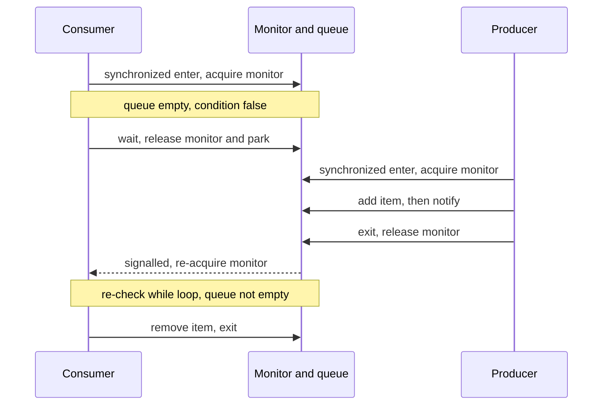

Sometimes a thread must **wait until some condition becomes true** — a queue is non-empty, a buffer has
space. Busy-spinning wastes a core. The primitive for this is the **guarded block**: `Object.wait()`
atomically **releases the monitor and parks** the thread; another thread changes the state and calls
**`notify()`** / **`notifyAll()`** to wake it. This is how producer/consumer handoff works underneath.

## A consumer waits; a producer wakes it

The consumer finds the queue empty and calls `wait()`, releasing the lock so a producer can even get in.
The producer adds an item, calls `notify()`, and exits — only then can the consumer re-acquire the
monitor and proceed:



Notice the ordering: `wait()` **gives up the lock**, so the producer can acquire it; the woken consumer
does **not** run immediately — it must **re-acquire** the monitor (after the producer releases) before
returning from `wait()`.

Under the hood every monitor has **two thread parking lots**: the **entry set** (threads trying to
*acquire* the monitor — state `BLOCKED`) and the **wait set** (threads that called `wait()` — state
`WAITING`). `notify` does not wake a thread into running; it only **moves it from the wait set to
the entry set**, where it must still win the monitor. Step through the full handshake:

```walkthrough
title: 'The wait/notify handshake: entry set, wait set, monitor'
code: |
  synchronized (lock) {          // consumer
      while (queue.isEmpty())
          lock.wait();           // release monitor, park in WAIT SET
      item = queue.remove();
  }
  synchronized (lock) {          // producer
      queue.add(item);
      lock.notifyAll();          // move waiters to ENTRY SET
  }                              // release monitor
steps:
  - text: 'Consumer **C** acquires the monitor. Producer **P** arrives at its own `synchronized (lock)` while C owns it — P parks in the **entry set**, state `BLOCKED`.'
    array: ['C', 'P', '—', 0]
    pointers: { 0: 'owner', 1: 'entry set', 2: 'wait set', 3: 'queue' }
    line: 1
  - text: 'C checks the guard: `queue.isEmpty()` is **true**, so C calls `wait()` — it **atomically releases the monitor and moves to the wait set**, state `WAITING`.'
    array: ['free', 'P', 'C', 0]
    highlight: [0, 2]
    pointers: { 0: 'owner', 1: 'entry set', 2: 'wait set', 3: 'queue' }
    line: 3
  - text: 'The monitor is free, so **P is promoted from the entry set to owner**. This is why `wait()` must release the lock — otherwise the producer could never get in.'
    array: ['P', '—', 'C', 0]
    highlight: [0]
    pointers: { 0: 'owner', 1: 'entry set', 2: 'wait set', 3: 'queue' }
    line: 6
  - text: 'P adds an item and calls `notifyAll()`. **C moves from the wait set to the entry set** — it is *not* running yet; it must re-acquire the monitor first.'
    array: ['P', 'C', '—', 1]
    highlight: [1, 3]
    pointers: { 0: 'owner', 1: 'entry set', 2: 'wait set', 3: 'queue' }
    line: 8
  - text: 'P exits its `synchronized` block and **releases the monitor**. Only now can the signalled consumer proceed.'
    array: ['free', 'C', '—', 1]
    highlight: [0]
    pointers: { 0: 'owner', 1: 'entry set', 2: 'wait set', 3: 'queue' }
    line: 9
  - text: 'C wins the monitor and returns from `wait()` — **inside the `while` loop** — so it re-checks the guard: `queue.isEmpty()` is now false.'
    array: ['C', '—', '—', 1]
    highlight: [0]
    pointers: { 0: 'owner', 1: 'entry set', 2: 'wait set', 3: 'queue' }
    line: 2
  - text: 'The guard holds, so C removes the item and exits. Handshake complete — no busy waiting, no lost signal.'
    array: ['C', '—', '—', 0]
    sorted: [0, 1, 2, 3]
    pointers: { 0: 'owner', 1: 'entry set', 2: 'wait set', 3: 'queue' }
    line: 4
```

## The guarded-block pattern

Two rules make this correct, and both are non-negotiable:

```java
// Consumer
synchronized (lock) {
    while (queue.isEmpty()) {   // WHILE, never if
        lock.wait();            // releases lock, parks; re-acquires on wake
    }
    return queue.remove();
}

// Producer
synchronized (lock) {
    queue.add(item);
    lock.notifyAll();           // wake waiters so they re-check the condition
}
```

**You must hold the monitor** to call `wait`, `notify`, or `notifyAll` on an object — otherwise you get
`IllegalMonitorStateException` at runtime. That is why every call sits inside `synchronized (lock)` on
that same `lock`.

## Why `while`, not `if`

The condition is re-checked in a **loop** for two independent reasons:

- **Spurious wakeups.** The JVM is permitted to return from `wait()` *without any* `notify()`. Real, and
  documented. An `if` would fall straight through with the condition still false.
- **Stolen conditions.** With multiple consumers, another may grab the item between your wakeup and your
  re-acquire of the lock. By the time you run, the queue is empty again.

An `if` proceeds regardless — calling `remove()` on an empty queue, corrupting an invariant. A `while`
simply re-checks and, if still false, waits again. **Always loop.**

## `notify` vs `notifyAll`

`notify()` wakes **one arbitrary** waiter; `notifyAll()` wakes them all to re-check. Prefer
`notifyAll()` unless you can prove a single wait condition. The danger of `notify()` is a **lost
wakeup**: if waiters are blocked on *different* predicates, `notify()` may wake the "wrong" one, which
re-checks, sees its condition still false, and goes back to sleep — while the thread that *could* have
proceeded is never signalled.

## `Condition` — precise wait-sets on a `ReentrantLock`

`Object`'s monitor gives you **one** anonymous wait-set. A `ReentrantLock` can mint **several**
`Condition`s, so you can signal exactly the right group:

````tabs
tabs:
  - label: synchronized wait/notify
    body: |
      One implicit monitor, one wait-set for everyone.
      ```java
      synchronized (lock) {
          while (queue.isEmpty())
              lock.wait();          // Object.wait
          return queue.remove();
      }
      // producer: after add -> lock.notifyAll();
      ```
      Simple, but consumers and producers share a single wait-set, so `notifyAll` wakes everyone.
  - label: ReentrantLock + Condition
    body: |
      Separate `notEmpty` and `notFull` wait-sets — signal only the right side.
      ```java
      final ReentrantLock lock = new ReentrantLock();
      final Condition notEmpty = lock.newCondition();

      T take() throws InterruptedException {
          lock.lock();
          try {
              while (queue.isEmpty())
                  notEmpty.await();     // Condition.await, not wait
              return queue.remove();
          } finally { lock.unlock(); }
      }
      // producer: after add -> notEmpty.signal();
      ```
      `await`/`signal`/`signalAll` mirror `wait`/`notify`/`notifyAll`, but targeting one predicate avoids
      waking threads that cannot make progress.
````

:::gotcha
**Using `if` instead of `while` around `wait()` is the classic wait/notify bug.** A spurious wakeup or a
condition stolen by another consumer leaves the predicate false, and the `if` proceeds anyway — popping
an empty queue or violating an invariant. Equally fatal: calling `wait`/`notify` **without holding the
object's monitor** throws `IllegalMonitorStateException`. Guard predicate + `wait()` in a `while`, inside
`synchronized` on the *same* object. `Condition.await()` must also loop.
:::

:::senior
`notifyAll()` is safe but can cause a **thundering herd** — wake N threads and N-1 immediately re-block.
`Condition`s fix this cleanly: give each predicate its own wait-set so `signal()` targets exactly the
threads that can proceed (`notFull` for producers, `notEmpty` for consumers). Two more notes:
`Condition.await()` releases the associated `ReentrantLock` just as `wait()` releases the monitor, and it
too is subject to spurious wakeups. And in real code, **do not hand-roll producer/consumer** — a
`BlockingQueue` from `java.util.concurrent` already encapsulates all of this correctly.
:::

## Check yourself

```quiz
title: Wait, notify and Condition check
questions:
  - q: 'Why must the condition around `wait()` be checked in a `while` loop rather than an `if`?'
    options:
      - text: 'Spurious wakeups and stolen conditions mean the predicate can be false when wait returns, so it must be re-checked'
        correct: true
      - 'while is faster than if for locks'
      - 'if cannot contain a wait() call'
    explain: 'wait() may return without a matching notify (spurious wakeup), and another thread may have invalidated the condition before you re-acquire the lock. A while re-checks and waits again if still false.'
  - q: 'What happens if you call `obj.wait()` without holding `obj`''s monitor?'
    options:
      - 'It waits normally'
      - 'It returns immediately'
      - text: 'It throws IllegalMonitorStateException'
        correct: true
    explain: 'wait, notify, and notifyAll require the calling thread to own the object monitor. Calling them outside a synchronized block on that object throws IllegalMonitorStateException.'
  - q: 'Why is `notifyAll()` generally safer than `notify()`?'
    options:
      - 'notifyAll is faster'
      - text: 'notify wakes one arbitrary waiter, which may be the wrong one and re-sleep, causing a lost wakeup; notifyAll wakes all to re-check'
        correct: true
      - 'notify does not release the monitor'
    explain: 'When waiters block on different conditions, notify may wake a thread whose predicate is still false. It re-sleeps while a runnable thread is never signalled. notifyAll wakes everyone to re-check, or use distinct Conditions to signal precisely.'
```

:::key
A **guarded block** waits for a predicate: `wait()` **atomically releases the monitor and parks**;
`notify()`/`notifyAll()` wake waiters. You **must hold the monitor** to call them. Always re-check the
predicate in a **`while` loop** (spurious wakeups, stolen conditions) — never an `if`. Prefer
`notifyAll()`, or use a `ReentrantLock` **`Condition`** to signal one precise wait-set. In practice,
reach for a `BlockingQueue`.
:::
